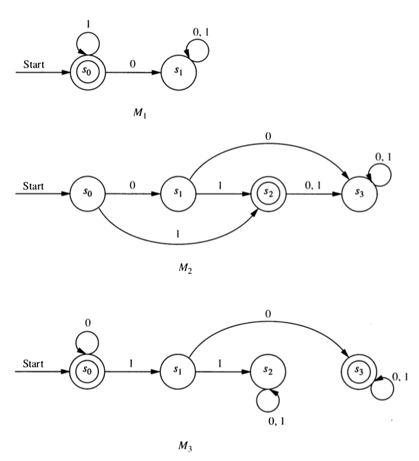
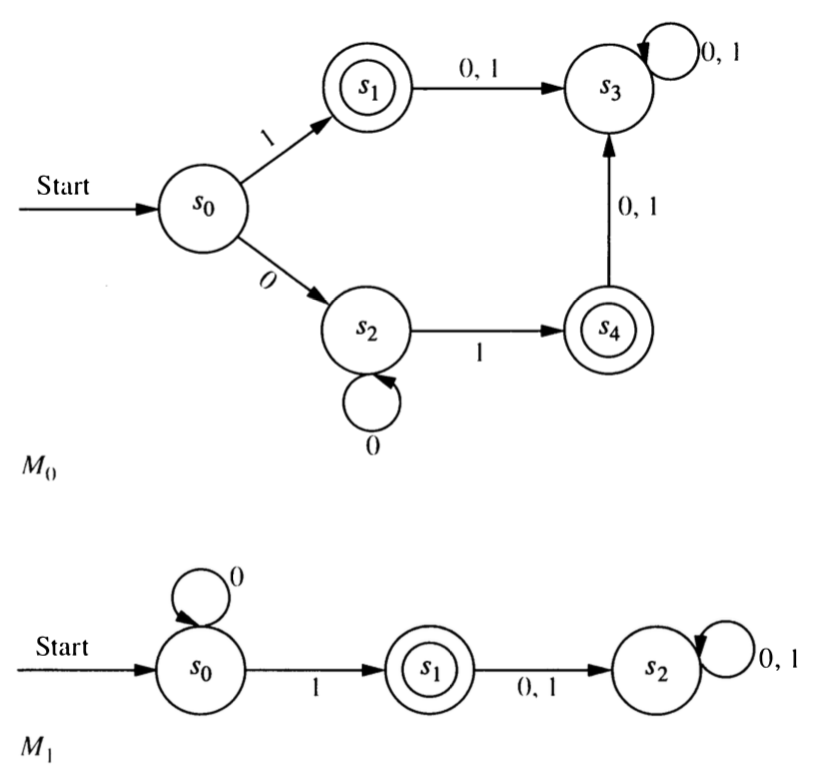
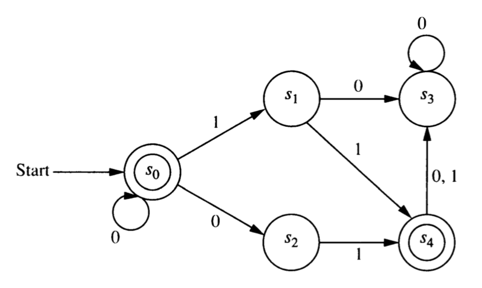

```{r setup, include=FALSE}
knitr::opts_chunk$set(echo = TRUE)
```

## Finite State Automata

A **finite state automaton** consists of the following:

* a finite set of **states**: $S$
* a finite **input alhpabet**: $I$
* a **start state**: $s_0 \in S$.
* a set of **final states**: $F \subseteq S$
* a **transition function**: $f : S \times I \to S$

**Example ($M_0$)**
states: $\{A, B, C, D\}$; input alphabet: $\{0, 1\}$; start state: $A$; 
final states: $\{A, D\}$; transition function described in table below

<!-- \  | \  | \  | \  | \  | \  | \  | \  | \ -->
$M_0$   |   |   |   |   |   |   |   | 
------- | - | - | - | - | - | - | - | -
state   | A | A | B | B | C | C | D | D
letter  | 0 | 1 | 0 | 1 | 0 | 1 | 0 | 1
$f$     | A | B | A | C | A | A | C | B

### Graph Representation

1. It is often easier to visualize what is going on if we represent an automaton
with a graph.  Create a labeled, directed graph with the following properties:

    * There is a vertex for each state, labeled with the state. 
      (Draw this as a circle with the state inside the cirlce.
    * There is an edge from state $s$ to state $t$ labeled with letter $x$ if and only if $f(s, x) = t$
    * Final states are circled a second time.  (We could use shape or color or something else to make it clear which states are final states, but double circling is easy.)
    * An extra arrow (not coming from any state) points to the start state.  This 
    isn't really an edge in the graph, just an extra bit of labeling.
   
### Extended transition function 

We can extend the transition function to $f^*: S \times I^* \to S$ with the following
recursive definition:

* $f^*(s, \lambda) = s$ for any state $s$
* $f^*(s, xa) = f(f^*(s,x) a)$ for any $x \in I^*$ and $a \in I$

2. Use this definition to determine the following.

    a. $f^*(B, \lambda)$
    a. $f^*(B, 0)$
    a. $f^*(B, 010)$
    a. $f^*(A, 101)$
    a. $f^*(A, 1011)$

\newpage

### Language Recognition

For any automaton $M$ 
with transition function $f$, start state $s$ and final states $F$,
the langauge recognized by $M$ (written $L(M)$) is defined as follows:

$$
x \in L(M) \iff f^*(s, x) \in F
$$

3. For each string $x$ below, compute $f^*(A, x)$. 
Which of these strings are in $L(M_0)$?  
(We will say that such strings are **accepted by $M_0$**.)
Do this both from the table and from the graph.  (You should get the same result either way.)

    a. $\lambda$
    a. $0$
    a. $1$
    a. $010$
    a. $1011$
    
4. For each of the automata represented below, determine the language recognized.

```{r, echo = FALSE, out.width = "50%", fig.align = "center"}

```

5. Create automata that recognize each of the following languages.

    a. The set of bitstrings that begin with two 0's
    b. The set of bitstrings that contain exactly two 0's
    b. The set of bitstrings that contain at least two 0's
    c. The set of bitstrings that contain two consecutive 0's (anywhere in the string)
    d. The set of bitstrings that do not contain two consecutive 0's anywhere
    d. The set of bitstrings that end with two 0's

\newpage

6. For each of the machines $M_1, M_2, M_3$ compute

    a. $f^*(s_0, 10)$
    a. $f^*(s_0, 1011)$
    a. $f^*(s_1, 1011)$

### Equivalent Automata and Grammars

We will say that two automata $M$ and $N$ are equivalent if $L(M) = L(N)$, that is, if they recognize 
the same language.  Similarly, two grammars are equivalent if they generate the same language.

7. What must you do to show that two automata are **not** equivalent?

8. What must you do to show that two automata **are** equivalent.

9. Are the two automata represented below equivalent?  Explain.


```{r, echo = FALSE, out.width = "50%", fig.align = "center"}

```

### Nondeterministic Automota

The finite state automata we have seen so far are often called **deterministic finite-state automata** or 
DFAs.  There is a generalization called a **non-deterministic finite-state automaton** or NFA.  The only 
difference is how the transition function is specified.  For an NFA, the transition function has the form

$$ f^*: S \times I^* \to P(S)$$

where $S$ is the set of states, $I$ is the input alphabet, and $P(S)$ is the powerset of $S$.


Here is a tabular description of the transition function for an NFA $N_0$ with
start state A and final states C and D.  

$N_0$   |   |   |   |   |   |   |   | 
------- | - | - | - | - | - | - | - | -
state   | A | A | B | B | C | C | D | D
letter  | 0 | 1 | 0 | 1 | 0 | 1 | 0 | 1
$f$     | $\{A,B\}$ | $\{D\}$ | $\{A\}$ | $\{B, D\}$ | $\{ \}$ | $\{A, C\}$ | $\{A, B, C\}$ | $\{B\}$

10. Draw the graph representation.
How will the graph of an NFA differ from the graph for a DFA?

11. How do we define the language recognized by an NFA?  [Check your answer before proceeding.]

12. Which of these strings are accepted by $N_0$?

    a. 01
    b. 011
    c. 00
    c. 0000
    c. $\lambda$
    d. 010101

Here is the graph of an NFA $N_1$.

```{r, echo = FALSE, out.width = "50%", fig.align = "center"}

```

13. Make a table showing the transition funtion for $N_1$.

14. Which of the following strings are accepted by $N_1$?

    a. $\lambda$
    b. 00
    c. 01
    d. 010
    e. 011
    f. 001

15. What is $L(N_1)$?

16. Create a DFA that recognizes $L(N_1)$.

17. Given an NFA $N$, is it always possible to create a DFA $M$ that recognizes the same langauge?  If so,
explain how.  If not, provide an example $N$ and explain why $L(N)$ cannot be recognized by a DFA.


