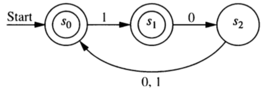

```{r setup, include=FALSE}
knitr::opts_chunk$set(echo = TRUE)
```


## Grammars to Automata 

1. Construct a finite state automaton that recognizes that langauge generated by the following
regular grammar.

    * terminals: 0 and 1
    * nonterminals: $S$ and $A$
    * start symbol: $S$.
    * production rules: $S \to 1A$, $S \to 0$, $S\to \lambda$, $A \to 0A$, $A \to 1A$, $A\to 1$

2. Construct a finite state automaton that recognizes that langauge generated by the following
regular grammar.

    * terminals: 0 and 1
    * nonterminals: $S$, $A$, $B$
    * start symbol: $S$.
    * production rules: 
      $S \to 1A$, $S \to 0$, 
      $A \to 0B$, $A \to 1A$, $A\to 1$
      $B \to 0A$, $B \to 1B$, $B\to 0$
    

3. Explain how *any* regular grammar $G$ can be converted into an NFA $N$ such that $L(N) = L(G)$.

    a. What is a regular grammar? (What sorts of production rules are allowed?)
    a. What will the states of $N$ be?  How many will there be?
    b. Which states will be final (ie. accepting) states?
    c. How does each rule in $G$ get converted into a part of $N$?  [Go through each kind of rule 
    a regular grammar may have.]

\newpage

## Automata to Grammars

4. Construct a regular grammar that generates the language accepted by this finite state automaton.

```{r, echo = FALSE, fig.align = "center"}
knitr::include_graphics("images/DFA-Fig-12-4-5.png")
```

5. Construct a regular grammar that generates the language accepted by this finite state automaton.

```{r, echo = FALSE, fig.align = "center"}
knitr::include_graphics("images/DFA-Ex-12-3-19.png")
```

6. Construct a regular grammar that generates the language accepted by this finite state automaton.

```{r, echo = FALSE, fig.align = "center"}

```


7. Explain how we know that *any* regular language $L$ is generated by a regular grammar $G$ by describing
how to construct the regular grammar $G$.

    a. We already know that every regular expression can converted into an NFA and every NFA into a DFA. So all we need to show is that we can converts DFAs or NFAs into regular grammars. Are there any advantages to 
    starting from a DFA over an NFA? 
    b. What will the terminals and nonterminals in your grammar be?
    c. What will the start symbol be?
    d. How are the production rules created?
    
8. Show that every DFA is equivalent to a DFA with a "lonely start state".  A lonely start state is a start state that can never be returned to. (In terms of the graph, its
in-degree is 0.)

<!-- 9. True of False. Every NFA is equivalent to an NFA with exactly 1 final state. -->

<!-- 10. True of False. Every DFA is equivalent to a DFA with exactly 1 final state. -->
