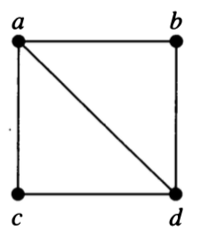
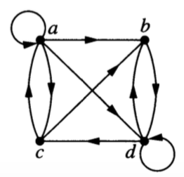
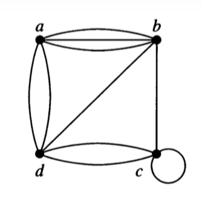
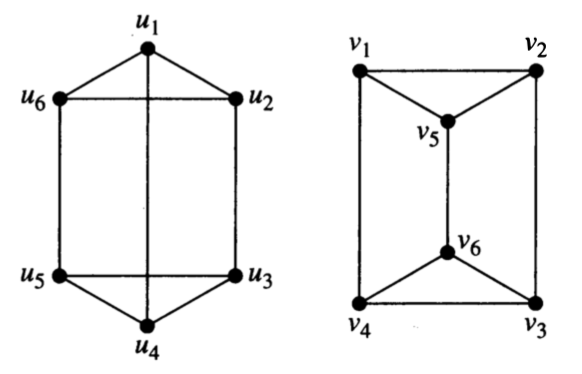
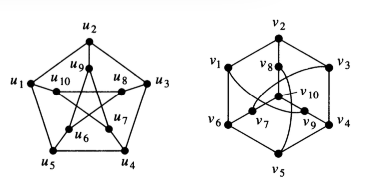

```{r setup-graphiso, include=FALSE}
knitr::opts_chunk$set(
  echo = FALSE, 
  out.width = "40%")
```

# Graph Representations 

<!-- ## Goals for the day -->

<!--   1. Understand how 4 different graph **representations** work. -->
<!--   2. Understand what it means for two graphs to be **isomorphic**. -->
<!--   3. Be able to give a convincing argument that two graphs are or are not isomorphic. -->
  
## 4 Representations of Graphs

There are several ways to represent a (simple) graph. 
The efficiency of some graph algorithms depends on which
representation is used to store the graph.

### Edge Lists

An edge list simply lists off the edges (i.e., pairs of vertices) in the graph.

### Adjacenty Lists

For each vertex $i$, a list of vertices $j$ such that there is an edge from $i$ to $j$.

### Adjacency Matrix

An adjacenty matrix $A$ is a square matrix with a row (and column) for each vertex.

  * $A_{ij} = 1$ if there is an edge from vertex $i$ to vertex $j$
  * $A_{ij} = 0$ if there is **not** an edge from vertex $i$ to vertex $j$
   
### Incidence Matrix

An incidence matrix $M$ has a row for each vertex and a column for each edge. 

  * $M_{ij} = 1$ if edge $j$ is incident with vertex $i$.
  * $M_{ij} = 0$ if edge $j$ is **not** incident with vertex $i$.
   
## Representation to Graphs

Draw graphs with the following representations.
  
1. edge list: $\{ \{1, 2\}, \{2, 3\}, \{3, 4\}, \{4, 5\}, \{1, 3\}, \{2, 4\}, \{3, 5\} \}$.

\newpage

2. adjacency list
    
vertex | adjacent vertices
-------|--------------------
   1   |  2, 3, 5
   2   |  1
   3   |  1, 4, 5
   4   |  3, 5
   5   |  1, 3, 4  
  

3. adjacency matrix: 
    
```
0 1 1 1 
1 0 1 1
1 1 0 0
1 1 0 0
```

4. adjacency matrix: 

```
0 1 1 0 
1 0 0 1
1 0 0 1
0 1 1 0
```

5. adjacency matrix

```
0 1 0 0 1 1
1 0 1 1 0 1
0 1 0 0 1 1
0 1 0 0 1 0
1 0 1 1 0 1
1 1 1 0 1 0
``` 

6. incedence matrix
    
```
1 1 0 0 0 0 
0 0 1 1 0 1
0 0 0 0 1 1 
1 0 1 0 0 0 
0 1 0 1 1 0
```

7. incedence matrix
    
```
1 1 1 0 0 0 0 0
0 1 1 1 0 1 1 0
0 0 0 1 1 0 0 1 
0 0 0 0 0 0 1 1 
1 0 0 0 1 1 0 0 
```

### Variations on the theme {-}

 7. Which of these representations can be used (perhaps with slight modification) 
 with **directed graphs**?  What adjustments do you need to make?
 
 3. Which of these representations can be used (perhaps with slight modification) 
 for graphs with **multi-edges**?  What adjustments do you need to make?
 
 4. Which of these representations can be used (perhaps with slight modification) 
 for graphs with **self-loops**?  What adjustments do you need to make?
 
## Graph to representation


 7. Use each representation to represent the following graphs or say why it isn't possible.
 
```{r, echo = FALSE, out.width = "25%", fig.show = 'hold', fig.align = "center"}

```

```{r, echo = FALSE, out.width = "25%", fig.show = 'hold', fig.align = "center"}

```


```{r, echo = FALSE, fig.align = "center", out.width = "25%", fig.show = 'hold'}

```

```{r, echo = FALSE, fig.align = "center", out.width = "40%", fig.show = 'hold'}
knitr::include_graphics("../images/GraphFig-9-3-7.png")
```

\newpage

# Graph Isomorphism

Two (mathematical) objects are called **isomorphic** if they are "essentially the same"
(iso-morph means same-form).
What "essentially the same" means depends on the kind of object.
For graphs, we mean that the vertex and edge structure is the same.  So

> Graphs $G$ and $H$ are **isomorphic** if there is a bijection (1-1 and onto function)  
$$f: G \to H$$ such that 
there is an edge from $a$ and $b$ if and only if there is an edge from $f(a)$ to $f(b)$.  The function
$f$ is called an **isomorphism**.

(For graphs that allow multi-edges, we require that the number of edges be the same.)

## Showing graphs are isomorphic

When graphs are isomorphic, we can demonstrate this by providing the isomorphism.

1. Show that the following pair of graphs is isomorphic by providing the
isomorphism.  

    a. What must you demonstrate to convince someone that your function
is indeed an isomorphism?

    b. Is there more than one isomorphism?  If so, give another one.

```{r, echo = FALSE, fig.align = "center", out.width = "25%"}

```


## Showing graphs are not isomorphic

Showing that two graphs are *not* isomorphic can be trickier.  Somehow you need to demonstrate that
no isomorphism exists.  Unfortunately, there are a lot of bijections ($n!$ if the graphs each have $n$ 
vertices), so checking all possible bijections to see if they are isomorphisms would not be a very
efficient algorithm.  

**News Flash:** Until recently, the best known algorithm for Graph Isomorphism had exponential 
worst case running time (but was polynomial time on average).  In 2015, Laszlo
Babai demonstrated an 
[algorithm that runs in sub-exponential time](https://motherboard.vice.com/en_us/article/4xagmd/graph-isomorphism-youve-been-served) (almost, but not quite polynomial time). 

Back to showing two graphs are not isomorphic. We need to demonstrate that no isomorphism exists, but
we don't want to check all of them.  One good approach is to consider **graph invariants**.  A graph
invariant is a property that is the same whenever two graphs are isomorphic.

 2. Which of the following are graph invariants?
 
    a. number of vertices
    b. number of edges
    c. degree sequence
    d. adjacency matrix
    e. incidenc matrix
    e. having a subgraph isomorphic to $K_4$
    f. having a subgraph isomorphic to _____ (can you fill in the blank with any graph?)
    
    
Unfortunately, matching invariants does not guarantee that graphs are isomorphic, but you can use 
graph invariants to help narrow the search.

Explain why each of the following pairs of graphs is not isomorphic.

 3.  
```{r, echo = FALSE, fig.align = "center"}
knitr::include_graphics("../images/GraphFig-9-3-9.png")
```
 4.
```{r, echo = FALSE, fig.align = "center"}
knitr::include_graphics("../images/GraphFig-9-3-10.png")
```
  
\newpage

## Isomorphic or not?

For each pair, determine whether the graphs are isomorphic.  Be sure to explain how you know.

 5.  
```{r, echo = FALSE, fig.align = "center"}
knitr::include_graphics("../images/GraphFig-9-3-12.png")
```
 6. 
```{r, echo = FALSE, fig.align = "center"}
knitr::include_graphics("../images/GraphEx-9-3-63.png")
```

 7. 
```{r, echo = FALSE, fig.align = "center"}

```

 8. 
```{r, echo = FALSE, fig.align = "center"}
knitr::include_graphics("../images/GraphEx-9-3-37.png")
```

\newpage