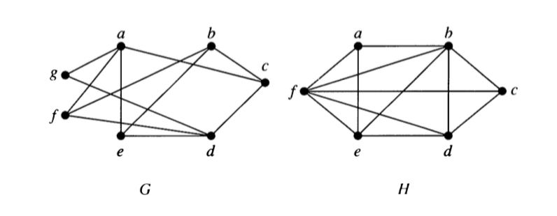
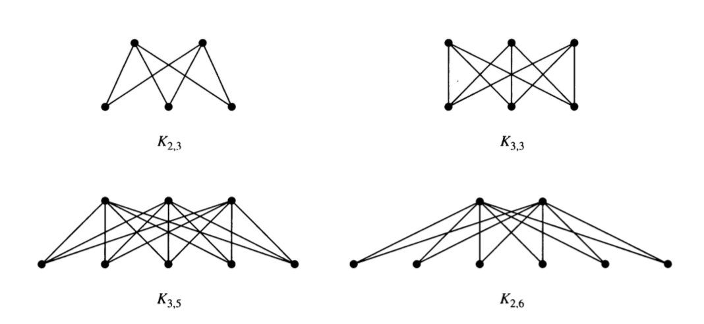
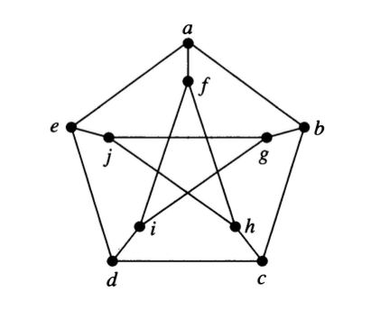

```{r setup-bipartite-planar, include=FALSE}
knitr::opts_chunk$set(echo = TRUE)
```
# Bipartite Graphs

## Definition

A simple graph $G$ is **biparatite** if its vertices can be partitioned into two disjoint
subsets $V_1$ and $V_2$ and every edge connects a vertex in $V_1$ with a vertex in $V_2$.
The pair $\langle<V_1, V_2\rangle$ is called a **bipartition** of $G$.

## Examples

 1. Which of the following are bipartite?
 
```{r, echo = FALSE, fig.align = "center", out.width = "40%"}

```

 2. For what values of $n$ are the following bipartite?
    a. $K_n$
    b. $C_n$
    c. $Q_n$
    
 3. Can a bipartite graph have more than one bipartition?  If so, give an example.  If
 not, explain why not.
 
 4. Describe an algorithm for checking whether a graph is bipartite.  How efficient is 
 your algorithm?

## Complete Bipartite Graphs 

A complete biparite graph $K_{m,n}$ has two disjoint sets of vertices $V_1$ and $V_2$
with $m$ and $n$ elements.  There is an edge between $x$ and $y$ if and only if 
$x \in V_1$ and $y \in V_2$ or $x \in V_2$ and $y \in V_1$.

Here are some examples.

```{r, echo = FALSE, fig.align = "center", out.width = "50%"}

```

\newpage

# Planar Graphs

A graph is a **planar graph** if it can be drawn in the plane with no edge crossings.
[Note: You may need to rearrange the vertices to avoid crossings.]

## Euler and Planarity

We have already seen that for planar graphs,

$$v - e + r = 1 + \mbox{number of connected components} \;,$$
where $v$ is the number of vertices, $e$ the number of edges and $r$ the number of 
regions.

In particular, for a connected graph we have $v - e + r = 2$.

 1. Show that the following are planar.
    a. $K_{2,2}$ 
    a. $K_{2,3}$ 
    a. $K_{2,4}$
    a. Is $K_{2,n}$ planar for every $n$?  
    
 2. Use Euler's formula to show that $K_5$ is not planar.  (Hint: how many regions
 would $K_5$ have it if were planar? Why is that problematic?)
 
 3. Use Euler's formula to show that $K_{3,3}$ is not planar.
 
## Kuratowski's Theorem

The proof of the following theorem is too involved for this course, but it turns 
out that all nonplanar graphs contain a "homeomorphic copy" of either $K_{5}$ or $K_{3,3}$.

**Kuratowski's Theoerm:**
A graph $G$ is nonplanar if and only if it contains a subgraph $H$ 
that is homeomorphic to either $K_5$ or $K_{3,3}$.

  * two graphs are **homeomorphic** if the can be obtained from the same graph by
  a sequence of elementary subdivisions.
  
  * an **elementary subdivision** of a graph $G$ removes one edge $(u, v)$ and 
  adds a new vertex $n$ and two new edges $(u,n)$ and $(v,n)$.
  
 4. Create a graph with 5 vertices and 7 edges.  Now perform three elementary 
 subdivisions on your graph.
 
 
 5. Describe what an elementary subdivision is in siple words a kindergarterner could understand.

 6. Explain why two homeomorphic graphs are either both planar or both nonplanar. 

 7. Use Kuratowski's Theorem to show that the Petersen graph is nonplanar.
 
```{r, echo = FALSE, fig.align = "center", out.width = "25%"}

```
 
\newpage
