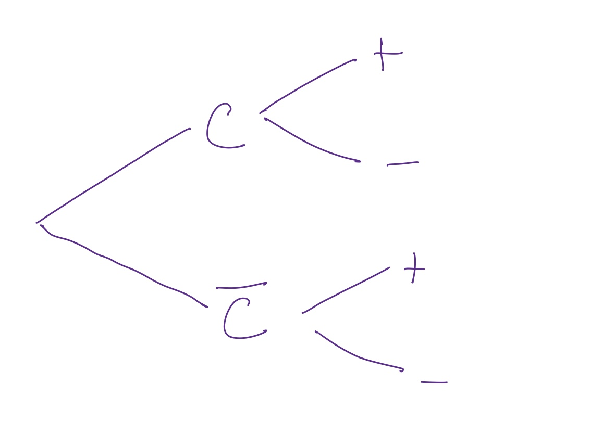

```{r setup, include=FALSE}
knitr::opts_chunk$set(echo = TRUE)
```

\def\prob{p}
\def\intersect{\cap}
\def\union{\cup}

<style>
button.collapsible {
  background-color: #777;
  color: white;
  cursor: pointer;
  padding: 4px;
  width: 100%;
  border: none;
  text-align: left;
  outline: none;
  font-size: 15px;
}

.active, button.collapsible:hover {
  background-color: #555;
}

.content {
  padding: 0 9px;
  display: none; 
  overflow: hidden;
  background-color: #f1f1f1;
}
</style>

### Daily Dope Sheet 

## Wednesday, March 18

#### Homework 

  * due today: WW 7
  * due Friday: WW 8 and PS 7
     * Submit PS 7 via moodle
     * You can submit up to five files (Moodle's max), but if you can assemble things into a single file somehow (perhaps drop your photos into Word or use some other online tool) and submit a single PDF, I think that will make things much nicer on the back end for our graders.
     * If you find a great workflow for this, post in the homework channel of Teams.
     


#### Stuff to do

1. Get today's worksheet (section 7). 

    * [PDF](../counting-and-probability/Counting-and-Probability.pdf) 
    * [HTML](../counting-and-probability/probability-trees-and-bayes.html)

2. Focus your attention on sections 7.1 - 7.3. So basically three problems today:

    * Bob's boxes
    * Breast cancer screening
    * Disease testing 
    
    There are some comments/hints/solutions below. Take a look at them after
    each section before moving on to the next.
    
    **Note:** You can ask very similar questions about the Corona virus, and most
    of the interesting questions are conditional probabilities like
    
    * *If* I get this *and* I'm young and healthy, what is the probability that I die?
    (Or to make it less personal, what proportion of young, healthy individuals who
    contract Covid-19 will die from it?)
    
    * What proportion of people who are extreme social distancers will contract Covid-19?
    * What proportion of mild social distancers will contract Covid-19?
    * What proportion of our health care workers will contract Covid-19?
    * Eventually: What proportion of people who are vaccinated will be immune?
    
    Right now, people are working hard to get estimates of these numbers, but we probably
    won't know for sure until after things have settled down and epidemiologists have 
    had some time to go over the data.

3. If you finish those and have extra time, feel free to get started on 
Sections 7.4 (Random Primality Testing) and 7.5 (Hashing).

#### Comments/Hints/Solutions

Check our MS Team channels as well.

<button type = 'button' class = "collapsible">Bob's Beautiful Boxes</button>
<div class = "content">
<button type = 'button' class = "collapsible">Not Equally Likely</button>
<div class = "content">
Box A has 9 balls; Box B has 7 balls.  The boxes are equally likely to be selected,
but since box A has more balls than box B, those balls are less likely to be chosen.

If it helps, imagine an extreme case: Suppose Box A had 1 million balls and Box B had 1.
The balls in Box A would be very unlikely to be selected -- even if Box A were chosen.
The ball in Box B would be chosen half the time -- every time Box B is chosen.

**Note 1:** The color of the balls is not the issue here. We are asking about the 
individual balls, not their color. 


**What's the point?** 
We cannot use the equally likely rule by counting balls since the balls
are not equally likely.
</div>

<button type = 'button' class = "collapsible">Inventory -- Getting Started</button>
<div class = "content">
* First Row:
    * Selecting boxes: $\prob(A) = 1/2$; $\prob(B) = 1/2$
* Second Row:
    * $\prob(A \intersect B) = 0$. (They are mutually exclusive.)
    * $A \union B$ is the sample space (we only have those two boxes), 
so $\prob(A \union B) = 1$.
    * We will come back to the last two items in this row shortly.

* Third Row: Two are easy, two are more challenging
    * Selecting colors *from within a box*: 
        * $\prob(R \mid A) = \frac{7}{9}$ since 7 of the 9 balls in that box are red (and they are all equally like *if* box A is chosen.
        * $\prob(R \mid B) = \frac{3}{7}$ since 3 of the 7 balls in that box are red
        (and they are all equally likely *if* box B is chosen.
    
    * Our question: $\prob(A \mid R)$.  *If* we know the ball was red, then what is
    the probability that it was drawn from Box A?
</div>

<button type = 'button' class = "collapsible">Inventory -- Building up</button>
<div class = "content">
We can get some more probabilities if we use the product rule: 
$\prob(E \intersect F) = \prob(E) \cdot \prob(F \mid E)$

* $\prob(A \intersect R) = \prob(A) \cdot \prob(R \mid A) =$ ___________
* $\prob(B \intersect R) = \prob(B) \cdot \prob(R \mid B) =$ ___________

</div>
<button type = 'button' class = "collapsible">Inventory -- Building up some more</button>
<div class = "content">
Now we can get even more probabilities using $\prob(E \union F) = \prob(E) + \prob(F) - \prob(E\intersect F)$.  Do you see how? (Note: this equation involves 4 probabilities.
If you ever know 3 of them, you can solve for the fourth.)
</div>

<button type = 'button' class = "collapsible">Inventory -> Solution</button>
<div class = "content">
We want $\displaystyle \prob(A \mid R) = \frac{\prob(A \intersect R)}{\prob(R)}$.  The top part of that 
fraction is in our inventory. But how do we get the bottom part?

A red ball could have come form either box, so let's use 
$R = (A \intersect R) \union (B \intersect R)$ and our rule for unions.

$\prob(R) = \prob((A \intersect R) \union (B \intersect R)) =$ ________ + __________ - _________
</div>

<button type = 'button' class = "collapsible">Putting it All Together</button>
<div class = "content">
Combining everything we get

$\prob(A \mid R) = \displaystyle \frac{\prob(A \intersect R)}{\prob(R)}$ 
$= \displaystyle \frac{\prob(A) \cdot \prob(R \mid A)}{\prob(A) \cdot \prob(R \mid A) + \prob(B) \cdot \prob(R \mid B)}$ 
$= \displaystyle \frac{\frac12 \cdot \frac79}{\frac12 \cdot \frac79 + \frac12 \cdot \frac37}$
$=$ `r round((7/9)/(7/9 + 3/7), 4)`

Notice how the question has the color in the condition and the solution has the 
box in the condition. This is our first example of a problem that flips those around.
The general approach is similar in all of these problems and is usually credited to
[Rev. Thomas Bayes](https://en.wikipedia.org/wiki/Thomas_Bayes).
(The formal theorem involved is called 
[Bayes' Theorem](https://en.wikipedia.org/wiki/Bayes%27_theorem), and there is an
entire branch of statistics called 
[Bayesian statistics](https://en.wikipedia.org/wiki/Bayesian_statistics) based on this idea.
You can learn about that in Stats 341.)
</div>

<button type = 'button' class = "collapsible">Using Probability Trees -- part 1</button>
<div class = "content">
The approach used above is very algebraic. We can organize the same arithmetic
visually using the method of probability trees.

First we set up the tree in this [video](https://rpruim.github.io/m252-recordings/probability//bobs-boxes-p1.mp4).

<video width="600" controls>
  <source src="https://rpruim.github.io/m252-recordings/probability//bobs-boxes-p1.mp4" type="video/mp4">
  Your browser does not support HTML5 video.
</video>
</div>

<button type = 'button' class = "collapsible">Using Probability Trees -- part 2</button>
<div class = "content">
Now that we have our tree, we can 
use the tree to get the probability we want in this [video](https://rpruim.github.io/m252-recordings/probability//bobs-boxes-p2.mp4).

<video width="600" controls>
  <source src="https://rpruim.github.io/m252-recordings/probability//bobs-boxes-p2.mp4" type="video/mp4">
  Your browser does not support HTML5 video.
</video>
</div>

</div>


<button type = 'button' class = "collapsible">Breast Cancer Screening</button>
<div class = "content">

<button type = 'button' class = "collapsible">Getting Started</button>
<div class = "content">
This problem has a similar structure to Bob's boxes.
Let $C$ be the event that a woman has breast cancer.
Let $+$ mean there is a positive test result. (A positive test result
means the test thinks the person has cancer.)
Start by identifying the three numbers we are given.
Make sure you use good notation.

* 0.017 = $\prob(________)$
* 0.780 = $\prob(________)$
* 0.10  = $\prob(________)$  Be careful with this one.

Now see if you can get from there to the probability we want, which is $\prob(________)$

---

Note: There is a little bit of ambiguity here about whether all the figures (which come
from different sources) align to the same people. 

**Let's assume that the probabilities given are the probabilities *among women who are tested*.**
That might not actually be true
of the first figure (which might apply to the whole population).  But since we don't have
any information about who does/does not get tested, that's the best we can do
with the data at hand.

Our calculations could be misleading if the rate of cancer is much higher among
those who are tested.  It probably is at least somewhat higher -- we test people
more when they are more likely to have cancer.
</div>


<button type = 'button' class = "collapsible">Setting up a probability tree</button>
<div class = "content">
Since we know $\prob(C)$ and $\prob(+ \mid C)$, it makes sense to set up our 
tree like this:



See if you can fill in some missing probabilities. Then check your work in the next tab.
</div>

<button type = 'button' class = "collapsible">Filling in the probability tree</button>
<div class = "content">
You don't have to use a probability tree to do this problem, you just need to multiply 
the correct probabilities together.  But the tree is a handy way to organize the arithmetic.

This [video](https://rpruim.github.io/m252-recordings/probability//breast-cancer-p1.mp4) 
will walk you through the process. See how my tree compares to yours. Then finish 
the problem before seeing how I did it in the next tab.

<video width="600" controls>
  <source src="https://rpruim.github.io/m252-recordings/probability//breast-cancer-p1.mp4" type="video/mp4">
  Your browser does not support HTML5 video.
</video>
</div>

<button type = 'button' class = "collapsible">Using the probability tree</button>
<div class = "content">

Now that we have the tree, we are all set to calculate the probability that we need.
This [video](https://rpruim.github.io/m252-recordings/probability//breast-cancer-p2.mp4) will walk you through the steps.
<video width="600" controls>
  <source src="https://rpruim.github.io/m252-recordings/probability//breast-cancer-p2.mp4" type="video/mp4">
  Your browser does not support HTML5 video.
</video>
</div>
</div>

<button type = 'button' class = "collapsible">Disease Testing</button>
<div class = "content">

This time you just get an answer to check your work.  If you didn't get this answer,
review the solutions above (and make sure you have the right notation for each of your 
events and probabilities).

```{r include = FALSE}
a <- round( 1/10000 * 0.99, 6)
b <- round(9999/10000 * 0.02, 6)
a / (a + b)
```

$p(D \mid P) = \frac{\frac1{10000}(.99)}{ \frac1{10000}(0.98) + \frac{9999}{10000} (0.02)} =$
$\frac{`r a`}{`r a` + `r b`} =$ 
`r round( 1/10000 * 0.99 / (1/10000 * 0.99 + 9999/10000 * 0.02), 4)`

**Note 1:** That probability is small, but it much larger than $\prob(D)$ -- it's
about 50 times as big.  So a positive test result increases your changes of
having the disease by two orders of magnitude.

**Note 2:** This is why we don't test everyone for everything -- the result would be 
lots of false positives. But if we only test people with symptoms, then our before
test probability of having the disease is much higher.  To see for yourself,
redo this problem assuming $\prob(D)$ is $1/10$, as it might be for someone who
has symptoms that could indicate the disease, but could also be something else.
</div>


<script>
var coll = document.getElementsByClassName("collapsible");
var i;

for (i = 0; i < coll.length; i++) {
  coll[i].addEventListener("click", function() {
    this.classList.toggle("active");
    var content = this.nextElementSibling;
    if (content.style.display === "block") {
      content.style.display = "none";
    } else {
      content.style.display = "block";
    }
  });
}
</script>