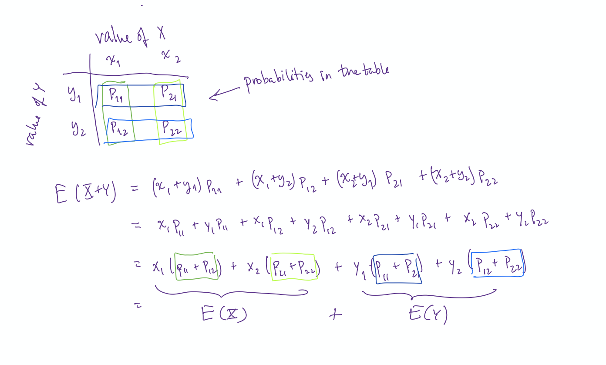

```{r setup, include=FALSE}
knitr::opts_chunk$set(echo = TRUE)
```

\def\prob{p}
\def\Prob{p}
\def\E{\mathrm{E}}
\def\intersect{\cap}
\def\union{\cup}
\def\To{\Rightarrow}


<script src="../../../styles/folding.js"></script>

### Daily Dope Sheet 

## Friday, April 3: Expectation is Linear

#### Homework 
      
* due today:  WW 10 and PS 8 
    * Submit PS 8 via <https://gradescope.com>. Let me know if you did not get an invite 
    to our class.
    * Here's how to do it.
    
    <iframe width="560" height="315" src="https://www.youtube.com/embed/KMPoby5g_nE" frameborder="0" allow="accelerometer; autoplay; encrypted-media; gyroscope; picture-in-picture" allowfullscreen></iframe>
    
    * Seems like the new system is working well so far.
    
# due Monday, April 6: WW 11 and PS 9

#### Stuff to do

1. Get today's worksheets. We'll be working mainly on Section 9 (Expected Value)

    * [PDF](../counting-and-probability/Counting-and-Probability.pdf) 
    * [HTML -- section 10](../counting-and-probability/more-expected-value.html)

2. Today's Theme: Expected Value is Linear

    * The most important things today: 
        * Understand what it means to say that expected value is linear.
        * Use linearity to simplify computing expected values.
        
    * Be sure to complete Exercise 1 - 13.  
    
    * Problem 14 is about proving that the Linearity Theorem is true.
    It's not hard, just a bit of algebra. But the intuition is probably
    just as important. For example, if on average $X$ produces 5
    and $Y$ produces 2, it makes sense that on average $X +Y$ should be 
    $5 + 2$.
    
    * Problems 15-17 show some more intersting ways to use linearity.
    **It would be good to do at least one of these**. (You may recognize 
    a couple of them from past worksheets.)

#### Comments/Hints/Solutions

\def\emptystring{\lambda}

<div class = "explain" label = "Exercise 10.1">

value of $5-X$  |    4   |   3   |   2   |   1
:----------: | :----: | :---: | :---: | :---:
probability  |  0.1   |  0.2  |  0.3  |  0.4

</div>

<div class = "explain" label = "Exercise 10.2">

2. Below is a probability table for $X$.  Create probability table for $X^2$ and $2X + 3$.

value        |   -1   |   0   |   1  
:----------: | :----: | :---: | :---: 
probability  |  0.2   |  0.5  |  0.3

---

##### Solution

If we just square the value this time, we get two columns with the same value because
there are two value of $X$ (1 and -1) that lead to the same value of $X^2$ (1):

 value of $X^2$ |   1    |   0   |   1  
:-------------: | :----: | :---: | :---: 
  probability   |  0.2   |  0.5  |  0.3
  
These can be combined to get

 value of $X^2$ |   0   |   1  
:-------------: | :---: | :---: 
  probability   |  0.5  |  0.5


We don't have this issue for $2X + 3$, so our table still has 3 values and 3 probabilities:

 value of $2X + 3$ |   1   |   3   |   5  
:-------------: | :----: | :---: | :---: 
  probability   |  0.2   |  0.5  |  0.3
</div>

<div class = "explain" label = "Exercise 10.3">

3. Below is a probability table for $X$.  Create probability tables for $X^2$ and for $2X$.

value of $X$ |    0   |   1   
:----------: | :----: | :---: 
probability  |  0.7   |  0.3 

---

##### Solution

value of $X^2$ |    0   |   1   
:------------: | :----: | :---: 
probability    |  0.7   |  0.3 

value of $2X$  |    0   |   2   
:------------: | :----: | :---: 
probability    |  0.7   |  0.3 

Notice that $X^2 = X$ in this example (because $0^2 = 0$ and $1^2 = 1$).

</div>

<div class = "explain" label = "Exercise 10.4">
<video width="600" controls>
  <source src="recordings/probs-from-2way-table-p1.mp4" type="video/mp4">
  Your browser does not support HTML5 video.
</video>
</div>

<div class = "explain" label = "Exercise 10.5">
<video width="600" controls>
  <source src="recordings/probs-from-2way-table-p2.mp4" type="video/mp4">
  Your browser does not support HTML5 video.
</video>
</div>

<div class = "explain" label = "Exercise 10.6">
6. Create three probability tables, one for 
   $X$, one for $Y$, and one for $X + Y$.  [Hint: Start by determining the possible values.]
   
---

##### Solution

   value of $X$ |   1    |   2   |   3  
:-------------: | :----: | :---: | :---: 
  probability   |  0.3   |  0.3  |  0.4


   value of $Y$ |   1    |   2   |   3  
:-------------: | :----: | :---: | :---: 
  probability   |  0.45  |  0.25 |  0.3

   value of $X + Y$ |   2    |   3   |   4   |   5   |   6
:-----------------: | :----: | :---: | :---: | :---: | :---:
  probability       |  0.1   |  0.2  |  0.4  | 0.25  | 0.05
  
</div>

<div class = "explain" label = "Exercise 10.7">

\begin{align*}
\E(X) &= 1 (0.3) + 2 (0.3) + 3 (0.4) = 0.3 + 0.6 + 1.2 = 2.1 \\
\E(Y) &= 1 (0.45) + 2 (0.25) + 3 (0.3) = 0.45 + 0.5 + 0.9 = 1.85 \\
\E(X + Y) & = 2 (0.1) + 3 (0.2) + 4 (0.4) + 5 (0.25) + 6 * 0.05) = 3.95\\
\end{align*}
</div>

<div class = "explain" label = "Exercise 10.9 -- Sum of 2 4-sided dice" >

For one die, the values are 1, 2, 3, and 4, each with probability 1/4.  So
the expected value is 

$$
1 \cdot \frac14 + 2 \cdot \frac14 + 3 \cdot \frac14 + 4 \cdot \frac14 = 2.5
$$
So our rule for sum would be

$$
\E(\mbox{sum of two dice}) = \E(\mbox{first die}) + \E(\mbox{second die}) = 2.5 + 2.5 = 5.0
$$

Or we can make a probability table for the sum:

   value of sum     |   2    |   3   |   4   |   5   |   6   |   7   |   8
:-----------------: | :----: | :---: | :---: | :---: | :---: | :---: | :---:
  probability       |  1/16  |  2/16 |  3/16 | 4/16  | 3/16  |  2/16 | 1/16


From this we get

\begin{align*}
\E(S) &= 
2 \cdot \frac1{16} +
3 \cdot \frac2{16} +
4 \cdot \frac3{16} +
5 \cdot \frac4{16} +
6 \cdot \frac3{16} +
7 \cdot \frac2{16} +
8 \cdot \frac1{16} 
\\[4mm]
&= 
\frac{2 + 6 + 12 + 20 + 18 + 14 + 8}{16} \\[4mm]
&= 5.0
\end{align*}

```{r, include = FALSE}
(2:8) * c(1,2,3,4,3,2,1)
sum((2:8) * c(1,2,3,4,3,2,1))
```

</div>

<div class = "explain" label = "Exercise 10.10 -- Sum of 2 6-sided dice">
The expected value of the sum of two dice is 7.
</div>

<div class = "explain" label = "Exercise 10.11 -- Names in a hat">
Watch this video to see how to handle the case with 5 people.  Then see if you
can do 10 people, 20 people, and 1 person.

<video width="600" controls>
  <source src="recordings/names-in-hat-5people.mp4" type="video/mp4">
  Your browser does not support HTML5 video.
</video>
</div>

<div class = "explain" label = "Exercise 10.12 -- Binom(1,p)">
Start by creating a  probability table.
What are the possible values? What is the probability of each?
</div>

<div class = "explain" label = "Exercise 10.13 -- Binomial distributions">

If $X \sim {\sf Binom}(n,p)$, we can write $X$ as $X = X_1 + X_2 + \cdots X_n$, where
each $X_i$ is either 0 or 1.

* Say in words what $X_3$ is.
* What is $\E(X_3)$?
* How does this help us compute $\E(X)$?
</div>

<div class = "explain" label = "Exercise 10.14 -- Proof of linearity">

Remember: Expected value is the sum of values time probabilities. Let's use that.

Let $Y = aX+b$, then the values of $Y$ are $av + b$ where $v$ is a value of $v$,
and $\Prob(Y = av + b) = \Prob(X = v)$, so

\begin{align*}
\E(Y)  &= \sum \overbrace{(av + b)}^{\mbox{value of $Y$}} \cdot 
\overbrace{\Prob(X = x)}^{\mathrm{probability}}\\
      &= a \sum \overbrace{v}^{\mbox{value of $X$}} \Prob(X = v) + \sum b \Prob(X = v)\\
      &= a\E(X) + b \cdot 1 = a \E(X) + b
\end{align*}
where all of the sums are over all possible values of $v$.

The proof for the sum of two random variables is similar, but the algebra is a little clunkier.
But the idea isn't that complicated.  Here's an illustration when $X$ and $Y$ each have 
two possible values.  The general case is just the same, but the sums are longer. 



General case:

\begin{align*}
\E(X + Y) &= \sum_x \sum_y(\overbrace{(x + y)}^{\mbox{value of $X +Y$}} \cdot \Prob(X = x \land Y = y)
\\
&= \sum_x \sum_y\overbrace{x}^{\mbox{value of $X$}} \cdot \Prob(X = x \land Y = y)  
+  \sum_y \sum_x\overbrace{y}^{\mbox{value of $Y$}} \cdot \Prob(X = x \land Y = y)  
\\
&= \sum_x x \sum_y  \Prob(X = x \land Y = y)  
+  \sum_y y \sum_x  \Prob(X = x \land Y = y)  
\\
&= \sum_x x \cdot \Prob(X = x)  
+  \sum_y y \cdot \Prob(Y = y)  
\\
&= \E(X) + \E(Y)
\end{align*}
</div>

<div class = "explain" label = "Exercise 10.15 -- Number of diamonds">
Let's do this one just like the names in a hat problem.
Let $D$ be the number of diamonds in the full 5-card hand, and let 
$D_1,  D_2,  D_3,  D_4,  D_5$ be 0-1 random variables such that 
$D = D_1 +  D_2 + D_3 + D_4 + D_5$.

* Say in words what $D_4$ is.
* What is $\Prob(D_4 = 1)$?
* Compute $\E(D_4)$.
* How does this help you compute $\E(D)$?

</div>

<div class = "explain" label = "Exercise 10.16 -- Rolling 4's">
This problem is very similar to Exercise 15. Can you take advantage of that?
</div>

<div class = "explain" label = "Exercise 10.17 -- Unique numbers rolled">
This problem can also be done like problems 15 and 16, but you need to be cleverer
about how you create your sum. 


<div class = "explain" label = "Exercise 10.17 -- Unique numbers rolled (part 1)">
<video width="600" controls>
  <source src="recordings/unique-die-rolls-p1.mp4" type="video/mp4">
  Your browser does not support HTML5 video.
</video>
</div>

<div class = "explain" label = "Exercise 10.17 -- Unique numbers rolled (part 2)">
<video width="600" controls>
  <source src="recordings/unique-die-rolls-p2.mp4" type="video/mp4">
  Your browser does not support HTML5 video.
</video>
</div>
</div>

<br><br>