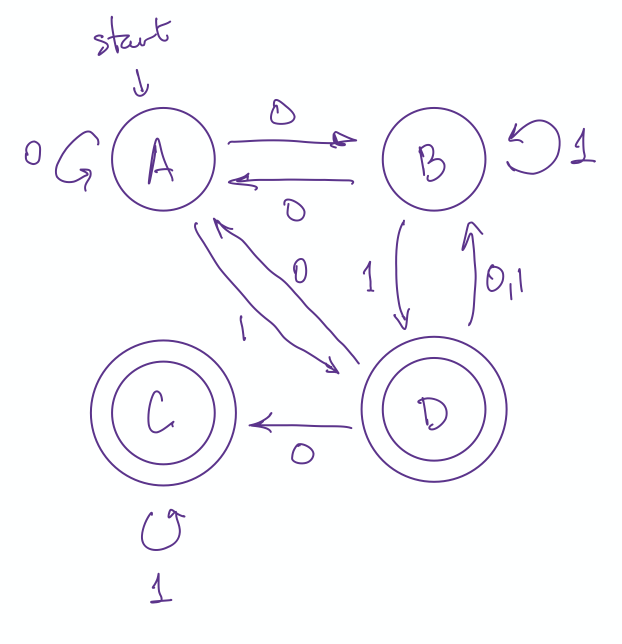

```{r setup, include=FALSE}
knitr::opts_chunk$set(echo = TRUE)
```

\def\prob{p}
\def\Prob{p}
\def\intersect{\cap}
\def\union{\cup}
\def\To{\Rightarrow}


<script src="../../../styles/folding.js"></script>

### Daily Dope Sheet 

## Wednesday, April 15: Nondeterminisitic Finite State Automata (NFAs)


#### Homework 

* due today: PS 12 (submit via [gradescope](https://gradescope.com))
* due Friday: PS 13 (submit via [gradescope](https://gradescope.com))
    
#### When is Test 2 going to be?

That's a good question. I've been working with Calvin to set up an online test-taking solution,
but it isn't ready yet, and it looks like it will be at least another week before it is in place.
So here is what I propose:

1. We will have 2 tests and a final instead of 3 tests and a final.  (I mentioned this possibility
on our lass day of in-person class, and it looks like that is going to be our best solution.)

2. The grading scheme will be adjusted to the following:

    * Homework: 20%
    * 2 Tests: 25% each
    * Final: 30%
    
    As before, if your final exam is better than your lower test, I'll replace that test with
    your final exam grade.  In that case the grading scheme becomes
    
    * Homework: 20%
    * Worse Test: 0%
    * Better Test: 25% 
    * Final: 50%

3. I'll let you know the date of Test 2 and the test logistics as soon as I know them.

    I can't announce a test date until I have a better idea when the test system will be in place.
    And I can't explain the logistics until I can see just what they are. But as I currently
    understand it, the main components will be
    
    * Most of you will take this 11:30-12:30 on one of our class days.
    If that doesn't work for you, I'll make alternative arrangements with you.
    * The test will be delivered to you online (probably via moodle) with a limited time to
    complete the test.  
    * Some responses may be collected via moodle; other parts you write on blank paper and 
    submit via gradescope shortly after completing the test.
    * Your laptop camera will be used to monitor you and your workspace while you take 
    the test.
    (**If for some reason you do not have access to a laptop with a web cam, let me know so I can begin thinking about alternative solutions.**
    It should be fine to borrow
    someone else's computer for the test.)
    * If we go with the system it looks like we will go with, it will provide you with a 
    simple online calculator you can use if you don't have one or left yours at Calvin when
    you moved out.  No other online resources will be allowed during the test.
    
    Again, I'll refine this list when I know more.  I'll likely also schedule a practice
    test session so you can try everything out in advance of the test. We will try to make 
    this as easy as is possible in the new course configuration.

#### What we are learning to day

Last time we learned about deterministic finite state automata (DFAs).  Today we will
learn 

* about **nondeterministic** finite state automata (NFAs), and 
* what it means for two automata or grammars to be **equivalent**.

NFAs are a lot like DFAs. With a DFA, there was always exactly one thing you
could do for each symbol processed -- the next step was completely determined.
With an NFA, you may have multiple options, or no options at all!

#### Worksheet

Begin today at section 3.4 (Equivalent Automata and Grammars).

* [HTML](../models-of-computation/finite-state-automata.html)
* [PDF](../models-of-computation/Models-of-Computation.pdf)

Your goal should be to get to at least Exercise 17.  Exercises 18 and 19 will help get you
ready for next time, so I recommend that you spend some time thinking about those as well,
but make sure you are good with 7 - 17 first.

Note: Rosen likes to label his states $s_0$, $s_1$, etc.  I find that clunky and 
**I suggest that you not bother with subscripts when creating your own machines.** 
You can use numbers, or letters, or even short words or phrases that identify
what a state represents. The worksheet will show you both styles.

#### Note about notation (repeated from last class period)

The Zybook and the Rosen text use different letters to denote the same things.
The letters are not as important as the ideas. Here is a table to help you
translate. I've included the notation used in the Wikipedia article on DFAs
just to show you another notation that is used.

concept                | Zybook notation      | Rosen notation      | Wikipedia notation
---------------------- | :------------------: | :-----------------: | :----------------------
&nbsp;                 | finite state machine | finite state automaton | finite automaton
transition function    | $\delta$             | $f$ (or $f$ and $g$)   | $\delta$
extended transition function    | none        | $f^*$                  | $\hat\delta$
set of states          | $Q$                  | $S$                    | $Q$
start state (usually)  | $q_0$                | $s_0$                  | $q_0$
accepting/final states | $A$                  | $F$                    | $F$
input alphabet         | $I$                  | $I$                    | $\Sigma$
output alphabet        | $O$                  | $O$                    | not discussed in DFA article

It is very important that you understand each of the concepts in this table. The
specific notation is less crucial.


#### Comments/Hints/Solutions

\def\emptystring{\lambda}

<div class = "foldable" label = "Exercise 3.4.7">
To show two automata are not equivalent, we just need to find one string on which 
they disagree (one machine accepts and the other rejects).
</div>

<div class = "foldable" label = "Exercise 3.4.8">
To show two automata are equivalent, we need to show that for any input string,
both machines give the same answer: either they both accept or they both 
reject.  This is potentially much harder since we need to say something about
*all* possible input strings, not just about one example.
</div>

<div class = "foldable" label = "Exercise 3.4.9">
These two machines are equivalent. One way to see this is to relable the states in $M_0$ as
follows:

* $s_0$ stays $s_0$
* $s_1$ stays $s_1$
* $s_2$ becomes $s_0$
* $s_3$ becomes $s_2$
* $s_4$ becomes $s_1$

Now observe that although the states are written multiple times (not technically allowed), all
the 0 edges and 1 edges out of the newly labeled states go to the same label, even if they 
go to a different vertex.
</div>

<div class = "foldable" label = "Exercise 3.4.10">

Here is one way to draw the NFA:

```{r echo = FALSE, fig.align = 'center'}

```

For a DFA there is exactly one edge out of each state for each input alphabet symbol.
For an NFA there may be none or more than one.  
Examples: Two 0 transitions out of A; no 0 transitions out of C.
</div>

<div class = "foldable" label = "Exercise 3.4.11">
There are several possible things we could choose.  Here are three:

1. Accept a string if no matter what choice you make, you always end up at an
accepting state. (We could call this the *all or nothing* system.)
2. Accept a string if the majority of choices lead you to an accepting state. 
(We could call this the *democratic* system.)
3. **Accept a string if there is some way to make choices that ends at an accepting state.**

The third option is the one that is used for an NFA.

A path through the graph o an NFA that starts at the start state and ends at an
accepting state is called an **accepting path**.  So we can rephrase 3 as 

3. **Accept a string if there is an accepting path for that string.**
</div>

<div class = "foldable" label = "Exercise 3.4.12">

* Accepted: $01, 011, 010101$

    * For each of these, you should be able to find at least one path to an accepting state.
    Let's call those accepting paths.
    Example: for 010101, we can use the path $A \to B \to B \to A \to D \to C$.

* Rejected: $00, 0000, \lambda$

    * For each of these, be sure you have a convincing argument why no accepting path
    exists.

</div>

<div class = "foldable" label = "Exercise 3.4.13">

$N_1$     |     |     |     |     |     |     |     |     |     |     
--------: | :-: | :-: | :-: | :-: | :-: | :-: | :-: | :-: | :-: | :-: 
state     |  0  |  0  |  1  |  1  |  2  |  2  |  3  |  3  |  4  |  4  
symbol    |  0  |  1  |  0  |  1  |  0  |  1  |  0  |  1  |  0  |  1   
new state | {0,2} | {1} | {3} | {4} | {} | {4} | {3} | {} | {3} | {3}

</div>

<div class = "foldable" label = "Exercise 3.4.14">

I'll get you started with a few of these ...

* $\lambda$: accepted
* $00$: accepted ($s_0 \to s_0 \to s_0$)
<!-- * $01$: accepted ($s_0 \to s_2 \to s_4$) -->
* $010$: rejected (No 0 arrows into $s_4$, and once we see a 1, we can't get back to $s_0$.)
<!-- * $011$: accepted ($s_0 \to s_0 \to s_1 \to s_4$) -->
* $001$: accepted ($s_0 \to s_0 \to s_2 \to s_4$)
</div>

<div class = "foldable" label = "Exercise 3.4.15">
To show that a string is accepted, we just need to show an accepting path. It is easy for
someone to check that our claimed path is correct.

To show that a string is not accepted, we need to give a convincing argument that
no accepting paths exist. This is potentially more challenging.
</div>

<div class = "foldable" label = "Exercise 3.4.16">

Here are two questions to think about before you look at the solution:

a. What sorts of paths start and end at $s_0$?
b. What sorts of paths start at $s_0$ and end at $s_4$?

Why are these the important questions?

<div class = "foldable" label = "Solution">
A string is in the language if one of the following is true:

1. the string has only 0s (including the empty string)
    * these loop at the start state, which is accepting.
2. the string has at least one 0 followed by a single 1 (01, 001, 0001, 00001, etc)
    * if you get sick of looping you can take the "lower path" with a 01 to get
    to an accepting state.  If you go any farther, you can't get back to an accepting state.
3. the string has any number of 0s (including none) followed by two 1s 
  (11, 011, 0011, 00011, etc.)
    * if you get sick of looping you can take the "upper path" with a 11 to get
    to an accepting state.  If you go any farther, you can't get back to an accepting state.

This is relatively easy to figure out because

a. the machine is pretty small, and 
b. there is no way to "double back" -- once you leave a state, you can't ever return.

You can imagine that determining the language could be harder for a more complicated
NFA.

</div>
</div>

<div class = "foldable" label = "Exercise 3.4.17">
Since every DFA is an NFA (one with exactly one choice in each situation), 
we have more options when we design NFAs, so it is never harder to make an NFA.

Also, NFAs often (but not always) have fewer states and/or transitions, which
can make them easier to work with.

</div>


<div class = "foldable" label = "Exercise 3.4.18 and 3.4.19">
These two problems are going to be a major focus of our next class period. 
So keep thinking about them until then.
</div>

<br><br>
