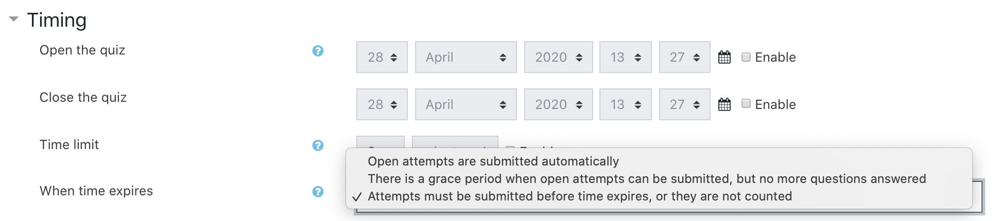
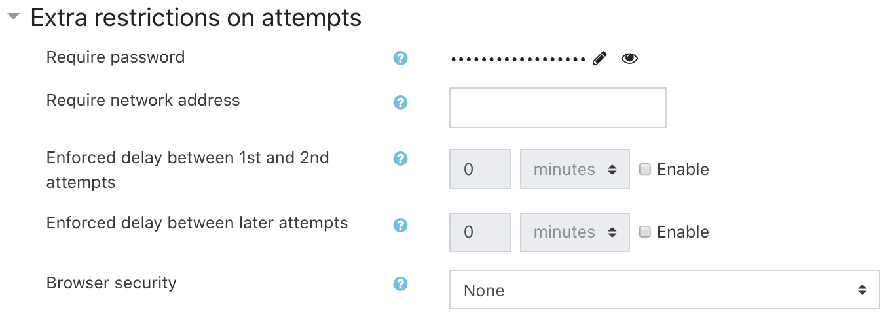
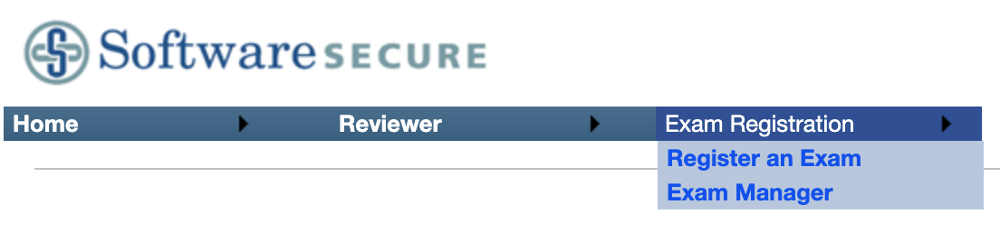
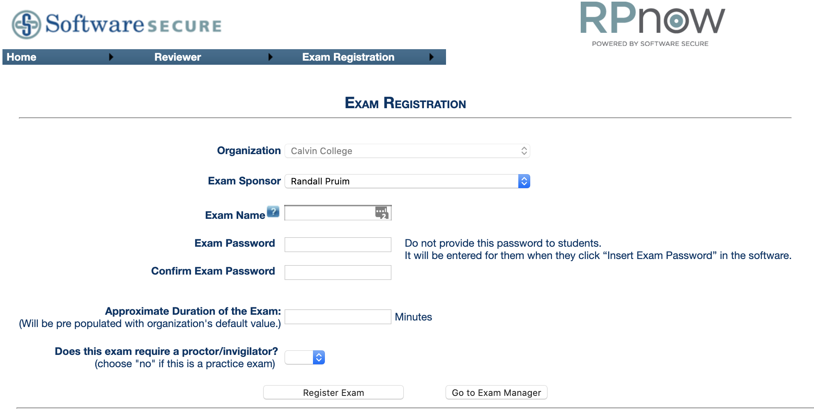

```{r setup, include=FALSE}
knitr::opts_chunk$set(echo = TRUE)
```

## What is RPnow?

RPnow (Remote Proctor now) is a service that monitors your computer activity and
video records students while they take a test. Instructors specify what is or is not
allowed during the test, and activities that appear to be in violation are flagged
for instructor review.

## Preparing the test in Moodle

The test itself is delivered as a Moodle quiz. You can set this up pretty much any way you like using the 
testing features in Moodle or just providing questions that students answer on paper and submit online.

The important things are:

* Set the **timing requirements** to restrict how much time students have for the test and when they may begin.

```{r echo = FALSE, fig.align = "center", out.width = "70%"}    

```

* Set a **password** for the test. 

    * This is how you require students go through RPnow to get to the test.
    * **Do not tell the students what the password is!**
    * This is located in an odd place: **Extra restrictions on attempts**

```{r echo = FALSE, fig.align = "center", out.width = "60%"}    

```
   
* If you are going to have students submit **hand-written work**, make sure you have a system
in place to collect it (examples: Moodle assignment, gradescope).  You may want to require 
students to enter some information about their solution (a number, the answer to some
qualitative question about their solution) in Moodle as a cross-check that what they
submit matches what they had done during the exam.

* The [**exams**](http://www.r-exams.org/) package in R makes it pretty easy to 
create a question bank with randomized problems and computed answers, mathematical notation,
R output (including plots). The result is an XML file that you import into Moodle's question
bank.  Then you can use the problems (including randomly selecting one of a set of 
related problems created in R) in your Moodle quiz.

## Setting things up in RPnow

* Website: <https://calvin.remoteproctor.com/adminsite>

* You will need to have an administrator create an account for you.

* Login and resister your exam.

```{r echo = FALSE, fig.align = "center", out.width = "60%"}    

```

* Name your exam with something that indicates your 
**the semester**, **course**, and **which test**. 
Example: 20SP Math252 Test 2

    * This name will be used by your students to identify your test.

```{r echo = FALSE, fig.align = "center", out.width = "70%"}    

```

* Copy in the **password** that you entered in the Moodle quiz.  This is the only
connection betwen the two systems and keeps students form taking the Moodle quiz outside
the RPnow system.  **Do not tell the students what the password is!**

* The approximate duration is just to give the RPnow folks an idea of how much processing
they have coming their way.

* Indicate whether the exam is **procotored** or not. (Set up a non-proctored test as 
practice for your students so they can make sure that everything works and they know how
to navigate the system.  Non-proctored exams are free and highly recommended.)

* For proctored tests, you will be asked to fill out **information about what is permitted**
during your test and the **time window** in which the test can be taken.

    * RPnow will provide its report with five days of the test window closing.


## Communicate with students

You might model your communication on [this example](RPnow.html).

