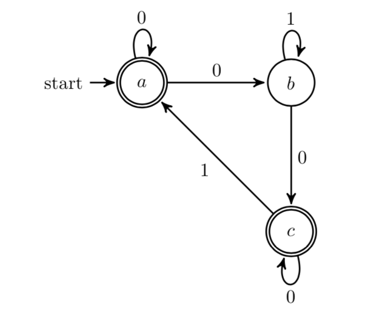
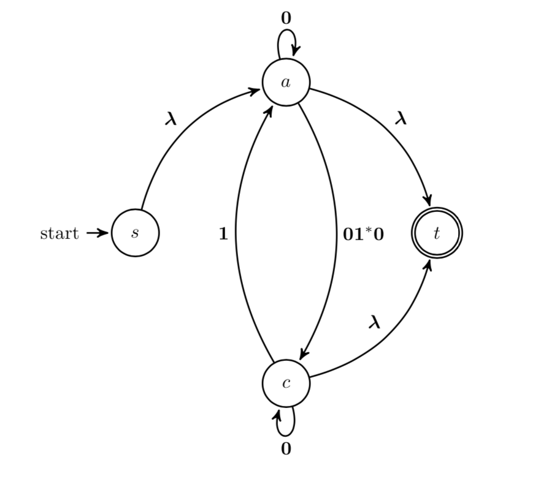

---
output:
  html_document:
    includes:
      before_body: ../header.shtml
    css: ../../styles/rpruim2017.css
---

```{r setup, include=FALSE}
knitr::opts_chunk$set(echo = TRUE)
require(dplyr)
require(tidyr)
require(kable)
require(kableExtra)
require(scales)
t1bks <- c(20, 33, 45, 57, 69, 83) %>% rev()
  # c(20, 43, 54, 65, 76, 88) %>% rev()
t2bks <- c(20, 40, 50, 60, 70, 86) %>% rev()
t3bks <- c(5, 20, 29, 38, 48, 58)  %>% rev()

fbks  <- c(25, 74, 96, 118, 140, 165)  %>% rev()
GS <- 
  data_frame(
    Grade = LETTERS[1:4],
    `test 1` = head(paste(lead(t1bks), "-", (t1bks)), 4),
    `test 2` = head(paste(lead(t2bks), "-", (t2bks)), 4),
    `test 3` = head(paste(lead(t3bks), "-", (t3bks)), 4)
    # `final`  = head(paste(lead(fbks),  "-", (fbks)), 4)
  ) %>% 
  arrange(Grade)
```

## Test Information

Information about tests will be posted here shortly before each test.

### Black out date requests

You can request that we not have a test on a particular day by filling out 
[this form](https://docs.google.com/forms/d/e/1FAIpQLSdVNA5aqsRvNoyUjPRU_fxG1MIj4LGfIrzOFs37PjQjzuXPDw/viewform?usp=sf_link)
I can't promise to 
meet all requests, but I'll do what I can to work with the data.

<!-- ### Grading Scales -->

<!-- Here are the grading scales used for each of our tests and the final. -->

<!-- ```{r, echo = FALSE} -->
<!-- kable(GS) %>% -->
<!--   kable_styling(bootstrap_options = "striped", full_width = F) %>% -->
<!--   row_spec(1, bold = F, color = "gray20", background = alpha("steelblue", 0.3)) %>% -->
<!--   row_spec(2, bold = F, color = "gray20", background = alpha("navy", 0.3)) %>% -->
<!--   row_spec(4, bold = F, color = "gray20", background = alpha("forestgreen", 0.3)) %>% -->
<!--   row_spec(3, bold = F, color = "gray20", background = alpha("limegreen", 0.2)) -->
<!-- ``` -->

### Test 1

**Date:** Friday, March 6

**Material Covered**: Graphs (Rosen chapter 10.1-10.5, 10.7) and Counting (Rosen 6.1-6.5)

#### Topics

**Graphs:**
modeling with graphs (what do edges and vertices represent?);
types of graphs(directed, undirected, self-loops, etc., etc.);
graph terminology (examples: vertex, edge, adjacent, degree, bipartite, path, connected,
connected component);
graph representations (adjacency matrix, incidence matrix, edge list, adjacency list);
graph isomorphism; graph invariants;
Euler paths and circuits; Hamilton paths and circuits;
planar graphs; Euler's formula; Kuratowski's Theorem; 
proving a graph is not planar *without* using Kuratowski's Theorem (like we did for 
$K_{5}$ and $K_{3,3,}$.

**Counting:**
bijection principle (no double counting, no skipping);
multiplication principle; addition principle; subtraction principle;
inclusion-exclusion;
division principle; 
pigeonhole principle;
permutations and combinations;
binomial coefficients;
the "donut problems".


### Test 2

**Date:** Friday, May 1

**Material Covered**: 

* Counting and Probability (Rosen 6 and 7)
* Languages, Grammars, and Automata (Rosen 13.1 -- 13.4)

#### Logistics

We will be using a system called RPNow (Remote Proctor Now) which you 
will access via Moodle.
I'm still figuring exactly how the system works,
so stay tuned for details.

I will be setting up a demo test so that you can go through all of the
steps ahead of time and make sure that everything works before the test.


#### Topics

**Counting:**
Bijection principle (no double counting, no skipping);
multiplication principle;
addition principle;  division principle;
inclusion-exclusion;
permutations and combinations; binomial coefficients;
inclusion-exclusion.

**Probability:**
Definition of finite probability and applications involving counting problems;
empirical vs theoretical probability;
3 probability axioms;
complement rule;
equally likely rule;
union rule;
conditional probability;
indepedence;
Bayes probability (e.g., false positives and false negatives);
probability trees;
random variables;
expected value of a random variable;
linearity of expected value;
Binomial distributions.

**Grammars:** Components of a grammar (terminals, nonterminals, start symbol,
production rules, etc.), derivations, language generated by a grammar, types of
grammars (regular, context sensitive, context free).

**Automata:** Components of an automaton (input alphabet, states, start state,
final states, transition funciton), DFA, NFA, language recognized by
an automaton, building up a complex automaton from component
automata; .

**Regular expressions:** Notation, three base cases and three operations, language
represented by a regular expression.

**Regular languages:** Equivalence of regular expressions, regular grammars,
DFAs, and NFAs.  You should know how to do the following conversions: 
DFA $\to$ NFA; 
NFA $\to$ DFA; 
regular expression $\to$ NFA; 
regular grammar $\to$ NFA;
NFA $\to$ regular grammar;
DFA/NFA $\to$ regular expression.  

Basically, you should know all the arrows on this diagram:

$$
\Large
\begin{array}{ccccccc}
\mathrm{DFA} & \longleftrightarrow & \mathrm{NFA} & \longrightarrow & \lambda\mathrm{-NFA} & \longrightarrow & \mathrm{GNFA} \\
&& \downarrow \uparrow & \nwarrow  &  & \swarrow  \\
& & \mathrm{regular}& & \mathrm{regular} \\
& & \mathrm{grammar}& & \mathrm{expression} 
\end{array}
$$

Notes: 

* Counting topics will largely arise in the context of probability calculations.
* Some of you may have seen extended regular expressions that include additional operators like $+$. These
are **not** included in our definition of regular expression.  (We will say something more about these later.)

<!-- ### Test 3 -->

<!-- **Date:** Friday, May 3 -->


<!-- ### Final Exam -->

<!-- **Date/Time:** 1:30 on Wednseday, May 15 or 9am on Thursday, May 16.  -->
<!-- (Please come to the time you have indicated so I have enough exam papers.) -->

<!-- **Material Covered**: The exam will cover topics from the entire semester. -->
<!-- In addition to the topics listed above for each test, the following topics are -->
<!-- also included: -->

<!-- * Showing languages are not regular (Pumping Lemma). -->
<!-- * **Python regular expressions** (at the level of the slides we used and the regular -->
<!-- expression game). -->
<!-- * **Turing Computation**: Definition of Turing machine, tracing Turing machines, -->
<!-- designing Turing machines, Turing computable languages, all regular languages -->
<!-- are Turing computable, Halting Problem. -->

<!-- An example question that could have been on test 3: -->

<!-- > We learned an algorithm for converting any DFA into a regular expression. -->
<!-- This problem asks you a few questions about that algorithm. -->

<!-- > a. In the first phase of the algorithm, -->
<!-- we must modify the automaton to make sure it -->
<!-- satisfies some properties that are necessary for the algorithm to work correctly. -->
<!-- What are those properties? -->
<!-- > b. Demonstrate how to do the first phase using the DFA below. -->

<!-- ```{r echo = FALSE, out.width="50%", fig.align = "center"} -->
<!--  -->
<!-- ``` -->

<!-- > c. In the second phase, states are ``ripped out" of a GNFA until -->
<!-- only two states remain.  Using that process, show what happens -->
<!-- when state $a$ is ripped out of the GNFA shown below. -->
<!-- (You don't have to complete the process, just do this one step.) -->

<!-- ```{r echo = FALSE, out.width="50%", fig.align = "center"} -->
<!--  -->
<!-- ``` -->

