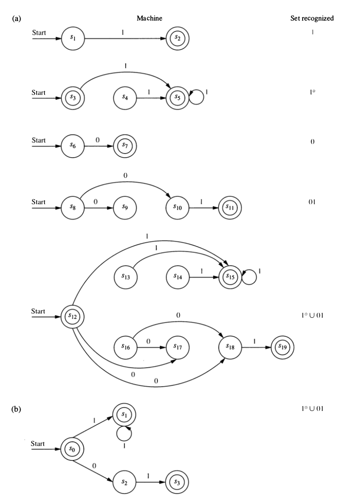

```{r setup, include=FALSE}
knitr::opts_chunk$set(echo = TRUE)
library(qrcode)
library(mosaic)
library(rjp)
library(tidyr)
set.seed(123)
spaces <- function(n) {
  paste(rep(" ", n), collapse = "")
}
Roster <- read.csv('../../../grades/S21/Math252-S21-roster-clean.csv') %>%
  mutate(name = paste(first, last))
```

<script src="../../styles/folding.js"></script>

<style>
div.indent {
  margin: 0 0 0 25px;
}
</style>

\def\prob{\operatorname{P}}
\def\Prob{\operatorname{P}}
\def\tand{\operatorname{and}}
\def\tor{\operatorname{or}}
\def\tif{\operatorname{if}}
\def\intersect{\operatorname{and}}
\def\union{\operatorname{or}}
\def\intersect{\cap}
\def\union{\cup}
\def\To{\Rightarrow}
\def\emptystring{\lambda}


# Dope Sheets {.tabset}

**dope**[^webster]

* *n.* information, especially from a reliable source [the inside dope];  
* *v.* figure out -- usually used with out;                              
* *adj.* excellent

[^webster]: Definitions selected from Webster's online dictionary  

Here's where you can come to find out what's up each day. Homework 
assignments are available on the [**homework page**](../hw/). 

And here is a link to the 
[**Progress Log**](https://docs.google.com/spreadsheets/d/1uPQf12t707jXYaEEGgfD5jWbOhp5EjynERKDuNIji0E/edit?usp=sharing) 
we will often use when working in groups on Teams.

[Dope sheets for weeks 1 - 5](dope01.html)

[Dope sheets for weeks 6 - 7](dope02.html)

[Dope sheets for weeks 8 - 9](dope03.html)


## Week 10 

### Mon 4/5

* New Groups

```{r echo = FALSE, results = "asis", include = TRUE}
set.seed(40520215)
R <- shuffle(Roster) %>% group_by(section) %>% 
  mutate(group = rep(1:5, length.out = n())) %>%
  mutate(group = ifelse(section == "B", group + 5, group))
         
for(g in 1:10) {
  cat(paste0('  * Group ', g, ": ", paste(R %>% filter(group == g) %>% pull(name) %>% sort(), collapse = ", "), "\n"))
}
```

* Homework

  * Find homework in the "after test 2" section now.
  * PS 13 due on Wednesday

* **Topic of the Day:** More finite state automata 

  * Worksheet: 
    [[HTML]](models-of-computation/finite-state-automata.html)
    [[PDF]](models-of-computation/finite-state-automata.pdf)
    
  * **Start at question 3** to get back into this after a week away from
  automata.

### Wed 4/7

* **Topic of the Day:** DFAs and NFAs

  * A couple things from last time
  
      * #6 d and e -- how to design a DFA (and what the states are) 
      * definition of NFA
      
  * Worksheet: 
    [[HTML]](models-of-computation/finite-state-automata.html)
    [[PDF]](models-of-computation/finite-state-automata.pdf)
    
      * Start at #10 and don't go beyond #19.
      * If you get through #19, don't leave without checking in with me.

### Fri 4/9

* Your **tests have been graded**.  I hope to post information about that later today.

* **Topics of the Day:** 

    * **DFAs and NFAs are equivalent**


        The last two days we learned about DFAs and NFAs.  Today we will learn that the
two models are equivalent: Every language recognized by one type of machine is
also recognized by the other.

    * **Regular Expressions**
    
        Regular expressions are a useful system for describing languages

* Before we get going, let's go back and think about an exercise from last time.
  
<div class = "indent">  
<div class = "explain" label = "Exercise 3.5.14">
There are (at least two ways) to think about searching for accepting 
paths in an NFA.  If you are familiar with the terms depth-first and breadth-first,
they correspond to those.

* depth-first: Follow a single path to its end.  If it is an accepting path, you
have found one and your are done.  If not, start over (or better do some back tracking)
to try a different path.  Keep going until you find an accepting path or have 
exhausted all possibilities.

* breadth-first pebbling: In this approach  
  we can imagine placing pebbles on the graph of the NFA representing all the 
  states we could get to at a particular step in processing a string.  
  
    1. We start with a pebble on the start state. 
    2. At each step me move pebbles to any state we could reach from one 
    of the currently pebbled states.
    3. When we are done, we check to see whether an accepting state has a pebble.

Let's illustrate the pebbling method using Exercise 3.5.14 on the string $011$.

[YouTube](https://youtu.be/BrUbzZ3QDSY):

<iframe width="560" height="315" src="https://www.youtube.com/embed/BrUbzZ3QDSY" title="YouTube video player" frameborder="0" allow="accelerometer; autoplay; clipboard-write; encrypted-media; gyroscope; picture-in-picture" allowfullscreen></iframe>


If we are doing this with pencil and paper, we could instead keep a record like this:

$$
\{s_0\} \stackrel{0}{\to} \{s_0, s_2\} \stackrel{1}{\to} \{s_1, s_4\} \stackrel{1}{\to} \{s_4, s_3\}
$$

or even more succinctly (since each state can be identified with a single character) as 

$$
0 \stackrel{0}{\to} 02 \stackrel{1}{\to} 14 \stackrel{1}{\to} 43
$$
Since $s_4$ is an accepting state, there is an accepting path -- there is some way to
get to that state.


Here's another illustration using the string $010$.

[YouTube](https://www.youtube.com/embed/r5iqJqWif2U):

<iframe width="560" height="315" src="https://www.youtube.com/embed/r5iqJqWif2U" title="YouTube video player" frameborder="0" allow="accelerometer; autoplay; clipboard-write; encrypted-media; gyroscope; picture-in-picture" allowfullscreen></iframe>

<!-- <iframe width="800" height="450" -->
<!-- src="https://www.youtube.com/embed/r5iqJqWif2U?rel=0&showinfo=0&autohide=1"  -->
<!-- frameborder="0" allow="accelerometer; encrypted-media; gyroscope; picture-in-picture" allowfullscreen> -->
<!-- </iframe> -->

Here's the pencil-and-paper version (succinct notation):

$$
0 \stackrel{0}{\to} 02 \stackrel{1}{\to} 14 \stackrel{0}{\to} 3
$$

Notice:

* At the last step, two pebbles go to the same place, so the number of states goes from 2 to 1.
* Since $s_3$ is not an accepting state, there is no accepting path and $010$ is not in the
language recognized by this machine.
</div>
</div>
<br>

* Worksheets:  We will cover Section 3.6 (Equivalence of DFA and NFA) 
    and sections 4.1-4.2 (about regular expressions)

    * [HTML](models-of-computation/finite-state-automata.html)
    * [PDF](models-of-computation/Models-of-Computation.pdf)


\def\emptystring{\lambda}

<div class = "indent">
<div class = "explain" label = "Comments/Hints/Solutions">

Note: Rosen likes to label his states $s_0$, $s_1$, etc.  I find that clunky and 
**I suggest that you not bother with subscripts when creating your own machines.** 
You can use numbers, or letters, or even short words or phrases that identify
what a state represents. The worksheet will show you both styles.

<div class = "explain" label = "Exercise 3.6.21">

Hint: Think about the pebbling algorithm.  How do the pebbles relate
to states in a DFA?

Make sure you give this a good attempt before comparing your work to this solution.

<div class = "explain">
```{r, echo = FALSE, out.width = "80%", fig.align = "center"}
knitr::include_graphics('images/NFA2DFA-example1sol.png')
```
</div>

</div>

<div class = "explain" label = "Exercise 3.6.22">

It isn't important where you put the states, but it is important that the edges and labels
match.

```{r, echo = FALSE, out.width = "80%", fig.align = "center"}
knitr::include_graphics('images/DFA-Fig7-13-3-8.png')
```
</div>

<div class = "explain" label = "Exercise 3.6.23">

In the worst case there is a state in the DFA for every possible set of states in the NFA.
If the NFA has $n$ states, how many subsets of states are there?  Hint: to build a subset, you
need to decide for each state whether it is in our out of the subset.  Now you use your counting
rules.
</div>

\newcommand{\mybold}[1]{\boldsymbol{#1}}

<div class = "explain" label = "Exercise 4.1.1">
What strings belong to $\{0, 01\}^2$? Let's add a vertical bar to show how the strings
are formed.  We need to have two pieces, and each piece must be either 0 or 01, so

* $0|0  \to 00$
* $0|01  \to 001$
* $01|0  \to 010$
* $01|01  \to 0101$
</div>

<div class = "explain" label = "Exercise 4.1.2">
Which of these strings belong to $\{0, 01\}^*$?

a. $01001$.  Yes: $01|0|01$
b. $10110$.  No: Cannot start with a $1$.
c. $00010$.  Yes: $0|0|01|0$. 
</div>

<div class = "explain" label = "Exercise 4.1.3">
Which of these strings belong to $\{101, 111, 11\}^*$?

a. $1010111$.  No.  You can start 101, but then you are stuck.
b. $1011011$.   No.  You have to start 101, then 101 again, but then there is only one 1 left.
c. $1110111$.   Yes.  $11|101|11$.
d. $11110111$.  Yes.  $111|101|11$
</div>

<div class = "explain" label = "Exercise 4.2.5">
$1$ is a symbol or a string with one symbol. 
$\mybold{1}$ represents a language with one string in it: $\{1\}$.

$\lambda$ is the empty string.
$\mybold{\lambda}$ represents a language containing only the empty string: $\{\lambda\}$.

$\emptyset$ is the empty set.
$\mybold{\emptyset}$ represents the empty language, but languages are sets, so the 
empty language is the empty set.
</div>

<div class = "explain" label = "Exercise 4.2.6">
Describe in words the languages represented by each of these regular expressions: 

a. $\mybold{10^*}$ is the set of all strings that begin with a 1 but don't have any other 1's.
b. $\mybold{(10)^*}$ is the set of all strings with even length that alternate 1's and 0's,
starting with a 1.  (0 is even, so the empty string is included in this description.)
c. $\mybold{0 \cup 01} = \{0, 01\}$, a language with only two strings, $0$ and $01$.
d. $\mybold{0^* \cup 01}$ consists of the string 01 and any string made up only
of 0's (including the empty string).
e. $\mybold{0 (0 \cup 1)^*}$ is the language consisting of strings that start with $0$.
f. $\mybold{(0 \cup 01)^*}$ is the language consisting of all strings that do not start with a 1 and do not have two adjacent $1$'s.  (The empty string is included in this.)
</div>

<div class = "explain" label = "Exercise 4.2.7">
All of the languages in this problem can be recognized by either a DFA or an NFA.
Do you see how to design them?
</div>

<div class = "explain" label = "Exercise 4.2.8">
This is will our topic for next time.
</div>
</div>
</div>

<!-- <div class = "explain" label = "Exercise 4.3.10"> -->

<!-- We can build up the solution bit by bit using methods for constructing unions, concatenations, -->
<!-- Kleene Star, etc. -->

<!-- ```{r, echo = FALSE, out.width = "80%", fig.align = "center"} -->
<!--  -->
<!-- ``` -->

<!-- </div> -->

<br><br>


## Week 11 

### Mon 4/12

* Test 2 has been graded.  Grading scale is on the [test info page](../test-info).

* Final countdown: Including today, we have 10 class days left, one of which will
be for Test 3. Be sure to add blackout date requests **today**.

* Where we're going

<div class = "indent">
<div class = "explain" label = "Show">

  * The main work last time was showing that NFAs and DFAs are equivalent by showing how 
  to translate any NFA into an equivalent DFA. (Translating a DFA into and NFA was 
  easier.)
  
    $$ 
    \mathrm{DFA} \leftrightarrow \mathrm{NFA}
    $$
    
  * The "arrow of the day" will be
  
    $$
    \mbox{regular expression} \to \mathrm{NFA}
    $$
  
  * So our picture will look like this
  
  

    $$
    \Large
    \begin{array}{ccc}
    \mathrm{DFA} & \stackrel{4/9}{\longleftrightarrow} & \mathrm{NFA} \\
    & \nearrow & \\
    \mathrm{regular} &&\\
    \mathrm{expression}  &&
    \end{array}
    $$


  * Eventually, we want to add regular grammars to our picture, and add some more arrows.

    $$
    \Large
    \begin{array}{ccc}
    \mathrm{DFA} & \stackrel{4/9}\longleftrightarrow & \mathrm{NFA} \\
    & \nearrow & \\
    \mathrm{regular}& & \mathrm{regular} \\
    \mathrm{expression}& & \mathrm{grammar} 
    \end{array}
    $$

We will see that all of these are equivalent.  The languages recognized/generated/expressed
by DFAs/NFAs/regular grammars/regular expressions are called **regular langauges**. 
</div>
</div>

* **Topic of the Day:** Regular Expressions and NFAs

  * Worksheets:  We will cover Sections 4.1-4.3 

    * [HTML](models-of-computation/finite-state-automata.html)
    * [PDF](models-of-computation/Models-of-Computation.pdf)
    
  * Start with questions 1 - 6 of sections 4.1 and 4.2 if you did not finish those last time. 
  Skip questions 7 and 8.
  
  * Move on to questions in Section 4.3. These walk through the process 
  of converting a regular expression into an NFA.

<div class = "indent">
<div class = "explain" label = "Show Comments/Hints/Solutions">
<div class = "explain" label = "Exercise 4.1.1">
What strings belong to $\{0, 01\}^2$? Let's add a vertical bar to show how the strings
are formed.  We need to have two pieces, and each piece must be either 0 or 01, so

* $0|0  \to 00$
* $0|01  \to 001$
* $01|0  \to 010$
* $01|01  \to 0101$
</div>

<div class = "explain" label = "Exercise 4.1.2">
Which of these strings belong to $\{0, 01\}^*$?

a. $01001$.  Yes: $01|0|01$
b. $10110$.  No: Cannot start with a $1$.
c. $00010$.  Yes: $0|0|01|0$. 
</div>

<div class = "explain" label = "Exercise 4.1.3">
Which of these strings belong to $\{101, 111, 11\}^*$?

a. $1010111$.  No.  You can start 101, but then you are stuck.
b. $1011011$.   No.  You have to start 101, then 101 again, but then there is only one 1 left.
c. $1110111$.   Yes.  $11|101|11$.
d. $11110111$.  Yes.  $111|101|11$
</div>

<div class = "explain" label = "Exercise 4.2.5">
$1$ is a symbol or a string with one symbol. 
$\mybold{1}$ represents a language with one string in it: $\{1\}$.

$\lambda$ is the empty string.
$\mybold{\lambda}$ represents a language containing only the empty string: $\{\lambda\}$.

$\emptyset$ is the empty set.
$\mybold{\emptyset}$ represents the empty language, but languages are sets, so the 
empty language is the empty set.
</div>

<div class = "explain" label = "Exercise 4.2.6">
Describe in words the languages represented by each of these regular expressions: 

a. $\mybold{10^*}$ is the set of all strings that begin with a 1 but don't have any other 1's.
b. $\mybold{(10)^*}$ is the set of all strings with even length that alternate 1's and 0's,
starting with a 1.  (0 is even, so the empty string is included in this description.)
c. $\mybold{0 \cup 01} = \{0, 01\}$, a language with only two strings, $0$ and $01$.
d. $\mybold{0^* \cup 01}$ consists of the string 01 and any string made up only
of 0's (including the empty string).
e. $\mybold{0 (0 \cup 1)^*}$ is the language consisting of strings that start with $0$.
f. $\mybold{(0 \cup 01)^*}$ is the language consisting of all strings that do not start with a 1 and do not have two adjacent $1$'s.  (The empty string is included in this.)
</div>

<div class = "explain" label = "Exercise 4.2.7">
All of the languages in this problem can be recognized by either a DFA or an NFA.
Do you see how to design them?
</div>

<div class = "explain" label = "Exercise 4.2.8">
This is will our topic for next time.
</div>
</div>
</div>
<br>

### Wed 4/14

* No Class: Advising Day
* PS 14 due at 11:59pm

### Fri 4/16

* Test 3 on Friday, 4/30

* No PS due today 

* New Groups

```{r echo = FALSE, results = "asis", include = TRUE}
set.seed(416202120)
R <- shuffle(Roster) %>% group_by(section) %>% 
  mutate(group = rep(1:5, length.out = n())) %>%
  mutate(group = ifelse(section == "B", group + 5, group))
         
for(g in 1:10) {
  cat(paste0('  * Group ', g, ": ", 
             paste(R %>% filter(group == g) %>% pull(name) %>% sort(), collapse = ", "), "\n"))
}
```

* **Topic of the Day:** Regular Grammars and NFAs

  * Worksheets:  We will cover Sections 5.1-5.2 

    * [HTML](models-of-computation/regular-grammars-and-automata.html)
    * [PDF](models-of-computation/Models-of-Computation.pdf)
    
  * If you finish with 5.1-5.2, return to 4.3.  (You will be in new groups, so
  you will have to negotiate which portions to work on.)


Today we will learn how to convert back aand forth between regular grammars and NFAs.
That adds two more arrows to our diagram:

$$
\Large
\begin{array}{ccc}
\mathrm{DFA} & \stackrel{\small 4/9}{\longleftrightarrow} & \mathrm{NFA} \\
& \stackrel{\small 4/12}{\nearrow} & \phantom{today} \downarrow \uparrow  \mathrm{\small today}\\
\mathrm{regular} & & \mathrm{regular}\\
\mathrm{expression}  & & \mathrm{grammar}
\end{array}
$$


We will see that all of these are equivalent.  The languages recognized/generated/expressed
by DFAs/NFAs/regular grammars/regular expressions are called **regular langauges**.

**Question:** If you could add one more arrow to this diagram, which one would it be? Why?
(We'll do that next time.)


<div class = "explain" label = "Comments/Hints/Solutions">

\def\emptystring{\lambda}
\def\set#1{\{#1\}}

<div class = "foldable" label = "Exercise 5.1.1">

Start state: $S$;
Accepting states: $S$ and $X$

state     |   0          |   1
--------: | :----------: | :--------:
$S$       |  $\set{X}$   | $\set{A}$
$A$       |  $\set{A}$   | $\set{A}$
$X$       |  $\set{}$    | $\set{X}$

```{r echo = FALSE, fig.align = 'center'}
knitr::include_graphics('images/grammar-to-nfa-01.png')
```

It's a good idea to check your work on a few strings to make sure
the grammar and the NFA agree.  You might try some of these:

* $\lambda$
* $0$
* $1$
* $01$
* $101$

</div>

<div class = "foldable" label = "Exercise 5.1.2">
Start state: $S$;
Accepting state: $X$

state     |   0           |   1
--------: | :-----------: | :-----------:
$S$       |  $\set{X}$    | $\set{A}$
$A$       |  $\set{B}$    | $\set{A, X}$
$B$       |  $\set{A, X}$ | $\set{B}$
$X$       |  $\set{}$     | $\set{}$

```{r echo = FALSE, fig.align = 'center'}
knitr::include_graphics('images/grammar-to-nfa-02.png')
```

It's a good idea to check your work on a few strings to make sure
the grammar and the NFA agree.  You might try some of these:

* $\lambda$
* $110$
* $011$
* $11001$
* $11100$

</div>


<div class = "foldable" label = "Exercise 5.1.3">

Three types of rules $S\to\lambda$, $A \to x B$, $A \to x$ where $S$ is the start state, capitals are 
non-terminals and lower case are terminals.

States of $N$: one for each non-terminal in the grammar and one more (let's call is $X$ for extra).

Start state = start symbol

$X$ is an accepting state; the only other state that might be accepting is start state.

Convert rules to transitions:

* $S \to \lambda$ makes the start state accepting.
* $A \to xB$ adds a transition $A \stackrel{x}{\to} B$.  (This is a self-loop if $A = B$.)
* $A \to x$ adds a transition $A \stackrel{x}\to X$.
* Note: there will be not transitions out of state $X$.

</div>


<div class = "foldable" label = "Exercise 5.2.6">

* $S_0 \to \lambda$
* $S_0 \to 0S_1$
* $S_0 \to 1S_2$
* $S_0 \to 1$
* $S_1 \to 0S_1$
* $S_1 \to 1S_2$
* $S_1 \to 1$
* $S_2 \to 0S_1$
* $S_2 \to 1S_2$
* $S_2 \to 1$
</div>


<div class = "foldable" label = "Exercise 5.2.7">

$S$ is new lonely start state.

* $S \to 0S_0$
* $S \to 1S_1$
* $S \to 1$
* $S_0 \to 0S_0$
* $S_0 \to 1S_1$
* $S_0 \to 1$
* $S_1 \to 0S_2$
* $S_1 \to 1S_1$
* $S_1 \to 1$
* $S_2 \to 0S_2$
* $S_2 \to 1S_2$
</div>


<div class = "foldable" label = "Exercise 5.2.8">

$S$ is new lonely start state.

* $S \to \lambda$
* $S \to 1S_1$
* $S \to 1$
* $S_0 \to 1S_1$
* $S_0 \to 1$
* $S_0 \to 0S_0$
* $S_1 \to 0S_2$
* $S_2 \to 0S_0$
* $S_2 \to 1S_0$
* $S_2 \to 0$
* $S_2 \to 1$
</div>
<div class = "foldable" label = "Exercise 5.2.9">

* terminals = input alphabet
* non-terminals = states (after adding lonely start state)
* start symbol = lonely start state
* Add $S \to \lambda$ if start state is accepting.
* Add $A \to xB$ if $A \stackrel{x}{\to} B$ is a transition.
* Add $A \to x$ if $A \stackrel{x}{\to} B$ and $B$ is accepting.
* Lonely start state avoids having rules with start state on the right side (which is not allowed for regular grammars).

</div>
</div>

<br><br>    

## Week 12 {.active}

* Today we add the last arrow to this chart: DFA $\to$ regular expression.

    $$
    \Large
    \begin{array}{ccc}
    \mathrm{DFA} & \stackrel{\longrightarrow}\longleftarrow & \mathrm{NFA} \\
    \downarrow& \nearrow & \downarrow \uparrow \\
    \mathrm{regular}& & \mathrm{regular} \\
    \mathrm{expression}& & \mathrm{grammar} 
    \end{array}
    $$

    This shows that all four of our representations (DFA, NFA, regular grammar, regular expression)
are equivalent.  The languages recognized/generated/expressed
by DFAs/NFAs/regular grammars/regular expressions are called **regular langauges**.

* **Note;** Rosen does not cover this topic.

  * This means there are also no problems on this topic.
  * But **it will be covered on test**.
  * You can easily practice using any DFA (or NFA) we have seen.  (You probably want
  to choose ones that don't have too many states.)

* Worksheet: Section 6 today

  * [HTML](../models-of-computation/regular-langauges.html)
  * [PDF](../models-of-computation/Models-of-Computation.pdf)


<div class = "indent">
<div class = "explain" label = "Comments/Hints/Solutions">

\def\emptystring{\lambda}
\def\union{\cup}

<div class = "foldable" label = "Exercise 6.2.1">

```{r echo = FALSE, fig.align = 'center'}
# path <- glue::glue('../images/DFA2regex1/frame_0000{i}.png', i = 1:9)
path <- dir('images/DFA2regex1', full.names = TRUE)
knitr::include_graphics(path)
```

</div>

<div class = "foldable" label = "Exercise 6.2.2">

```{r echo = FALSE, fig.align = 'center'}
path <- dir('images/DFA2regex2', full.names = TRUE)
knitr::include_graphics(path)
```

</div>
<div class = "foldable" label = "Exercise 6.2.3">


```{r echo = FALSE, fig.align = 'center'}
path <- dir('images/DFA2regex3', full.names = TRUE)
knitr::include_graphics(path)
```

</div>

<div class = "foldable" label = "Exercise 6.2.4-5">
The algorithm works just the same if you start from an NFA or a GNFA.

As a side note, this implies that GNFAs are equivalent to NFAs.  In particular,
$\lambda$-NFAs (NFAs that allow transitions labeled $\lambda$ that can be used
without processing any input symbols) are equivalent.  So our diagram looks like
this

$$
\Large
\begin{array}{ccccccc}
\mathrm{DFA} & \longleftrightarrow & \mathrm{NFA} & \longrightarrow & \lambda\mathrm{-NFA} & \longrightarrow & \mathrm{GNFA} \\
&& \downarrow \uparrow & \nwarrow  &  & \swarrow  \\
& & \mathrm{regular}& & \mathrm{regular} \\
& & \mathrm{grammar}& & \mathrm{expression} 
\end{array}
$$
Some books and online resources will demonstrate the conversion 

$$
\mbox{regular expression} \longrightarrow \lambda\mathrm{-NFA}
$$
since this is slightly easier than 
$$
\mbox{regular expression} \longrightarrow \mathrm{NFA}
$$
But then we would need an additional conversion
$$
\lambda\mathrm{-NFA} \longrightarrow  \mathrm{NFA} \;.
$$
This doable, but isn't really any easier than building it into the 
the conversion from regular expressions to NFAs, the way we did it.

You should know how to perform all of the conversions illustrated in the diagram
above.
</div>

<div class = "foldable" label = "Exercise 6.3.1">
Compare your descriptions to the descriptions below.  Did you leave out 
anything important?  Do the solutions below leave out anything important?

1a. regex $\to$ NFA: 

* 6 parts: 
    * 3 base cases -- pretty easy
    * 3 that show union, concatenation and Kleene star -- these are the "interesting" part
  
* union: $A \cup B$ where $A = L(N_1)$ and $B = L(N_2)$.

    * keep all states and transitions from $N_1$ and $N_2$
    
    * add one new start state $S$; $S$ is final if either 
      start state of $N_1$ or start state of $N_2$ is final
      
    * add some additional transitions
        * if $S_1 \stackrel{x}{\to} A$, add $S \stackrel{x}{\to} A$
        * if $S_2 \stackrel{x}{\to} B$, add $S \stackrel{x}{\to} B$

* concatenation: $AB$ where $A = L(N_1)$ and $B = L(N_2)$.

    * keep all states and transitions from $N_1$ and $N_2$
    * start state from $N_1$ is the start state 
    * only final states from $N_2$ are final
    * add some additional transitions
        * if $A \stackrel{x}{\to} F$ (a final state in $N_1$), then add
          add $A \stackrel{x}{\to} S_2$ (start state in $N_2$)
          
* Kleene star: $A = L(N_1)$

    * keep all states and transitions from $N_1$ 
    * add a new start state that is a final state (because $\lambda \in A^*$)
    * add new transitions from new start state ($S$)
    
        * if $S_1 \stackrel{x}{\to} A$, add $S \stackrel{x}{\to} A$ (includes case where $A = S_1$)
        
    * add new transitions to old start state ($S_1$)
    
        * if $A \stackrel{x}{\to} F$, where F is final, add $A \stackrel{x}{\to} S_1$
        * If we are at the end of a string in $L(N_1)$, this lets us "restart"
    
        
1b. DFA $\to$ NFA

* easy: a DFA "is" an NFA. (Why is "is" in quotes?)

1c. NFA $\to$ DFA

* DFA states are **subsets of NFA states** (think: magnets on white board)

* A is final in DFA if A contains a final state of NFA 

* Remember that $\{ \}$ may be needed as one of the states in the DFA
    
1d. DFA (or NFA) $\to$ reg grammar

* $A \stackrel{x}{\to} B$ becomes 

    * $A \to xB$
    
    * also $A \to x$  if B is final state
    
* If S is final in NFA/DFA, then add $S \to \lambda$
    
* Number of rules = number of transitions + number of transitions to final states +
    1 more if the start state is final
    
1e. reg grammar $\to$ NFA

* states: non-terminals of grammar + 
one additional state $F$ (a final state)
    * Start symbol is also start state
    * If $S \to \lambda$ is a rule, then $S$ is a final state

* production rules become transitions in NFA

    * $A \to xB$ becomes $A \stackrel{x}{\to} B$
    * $A \to x$  becomes $A \stackrel{x}{\to} F$ (the added final state)
  
1f. DFA $\to$ regular expression
 
* Big idea: Make GNFAs with fewer and fewer states until we have a GNFA with two states 
(one the start state and the other the accepting state) and one transition between them, labeled
with a regular expression.

* If necessary, make two addjustments to the DFA before beginning
    * Make sure there is a lonely start state 
    * Make sure there is a single accepting state with no exiting transitions.
    * $\lambda$-transitions are allowed for this step, so we might not have a DFA anymore after these adjustments.
    
* Pick any internal state $R$ (not the start or accepting state) and "rip it out".
    * create or update transitions $A \to B$ when there was $A \to R \to B$.
</div>

<br><br>