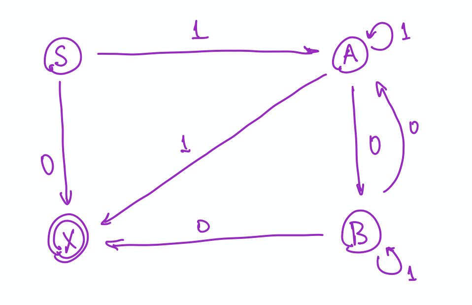

```{r setup, include = FALSE}
library(tidyverse)
library(mosaic)
```

<script src="../../styles/folding.js"></script>


<style>
div.indent {
  margin: 0 0 0 25px;
}
</style>


## Worksheets/Handouts

I'll print and bring worksheets to class, but if you lose one or want to have it in
electronic format from some reason, you can get it here as well.

<!-- ### Models of Computation -->

<!-- * Worksheets:  -->
<!--   [PDF](models-of-computation/Models-of-Computation.pdf) -->
<!--   [HTML](models-of-computation) -->

<!-- ### Counting and Probability -->

<!-- * Worksheets:  -->
<!--   [PDF](counting-and-probability/Counting-and-Probability.pdf) -->
<!--   [HTML](counting-and-probability/) -->

<div class = "explain" label = "Before Test 1">
<div class = "explain" label = "Groups starting 10 Jan">


```{r echo = FALSE, results = "asis", include = TRUE, message = FALSE}
set.seed(110)
n_groups <- function(x) {
  ifelse(x > 18, (x+3) %/% 4, x %/% 3)
}  

Roster <- read.csv('../../../webwork/Math252-S22-roster-clean.csv') %>%
  mutate(name = paste(first, last))

R <- 
  mosaic::shuffle(Roster) |>
  group_by(section) |>
  mutate(group = rep(1:(n_groups(n())), length.out = n())) |>
  mutate(group = paste0(section, group)) 
         
for(g in sort(unique(R$group))) {
  cat(paste0('  * Group ', g, ": ", paste(R %>% filter(group == g) %>% pull(name), collapse = ", "), "\n"))
}
```

</div>

<div class = "explain" label = "Groups starting 17 Jan">


```{r echo = FALSE, results = "asis", include = TRUE, message = FALSE}
set.seed(117)
n_groups <- function(x) {
  ifelse(x > 18, (x+3) %/% 4, x %/% 3)
}  

Roster <- read.csv('../../../webwork/Math252-S22-roster-clean2.csv') %>%
  mutate(name = paste(first, last))

R <- 
  mosaic::shuffle(Roster) |>
  group_by(section) |>
  mutate(group = rep(1:(n_groups(n())), length.out = n())) |>
  mutate(group = paste0(section, group)) 
         
for(g in sort(unique(R$group))) {
  cat(paste0('  * Group ', g, ": ", paste(R %>% filter(group == g) %>% pull(name), collapse = ", "), "\n"))
}
```

</div>

<div class = "explain" label = "Groups starting 24 Jan">

```{r echo = FALSE, results = "asis", include = TRUE, message = FALSE}
set.seed(124)
n_groups <- function(x) {
  ifelse(x > 18, (x+3) %/% 4, x %/% 3)
}  

Roster <- read.csv('../../../webwork/Math252-S22-roster-clean2.csv') %>%
  mutate(name = paste(first, last))

R <- 
  mosaic::shuffle(Roster) |>
  group_by(section) |>
  mutate(group = rep(1:(n_groups(n())), length.out = n())) |>
  mutate(group = paste0(section, group)) 
         
for(g in sort(unique(R$group))) {
  cat(paste0('  * Group ', g, ": ", paste(R %>% filter(group == g) %>% pull(name), collapse = ", "), "\n"))
}
```

</div>

<div class = "explain" label = "Groups starting 2 Feb">

```{r echo = FALSE, results = "asis", include = TRUE, message = FALSE}
set.seed(202)
n_groups <- function(x) {
  ifelse(x > 18, (x+3) %/% 4, x %/% 3)
}  

Roster <- read.csv('../../../webwork/Math252-S22-roster-clean2.csv') %>%
  mutate(name = paste(first, last))

R <- 
  mosaic::shuffle(Roster) |>
  group_by(section) |>
  mutate(group = rep(1:(n_groups(n())), length.out = n())) |>
  mutate(group = paste0(section, group)) 
         
for(g in sort(unique(R$group))) {
  cat(paste0('  * Group ', g, ": ", paste(R %>% filter(group == g) %>% pull(name), collapse = ", "), "\n"))
}
```

</div>


### Graphs

date     |  Topic                | link(s)
-------- | --------------------- | ------------------------------------------
Mon 1/10 | Intro to Graphs       | [PDF](graphs/intro-to-graphs.pdf)
Wed 1/12 | More Graphs           | [PDF](graphs/more-graphs.pdf)
Fri 1/14 | Graph Representations | [PDF](graphs/graph-representations.pdf)
Mon 1/17 | Graph Isomorphism     | [PDF](graphs/graph-isomorphism.pdf)
Wed 1/19 | Paths in Graphs       | [PDF](graphs/paths-in-graphs.pdf)
Fri 1/21 | Paths in Graphs       | [PDF](graphs/paths-in-graphs.pdf)
Mon 1/24 | Bipartite Graphs      | [PDF](graphs/bipartite-planar.pdf)
Wed 1/26 | Planar, Non-planar Graphs      | [PDF](graphs/planar-and-non-planar-graphs.pdf)

### Counting and Probability

date     |  Topic                | link(s)
-------- | --------------------- | ------------------------------------------
Mon 1/31 | Some Counting Problems | [PDF](counting-and-probability/some-counting-problems.pdf)
Wed 2/02 | Pigeon Hole Principle | [PDF](counting-and-probability/pigeonhole-principle.pdf)
Fri 2/04 | Division Principle    | [PDF](counting-and-probability/division-principle.pdf)
Mon 2/07 | Donuts                | [PDF](counting-and-probability/counting-problems.pdf)

</div>
</div>

<div class = "explain" label = "Between Test 1 and Test 2">

### Groups

We will often work in groups. Periodically we will shuffle things up so you get to
work with new people.

<div class = "explain" label = "Groups starting 11 Feb">


```{r echo = FALSE, results = "asis", include = TRUE, message = FALSE}
set.seed(1102)
n_groups <- function(x) {
  ifelse(x > 18, (x+3) %/% 4, x %/% 3)
}  

Roster <- read.csv('../../../webwork/Math252-S22-roster-clean2.csv') %>%
  mutate(name = paste(first, last))

R <- 
  mosaic::shuffle(Roster) |>
  group_by(section) |>
  mutate(group = rep(1:(n_groups(n())), length.out = n())) |>
  mutate(group = paste0(section, group)) 
         
for(g in sort(unique(R$group))) {
  cat(paste0('  * Group ', g, ": ", paste(R %>% filter(group == g) %>% pull(name), collapse = ", "), "\n"))
}
```

</div>
<div class = "explain" label = "Groups starting 21 Feb">

```{r echo = FALSE, results = "asis", include = TRUE, message = FALSE}
set.seed(221)
n_groups <- function(x) {
  ifelse(x > 18, (x+3) %/% 4, x %/% 3)
}  

Roster <- read.csv('../../../webwork/Math252-S22-roster-clean2.csv') %>%
  mutate(name = paste(first, last))

R <- 
  mosaic::shuffle(Roster) |>
  group_by(section) |>
  mutate(group = rep(1:(n_groups(n())), length.out = n())) |>
  mutate(group = paste0(section, group)) 
         
for(g in sort(unique(R$group))) {
  cat(paste0('  * Group ', g, ": ", paste(R %>% filter(group == g) %>% pull(name), collapse = ", "), "\n"))
}
```

</div>

<div class = "explain" label = "Groups starting 7 March">

```{r echo = FALSE, results = "asis", include = TRUE, message = FALSE}
set.seed(307)
n_groups <- function(x) {
  ifelse(x > 18, (x+3) %/% 4, x %/% 3)
}  

Roster <- read.csv('../../../webwork/Math252-S22-roster-clean2.csv') %>%
  mutate(name = paste(first, last))

R <- 
  mosaic::shuffle(Roster) |>
  group_by(section) |>
  mutate(group = rep(1:(n_groups(n())), length.out = n())) |>
  mutate(group = paste0(section, group)) 
         
for(g in sort(unique(R$group))) {
  cat(paste0('  * Group ', g, ": ", paste(R %>% filter(group == g) %>% pull(name), collapse = ", "), "\n"))
}
```

</div>

### Counting and Probability

date     |  Topic                | link(s)
-------- | --------------------- | ------------------------------------------
Mon 1/31 | Some Counting Problems | [PDF](counting-and-probability/some-counting-problems.pdf)
Wed 2/02 | Pigeon Hole Principle | [PDF](counting-and-probability/pigeonhole-principle.pdf)
Fri 2/04 | Division Principle    | [PDF](counting-and-probability/division-principle.pdf)
Mon 2/07 | Donuts                | [PDF](counting-and-probability/counting-problems.pdf)
Fri 2/11 | Probability           | [PDF](counting-and-probability/probability.pdf)
Mon 2/11 | Probability (cont'd)  | [PDF](counting-and-probability/probability.pdf)
Wed 2/16 | Conditional Probability 1 | [PDF](counting-and-probability/conditional-probability.pdf)
Fri 2/18 | Conditional Probability 2 | [PDF](counting-and-probability/probability-trees-and-bayes.pdf)
Mon 2/21 | Random Variables      | [PDF](counting-and-probability/random-variables.pdf)
Wed 2/23 | Expected Value        | [PDF](counting-and-probability/expected-value.pdf)
Fri 2/25 | More Expected Value   | [PDF](counting-and-probability/more-expected-value.pdf)
Mon 3/7  | Probability Wrap-Up   | [PDF](probability-wrapup.pdf)

  
### Langauges, Grammars, Machines

date     |  Topic                | link(s)
-------- | --------------------- | ------------------------------------------
Wed 3/9  | Grammars              | [PDF](models-of-computation/alphabets-languages-and-grammars.pdf)
Fri 3/11 | Types of Grammars     | [PDF](models-of-computation/types-of-grammars.pdf)

</div>

<div class = "explain" label = "After Test 2">

### Groups

We will often work in groups. Periodically we will shuffle things up so you get to
work with new people.

<div class = "explain" label = "Groups starting 16 Mar">


```{r echo = FALSE, results = "asis", include = TRUE, message = FALSE}
set.seed(1603)
n_groups <- function(x) {
  ifelse(x > 18, (x+3) %/% 4, x %/% 3)
}  

Roster <- read.csv('../../../webwork/Math252-S22-roster-clean2.csv') %>%
  mutate(name = paste(first, last))

R <- 
  mosaic::shuffle(Roster) |>
  group_by(section) |>
  mutate(group = rep(1:(n_groups(n())), length.out = n())) |>
  mutate(group = paste0(section, group)) 
         
for(g in sort(unique(R$group))) {
  cat(paste0('  * Group ', g, ": ", paste(R %>% filter(group == g) %>% pull(name), collapse = ", "), "\n"))
}
```

</div>

<div class = "explain" label = "Groups starting 25 Mar">

```{r echo = FALSE, results = "asis", include = TRUE, message = FALSE}
set.seed(2503)
n_groups <- function(x) {
  ifelse(x > 18, (x+3) %/% 4, x %/% 3)
}  

Roster <- read.csv('../../../webwork/Math252-S22-roster-clean2.csv') %>%
  mutate(name = paste(first, last))

R <- 
  mosaic::shuffle(Roster) |>
  group_by(section) |>
  mutate(group = rep(1:(n_groups(n())), length.out = n())) |>
  mutate(group = paste0(section, group)) 
         
for(g in sort(unique(R$group))) {
  cat(paste0('  * Group ', g, ": ", paste(R %>% filter(group == g) %>% pull(name), collapse = ", "), "\n"))
}
```
</div>

<div class = "explain" label = "Groups starting 4 Apr">

```{r echo = FALSE, results = "asis", include = TRUE, message = FALSE}
set.seed(403)
n_groups <- function(x) {
  ifelse(x > 18, (x+3) %/% 4, x %/% 3)
}  

Roster <- read.csv('../../../webwork/Math252-S22-roster-clean2.csv') %>%
  mutate(name = paste(first, last))

R <- 
  mosaic::shuffle(Roster) |>
  group_by(section) |>
  mutate(group = rep(1:(n_groups(n())), length.out = n())) |>
  mutate(group = paste0(section, group)) 
         
for(g in sort(unique(R$group))) {
  cat(paste0('  * Group ', g, ": ", paste(R %>% filter(group == g) %>% pull(name), collapse = ", "), "\n"))
}
```
</div>

<div class = "explain" label = "Groups starting 11 Apr">

Choose your own groups!

</div>

### Langauges, Grammars, Machines

date     |  Topic                | link(s)
-------- | --------------------- | ------------------------------------------
Wed 3/9  | Grammars              | [PDF](models-of-computation/alphabets-languages-and-grammars.pdf)
Fri 3/11 | Types of Grammars     | [PDF](models-of-computation/types-of-grammars.pdf)
Wed 3/16 | Automata              | [PDF](models-of-computation/finite-state-automata.pdf)
Fri 3/18 | Automata              | [PDF](models-of-computation/finite-state-automata.pdf)
Fri 3/18 | Nondeterministic Automata | [PDF](models-of-computation/nfa.pdf) 
Fri 3/25 | DFA vs NFA            | [PDF](models-of-computation/dfa-v-nfa.pdf)
Fri 3/25 | Regular Expressions and Languages | [PDF](models-of-computation/regular-expressions-and-languages.pdf)
Mon 3/28 | Regular Expression -> NFA | [PDF](models-of-computation/regex-to-nfa.pdf)
Wed 3/30 | Regular Grammars and Automata | [PDF](models-of-computation/regular-grammars-and-automata.pdf)
04/04 | DFA to regex | [PDF](models-of-computation/dfa-to-regex.pdf), [notes](https://courses.engr.illinois.edu/cs374/fa2017/extra_notes/01_nfa_to_reg.pdf)
04/06 | Turing Machines | [PDF](models-of-computation/turing-machines.pdf), [simulator](http://morphett.info/turing/turing.html) 
04/11 | A language that is not regular | [PDF](models-of-computation/not-regular.pdf)

<!-- 05/07 | [Python regex project description](Python-tidy-project.html) -->
<!-- 05/07 | [Regular expressions in python](https://docs.google.com/presentation/d/1bjzMKrH8LeGmHC23fcX6z-gx3zW958VHTkjYyF1-Pdg/edit?usp=sharing) -->
<!-- 04/30 | [Turing Machine Simulator](http://www.6by9.net/z/projects/turingMachine/turingMachineApplet/) -->
<!-- 04/25 | [Regular Languages Wrap-Up](Regular-WrapUp.pdf) -->
<!-- 04/23 | [Regular Grammars](Regular-Grammars.pdf) -->

<div class = "explain" label = "Some Comments/Hints/Solutions">
<div class = "indent">
\def\emptystring{\lambda}
<div class = "explain" label = "Types of Grammars">


<div class = "explain" label = "Exercise 2.1 -- Identify types of grammars">
For each grammar, look at each rule to see if it follows the restrictions
of each type of grammar.

Example: $G_1$

* Not context sensitive because the rule $AB \to b$ doesn't work.  (One of $A$
  or $B$ would need to be part of the context and so reappear on the right side.)
* Not context free or regular because there are rules with more than a single
  non-terminal on the left side.
* So $G_1$ is type 0, but not any of the other types.

<!-- Log your answers for grammars 1-4 in this [google -->
<!-- form](https://docs.google.com/forms/d/e/1FAIpQLSfMWd2J9gM44ScBVSCf7mYb6Y9SB6pX3AdQkmuMinM2m2zPxg/viewform?usp=sf_link). -->

</div>

<div class = "explain" label = "Exercise 2.2 -- Rule Elimination">

Example: You can't have $A \to \lambda$ and $A$ on the right side of rules in
a context sensitive grammar.  So you will need to remove one or the other to
make this type 1.  (There are other things that need doing as well.)

</div>

<div class = "explain" label = "Exercise 2.3 -- Grammar Hierarchy?">
There is one case where the answer is no.  Can you find it?
</div>

<div class = "explain" label = "Exercise 2.4 -- Language Hierarchy?">
Despite the answer to Exercise 2, this is true. Do you see how to get around the 
issue in Exercise 2 when we talk about languages rather than grammars?
</div>

<div class = "explain" label = "More about the Hierarchy">
Using $S$ as the start nonterminal and $a$ and $b$ as a terminals,
the following grammar is type 2 but not type 1 
(because we aren't allowed to have $S$ on the right side of a rule
if we also have $S\to\lambda$):

* $S \to \lambda$
* $S \to aS$
* $S \to ab$

But the **language** generated by the grammar is a type 1 language because we can use a different grammar
to generate it:

* $S \to \lambda$
* $S \to A$
* $A \to aA$
* $A \to ab$

Basically we just translate $S$ to $A$.  This avoids the problem of having $S$ on the right side of a production
rule. This same trick can be applied to any type 2 grammar.

More generally, to tell whether a grammar is of a certian type, we just need to check the rules.  But to tell
whether a language is of a certain type, we need to ask whether there is any grammar of the appropriate type
that can generate it.

**Note:** This language is actually also regular.  Here is a regular grammar that generates the same language.

* $S \to \lambda$
* $S \to aS$
* $S \to aB$
* $B \to b$

</div>

<div class = "explain" label = "Exercise 2.5 -- BNF only for context free grammars">
**Answer:** 
There is no place for context in the notation.  The left side is always just
a single non-terminal.
</div>

<div class = "explain" label = "Exercise 2.6 -- BNF examples">
Example: Grammar 2

```
<S> ::= a<A> | b
<A> ::= aa
```
</div>
</div>


\def\emptystring{\lambda}

<div class = "explain" label = "Exercise 3.3.6 -- Creating DFAs">

Here are example machines for a few of these.  Note: I strongly
advise using meaningful state names.

I'm doing these with "ASCII art", so I won't always include
all of the transitions.  Be sure to read the description
that goes along.  You might want to draw out the 
full machine for yourself.

a. The set of bitstrings that begin with two 0’s

    Keep track of what has been seen so far.  Here's
    the core of the DFA:

    ```
    -> [ ]  -- 0 --> [ 0 ] -- 0 --> [[ 00 ]] 
    ```
    
    Now add:
    
    * a self-loop on the accepting state (for both 0 and 1)
    * all other transitions go to a non-accepting 'dead' state.
    
    The only way to get to the accepting state is to 
    have the first two symbols be 0.
    
b. The set of bitstrings that contain exactly two 0’s

    The core of this is similar to part a, but now
    we don't need to have the 0's consecutively,
    and we are not allowed to hae extra 0's.
    Again, start with this:
    
    ```
    -> [ no zeros ]  -- 0 --> [ one 0 ] -- 0 --> [[ two 0s ]] -- 0 --> [more]
    ```
    
    Now add some more transitions:
    
    * When reading a 1, always loop where you are.
    * When reading a 0 at the `[more]` state, loop.

c. The set of bitstrings that contain at least two 0’s

    The only change to the previous machine is that if
    we ever get to [[ two 0's]], then we stay there (loop
    on both 0 and 1).  So we can delete the `[more]` state.
    
    ```
    -> [ no zeros ]  -- 0 --> [ one 0 ] -- 0 --> [[ two 0s ]] -- 0 --> [more]
    ```
    
d. The set of bitstrings that contain two consecutive 0’s (anywhere in the string)

    Again, very similar.  But now, whenever we see a 1 before
    we see two consecutive 0's, we "start over".  Once 
    we see two consecutive 0's, we know the string is accepted.
    
    Here's the core:

    ```
    -> [ no zeros ]  -- 0 --> [ one 0 ] -- 0 --> [[ good! ]] 
    ```
    
    Now add
    
    * self-loop on `[[ good !]]` for both 0 and 1.
    * transitions back to the start state if you read
    a 1 while in the other two states.
    
e. The set of bitstrings that do not contain two consecutive 0’s anywhere

    We need to remember the same information as in the previous
    example, but we need to flip the result.

    Here's the core:

    ```
    -> [[ no zeros ]]  -- 0 --> [[ one 0 ]] -- 0 --> [ bad! ] 
    ```
    
    Now add:
    
    * self-loop at `[ bad! ]` for both 0 and 1.
    * transitions back to start from the other two states
    when you read a 1.

f. The set of bitstrings that end with two 0’s

    This time, we need to remember the last two bits
    we have seen.  So the core states are 
    00, 01, 10, and 11.  We'll need to add some states
    to get started: S, 0, nad 1. These states code 
    what the last 2 bits were. Now see if you can figure
    out how to add the transitions and determine which
    states are accepting.

</div>

<div class = "explain" label = "25 March Comments/Hints/Solutions">

Note: Rosen likes to label his states $s_0$, $s_1$, etc.  I find that clunky and 
**I suggest that you not bother with subscripts when creating your own machines.** 
You can use numbers, or letters, or even short words or phrases that identify
what a state represents. The worksheet will show you both styles.

<div class = "explain" label = "Exercise 3.6.21">

Hint: Think about the pebbling algorithm.  How do the pebbles relate
to states in a DFA?

Make sure you give this a good attempt before comparing your work to this solution.

<div class = "explain">
```{r, echo = FALSE, out.width = "80%", fig.align = "center"}
knitr::include_graphics('../../S21/from-class/images/NFA2DFA-example1sol.png')
```
</div>

</div>

<div class = "explain" label = "Exercise 3.6.22">

It isn't important where you put the states, but it is important that the edges and labels
match.

```{r, echo = FALSE, out.width = "80%", fig.align = "center"}
knitr::include_graphics('../../S21/from-class/images/DFA-Fig7-13-3-8.png')
```
</div>

<div class = "explain" label = "Exercise 3.6.23">

In the worst case there is a state in the DFA for every possible set of states in the NFA.
If the NFA has $n$ states, how many subsets of states are there?  Hint: to build a subset, you
need to decide for each state whether it is in our out of the subset.  Now you use your counting
rules.
</div>

\newcommand{\mybold}[1]{\boldsymbol{#1}}

<div class = "explain" label = "Exercise 4.1.1">
What strings belong to $\{0, 01\}^2$? Let's add a vertical bar to show how the strings
are formed.  We need to have two pieces, and each piece must be either 0 or 01, so

* $0|0  \to 00$
* $0|01  \to 001$
* $01|0  \to 010$
* $01|01  \to 0101$
</div>

<div class = "explain" label = "Exercise 4.1.2">
Which of these strings belong to $\{0, 01\}^*$?

a. $01001$.  Yes: $01|0|01$
b. $10110$.  No: Cannot start with a $1$.
c. $00010$.  Yes: $0|0|01|0$. 
</div>

<div class = "explain" label = "Exercise 4.1.3">
Which of these strings belong to $\{101, 111, 11\}^*$?

a. $1010111$.  No.  You can start 101, but then you are stuck.
b. $1011011$.   No.  You have to start 101, then 101 again, but then there is only one 1 left.
c. $1110111$.   Yes.  $11|101|11$.
d. $11110111$.  Yes.  $111|101|11$
</div>

<div class = "explain" label = "Exercise 4.2.5">
$1$ is a symbol or a string with one symbol. 
$\mybold{1}$ represents a language with one string in it: $\{1\}$.

$\lambda$ is the empty string.
$\mybold{\lambda}$ represents a language containing only the empty string: $\{\lambda\}$.

$\emptyset$ is the empty set.
$\mybold{\emptyset}$ represents the empty language, but languages are sets, so the 
empty language is the empty set.
</div>

<div class = "explain" label = "Exercise 4.2.6">
Describe in words the languages represented by each of these regular expressions: 

a. $\mybold{10^*}$ is the set of all strings that begin with a 1 but don't have any other 1's.
b. $\mybold{(10)^*}$ is the set of all strings with even length that alternate 1's and 0's,
starting with a 1.  (0 is even, so the empty string is included in this description.)
c. $\mybold{0 \cup 01} = \{0, 01\}$, a language with only two strings, $0$ and $01$.
d. $\mybold{0^* \cup 01}$ consists of the string 01 and any string made up only
of 0's (including the empty string).
e. $\mybold{0 (0 \cup 1)^*}$ is the language consisting of strings that start with $0$.
f. $\mybold{(0 \cup 01)^*}$ is the language consisting of all strings that do not start with a 1 and do not have two adjacent $1$'s.  (The empty string is included in this.)
</div>

<div class = "explain" label = "Exercise 4.2.7">
All of the languages in this problem can be recognized by either a DFA or an NFA.
Do you see how to design them?
</div>

<div class = "explain" label = "Exercise 4.2.8">
This is will our topic for next time.
</div>
</div>


\def\emptystring{\lambda}
\def\set#1{\{#1\}}

<div class = "foldable" label = "Exercise 5.1.1">

Start state: $S$;
Accepting states: $S$ and $X$

state     |   0          |   1
--------: | :----------: | :--------:
$S$       |  $\set{X}$   | $\set{A}$
$A$       |  $\set{A}$   | $\set{A}$
$X$       |  $\set{}$    | $\set{X}$

```{r echo = FALSE, fig.align = 'center'}
knitr::include_graphics('../../S21/from-class/images/grammar-to-nfa-01.png')
```

It's a good idea to check your work on a few strings to make sure
the grammar and the NFA agree.  You might try some of these:

* $\lambda$
* $0$
* $1$
* $01$
* $101$

</div>

<div class = "foldable" label = "Exercise 5.1.2">
Start state: $S$;
Accepting state: $X$

state     |   0           |   1
--------: | :-----------: | :-----------:
$S$       |  $\set{X}$    | $\set{A}$
$A$       |  $\set{B}$    | $\set{A, X}$
$B$       |  $\set{A, X}$ | $\set{B}$
$X$       |  $\set{}$     | $\set{}$

```{r echo = FALSE, fig.align = 'center'}

```

It's a good idea to check your work on a few strings to make sure
the grammar and the NFA agree.  You might try some of these:

* $\lambda$
* $110$
* $011$
* $11001$
* $11100$

</div>


<div class = "foldable" label = "Exercise 5.1.3">

Three types of rules $S\to\lambda$, $A \to x B$, $A \to x$ where $S$ is the start state, capitals are 
non-terminals and lower case are terminals.

States of $N$: one for each non-terminal in the grammar and one more (let's call is $X$ for extra).

Start state = start symbol

$X$ is an accepting state; the only other state that might be accepting is start state.

Convert rules to transitions:

* $S \to \lambda$ makes the start state accepting.
* $A \to xB$ adds a transition $A \stackrel{x}{\to} B$.  (This is a self-loop if $A = B$.)
* $A \to x$ adds a transition $A \stackrel{x}\to X$.
* Note: there will be not transitions out of state $X$.

</div>


<div class = "foldable" label = "Exercise 5.2.6">

* $S_0 \to \lambda$
* $S_0 \to 0S_1$
* $S_0 \to 1S_2$
* $S_0 \to 1$
* $S_1 \to 0S_1$
* $S_1 \to 1S_2$
* $S_1 \to 1$
* $S_2 \to 0S_1$
* $S_2 \to 1S_2$
* $S_2 \to 1$
</div>


<div class = "foldable" label = "Exercise 5.2.7">

$S$ is new lonely start state.

* $S \to 0S_0$
* $S \to 1S_1$
* $S \to 1$
* $S_0 \to 0S_0$
* $S_0 \to 1S_1$
* $S_0 \to 1$
* $S_1 \to 0S_2$
* $S_1 \to 1S_1$
* $S_1 \to 1$
* $S_2 \to 0S_2$
* $S_2 \to 1S_2$
</div>


<div class = "foldable" label = "Exercise 5.2.8">

$S$ is new lonely start state.

* $S \to \lambda$
* $S \to 1S_1$
* $S \to 1$
* $S_0 \to 1S_1$
* $S_0 \to 1$
* $S_0 \to 0S_0$
* $S_1 \to 0S_2$
* $S_2 \to 0S_0$
* $S_2 \to 1S_0$
* $S_2 \to 0$
* $S_2 \to 1$
</div>
<div class = "foldable" label = "Exercise 5.2.9">

* terminals = input alphabet
* non-terminals = states (after adding lonely start state)
* start symbol = lonely start state
* Add $S \to \lambda$ if start state is accepting.
* Add $A \to xB$ if $A \stackrel{x}{\to} B$ is a transition.
* Add $A \to x$ if $A \stackrel{x}{\to} B$ and $B$ is accepting.
* Lonely start state avoids having rules with start state on the right side (which is not allowed for regular grammars).

</div>

<div class = "foldable" label = "Exercise 6.2.1">

```{r echo = FALSE, fig.align = 'center'}
# path <- glue::glue('../images/DFA2regex1/frame_0000{i}.png', i = 1:9)
path <- dir('../../S21/from-class/images/DFA2regex1', full.names = TRUE)
knitr::include_graphics(path)
```

</div>

<div class = "foldable" label = "Exercise 6.2.2">

```{r echo = FALSE, fig.align = 'center'}
path <- dir('../../S21/from-class/images/DFA2regex2', full.names = TRUE)
knitr::include_graphics(path)
```

</div>
<div class = "foldable" label = "Exercise 6.2.3">


```{r echo = FALSE, fig.align = 'center'}
path <- dir('../../S21/from-class/images/DFA2regex3', full.names = TRUE)
knitr::include_graphics(path)
```

</div>

<div class = "foldable" label = "Exercise 6.2.4-5">
The algorithm works just the same if you start from an NFA or a GNFA.

As a side note, this implies that GNFAs are equivalent to NFAs.  In particular,
$\lambda$-NFAs (NFAs that allow transitions labeled $\lambda$ that can be used
without processing any input symbols) are equivalent.  So our diagram looks like
this

$$
\Large
\begin{array}{ccccccc}
\mathrm{DFA} & \longleftrightarrow & \mathrm{NFA} & \longrightarrow & \lambda\mathrm{-NFA} & \longrightarrow & \mathrm{GNFA} \\
&& \downarrow \uparrow & \nwarrow  &  & \swarrow  \\
& & \mathrm{regular}& & \mathrm{regular} \\
& & \mathrm{grammar}& & \mathrm{expression} 
\end{array}
$$
Some books and online resources will demonstrate the conversion 

$$
\mbox{regular expression} \longrightarrow \lambda\mathrm{-NFA}
$$
since this is slightly easier than 
$$
\mbox{regular expression} \longrightarrow \mathrm{NFA}
$$
But then we would need an additional conversion
$$
\lambda\mathrm{-NFA} \longrightarrow  \mathrm{NFA} \;.
$$
This doable, but isn't really any easier than building it into the 
the conversion from regular expressions to NFAs, the way we did it.

You should know how to perform all of the conversions illustrated in the diagram
above.
</div>

<div class = "foldable" label = "Exercise 6.3.1">
Compare your descriptions to the descriptions below.  Did you leave out 
anything important?  Do the solutions below leave out anything important?

1a. regex $\to$ NFA: 

* 6 parts: 
    * 3 base cases -- pretty easy
    * 3 that show union, concatenation and Kleene star -- these are the "interesting" part
  
* union: $A \cup B$ where $A = L(N_1)$ and $B = L(N_2)$.

    * keep all states and transitions from $N_1$ and $N_2$
    
    * add one new start state $S$; $S$ is final if either 
      start state of $N_1$ or start state of $N_2$ is final
      
    * add some additional transitions
        * if $S_1 \stackrel{x}{\to} A$, add $S \stackrel{x}{\to} A$
        * if $S_2 \stackrel{x}{\to} B$, add $S \stackrel{x}{\to} B$

* concatenation: $AB$ where $A = L(N_1)$ and $B = L(N_2)$.

    * keep all states and transitions from $N_1$ and $N_2$
    * start state from $N_1$ is the start state 
    * only final states from $N_2$ are final
    * add some additional transitions
        * if $A \stackrel{x}{\to} F$ (a final state in $N_1$), then add
          add $A \stackrel{x}{\to} S_2$ (start state in $N_2$)
          
* Kleene star: $A = L(N_1)$

    * keep all states and transitions from $N_1$ 
    * add a new start state that is a final state (because $\lambda \in A^*$)
    * add new transitions from new start state ($S$)
    
        * if $S_1 \stackrel{x}{\to} A$, add $S \stackrel{x}{\to} A$ (includes case where $A = S_1$)
        
    * add new transitions to old start state ($S_1$)
    
        * if $A \stackrel{x}{\to} F$, where F is final, add $A \stackrel{x}{\to} S_1$
        * If we are at the end of a string in $L(N_1)$, this lets us "restart"
    
        
1b. DFA $\to$ NFA

* easy: a DFA "is" an NFA. (Why is "is" in quotes?)

1c. NFA $\to$ DFA

* DFA states are **subsets of NFA states** (think: magnets on white board)

* A is final in DFA if A contains a final state of NFA 

* Remember that $\{ \}$ may be needed as one of the states in the DFA
    
1d. DFA (or NFA) $\to$ reg grammar

* $A \stackrel{x}{\to} B$ becomes 

    * $A \to xB$
    
    * also $A \to x$  if B is final state
    
* If S is final in NFA/DFA, then add $S \to \lambda$
    
* Number of rules = number of transitions + number of transitions to final states +
    1 more if the start state is final
    
1e. reg grammar $\to$ NFA

* states: non-terminals of grammar + 
one additional state $F$ (a final state)
    * Start symbol is also start state
    * If $S \to \lambda$ is a rule, then $S$ is a final state

* production rules become transitions in NFA

    * $A \to xB$ becomes $A \stackrel{x}{\to} B$
    * $A \to x$  becomes $A \stackrel{x}{\to} F$ (the added final state)
  
1f. DFA $\to$ regular expression
 
* Big idea: Make GNFAs with fewer and fewer states until we have a GNFA with two states 
(one the start state and the other the accepting state) and one transition between them, labeled
with a regular expression.

* If necessary, make two addjustments to the DFA before beginning
    * Make sure there is a lonely start state 
    * Make sure there is a single accepting state with no exiting transitions.
    * $\lambda$-transitions are allowed for this step, so we might not have a DFA anymore after these adjustments.
    
* Pick any internal state $R$ (not the start or accepting state) and "rip it out".
    * create or update transitions $A \to B$ when there was $A \to R \to B$.
</div>


<div class = "foldable" label = "A language that is not regular"> 

In addition to the in class discussion, you might like to look at page 885 of the text.
</div>

<div class = "foldable" label = "The Pumping Lemma"> 

<div class = "foldable" label = "Ideas behind the Pumping Lemma"> 

The basic idea used to show that $\{0^n1^n \mid n = 0, 1, 2, ... \}$ is not regular
can be turned into a lemma that doesn't mention DFAs at all.  

Suppose $L$ is a regular language.  Then there must be a DFA $M$ that recognizes
$L$.  This machine has some number of states, let's call that number $N$.

Now suppose we have a long string $x$ with more symbols than $N$.  (We will write this 
$l(x) > N$.  We can break our string into three parts:

* before the loop: $u$
    * What can we say about the length of $u$?
    
* in the loop: $v$
    * What can we say about the length of $v$?
    
* after the loop: $w$.

Explain why each of these strings is in $L$ if and only if $x \in L$.

* $uvw$
* $uw$
* $uvvw$
* $uv^kw$

Putting this all together gives us the **Pumping Lemma**: 
</div>

<div class = "foldable" label = "The Pumping Lemma -- Statement"> 
If $L$ is a regular language, then there is a number $N$ such that for any
string $x$ with $l(x) > N$, we can write $x$ as

$$ 
x = uvw
$$

such that

* $l(uv) \le N$,
* $l(v) > 0$,
* $x \in L$ if and only if $uv^kw \in L$ for every natural number $k$.

Important things to note:

* The Pumping Lemma says something about *long* strings.  There is some length
beyond which the $x = uvw$ splitting is guaranteed. It may or may not work for shorter
strings.

* You do not get to choose $u$, $v$, and $w$.  The Pumping Lemma tells you that
there is a way to split up $x$, not that every way of splitting up $x$ will work.

* The length constraints on $u$ and $v$ are often important in applications.
In particular, $l(uv) \le N$.


</div>

<div class = "foldable" label = "Pumping Lemma -- Example Application"> 

Let's try using the Pumping Lemma to show that $\{0^n1^n \mid n = 0, 1, \dots \}$ is not
regular.

Suppose $L$ were regular.
Let $N$ be the number given by the Pumping Lemma.  Consider $x = 0^N1^N$. 

* There is some way to split up $x$ as $x = uvw$ (because $x$ is long enough), and 
* $u$ and $v$ consist entirely of 0's, since $l(uw) \le N$.

Now consider the string $uw$.  $uw$ must be in $L$, but $uw$ has fewer 0's than 1's, so
it can't be in $L$.  This means our assumption that $L$ was regular must be false.

**Note 1:** Anything you can prove using the Pumping Lemma, you can also prove by going
back to the underlying argument about repeated states (pigeon hole principle), loops,
etc.  So you can think of the Pumping Lemma as an (optional) alternative way to think
about these problems.  I don't care which approach you take, as long as you do it correctly.
Any problem that says "by the Pumping Lemma" may also be done from the underlying argument.

**Note 2:** Using $x = 0^N1^N$ is sufficient since we read more more state than we 
have read symbols. 
(After reading the first symbol, 
we have seen the start state and a next state.)  
But if you prefer to use $x=0^{N+1}1^{N+1}$ 
just to make the argument easier, that's fine too. 
<!-- (I switched from $N$ to $N + 1$ when doing it in class to save us a little -->
<!-- time.) -->
</div>
</div>


</div>
<br>

------------


<!-- ## Other Resources -->

<!-- Date  | Resource -->
<!-- ----- | --------------------------------------------------- -->
<!-- 02/03 | [Wikipedia's page of graph terminology](https://en.wikipedia.org/wiki/Glossary_of_graph_theory_terms) -->
