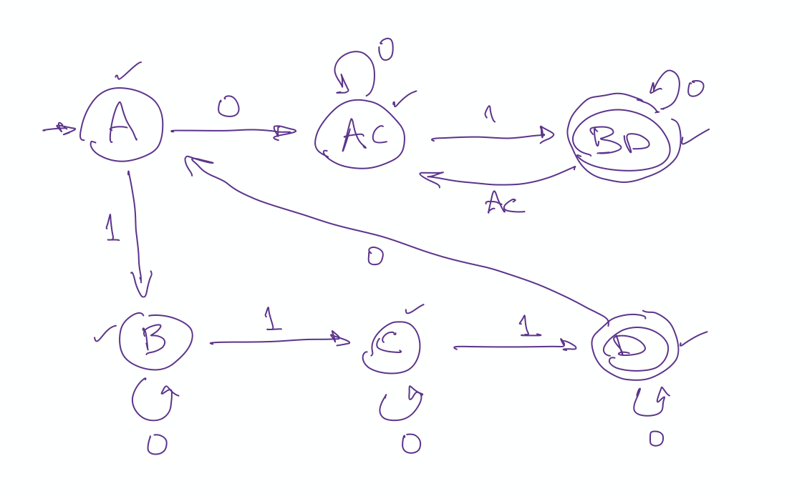
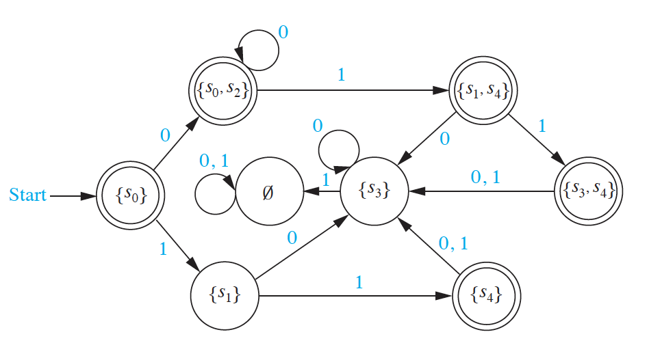

```{r setup, include = FALSE}
library(tidyverse)
library(mosaic)
```

<script src="../../styles/folding.js"></script>


<style>
div.indent {
  margin: 0 0 0 25px;
}
</style>


## Worksheets/Handouts

I'll print and bring worksheets to class, but if you lose one or want to have it in
electronic format from some reason, you can get it here as well.

<!-- ### Models of Computation -->

<!-- * Worksheets:  -->
<!--   [PDF](models-of-computation/Models-of-Computation.pdf) -->
<!--   [HTML](models-of-computation) -->

<!-- ### Counting and Probability -->

<!-- * Worksheets:  -->
<!--   [PDF](counting-and-probability/Counting-and-Probability.pdf) -->
<!--   [HTML](counting-and-probability/) -->

<div class = "explain" label = "Before Test 1">
<div class = "explain" label = "Groups starting 10 Jan">


```{r echo = FALSE, results = "asis", include = TRUE, message = FALSE}
set.seed(110)
n_groups <- function(x) {
  ifelse(x > 18, (x+3) %/% 4, x %/% 3)
}  

Roster <- read.csv('../../../webwork/Math252-S22-roster-clean.csv') %>%
  mutate(name = paste(first, last))

R <- 
  mosaic::shuffle(Roster) |>
  group_by(section) |>
  mutate(group = rep(1:(n_groups(n())), length.out = n())) |>
  mutate(group = paste0(section, group)) 
         
for(g in sort(unique(R$group))) {
  cat(paste0('  * Group ', g, ": ", paste(R %>% filter(group == g) %>% pull(name), collapse = ", "), "\n"))
}
```

</div>

<div class = "explain" label = "Groups starting 17 Jan">


```{r echo = FALSE, results = "asis", include = TRUE, message = FALSE}
set.seed(117)
n_groups <- function(x) {
  ifelse(x > 18, (x+3) %/% 4, x %/% 3)
}  

Roster <- read.csv('../../../webwork/Math252-S22-roster-clean2.csv') %>%
  mutate(name = paste(first, last))

R <- 
  mosaic::shuffle(Roster) |>
  group_by(section) |>
  mutate(group = rep(1:(n_groups(n())), length.out = n())) |>
  mutate(group = paste0(section, group)) 
         
for(g in sort(unique(R$group))) {
  cat(paste0('  * Group ', g, ": ", paste(R %>% filter(group == g) %>% pull(name), collapse = ", "), "\n"))
}
```

</div>

<div class = "explain" label = "Groups starting 24 Jan">

```{r echo = FALSE, results = "asis", include = TRUE, message = FALSE}
set.seed(124)
n_groups <- function(x) {
  ifelse(x > 18, (x+3) %/% 4, x %/% 3)
}  

Roster <- read.csv('../../../webwork/Math252-S22-roster-clean2.csv') %>%
  mutate(name = paste(first, last))

R <- 
  mosaic::shuffle(Roster) |>
  group_by(section) |>
  mutate(group = rep(1:(n_groups(n())), length.out = n())) |>
  mutate(group = paste0(section, group)) 
         
for(g in sort(unique(R$group))) {
  cat(paste0('  * Group ', g, ": ", paste(R %>% filter(group == g) %>% pull(name), collapse = ", "), "\n"))
}
```

</div>

<div class = "explain" label = "Groups starting 2 Feb">

```{r echo = FALSE, results = "asis", include = TRUE, message = FALSE}
set.seed(202)
n_groups <- function(x) {
  ifelse(x > 18, (x+3) %/% 4, x %/% 3)
}  

Roster <- read.csv('../../../webwork/Math252-S22-roster-clean2.csv') %>%
  mutate(name = paste(first, last))

R <- 
  mosaic::shuffle(Roster) |>
  group_by(section) |>
  mutate(group = rep(1:(n_groups(n())), length.out = n())) |>
  mutate(group = paste0(section, group)) 
         
for(g in sort(unique(R$group))) {
  cat(paste0('  * Group ', g, ": ", paste(R %>% filter(group == g) %>% pull(name), collapse = ", "), "\n"))
}
```

</div>


### Graphs

date     |  Topic                | link(s)
-------- | --------------------- | ------------------------------------------
Mon 1/10 | Intro to Graphs       | [PDF](graphs/intro-to-graphs.pdf)
Wed 1/12 | More Graphs           | [PDF](graphs/more-graphs.pdf)
Fri 1/14 | Graph Representations | [PDF](graphs/graph-representations.pdf)
Mon 1/17 | Graph Isomorphism     | [PDF](graphs/graph-isomorphism.pdf)
Wed 1/19 | Paths in Graphs       | [PDF](graphs/paths-in-graphs.pdf)
Fri 1/21 | Paths in Graphs       | [PDF](graphs/paths-in-graphs.pdf)
Mon 1/24 | Bipartite Graphs      | [PDF](graphs/bipartite-planar.pdf)
Wed 1/26 | Planar, Non-planar Graphs      | [PDF](graphs/planar-and-non-planar-graphs.pdf)

### Counting and Probability

date     |  Topic                | link(s)
-------- | --------------------- | ------------------------------------------
Mon 1/31 | Some Counting Problems | [PDF](counting-and-probability/some-counting-problems.pdf)
Wed 2/02 | Pigeon Hole Principle | [PDF](counting-and-probability/pigeonhole-principle.pdf)
Fri 2/04 | Division Principle    | [PDF](counting-and-probability/division-principle.pdf)
Mon 2/07 | Donuts                | [PDF](counting-and-probability/counting-problems.pdf)

</div>
</div>

<div class = "explain" label = "Between Test 1 and Test 2">

### Groups

We will often work in groups. Periodically we will shuffle things up so you get to
work with new people.

<div class = "explain" label = "Groups starting 11 Feb">


```{r echo = FALSE, results = "asis", include = TRUE, message = FALSE}
set.seed(1102)
n_groups <- function(x) {
  ifelse(x > 18, (x+3) %/% 4, x %/% 3)
}  

Roster <- read.csv('../../../webwork/Math252-S22-roster-clean2.csv') %>%
  mutate(name = paste(first, last))

R <- 
  mosaic::shuffle(Roster) |>
  group_by(section) |>
  mutate(group = rep(1:(n_groups(n())), length.out = n())) |>
  mutate(group = paste0(section, group)) 
         
for(g in sort(unique(R$group))) {
  cat(paste0('  * Group ', g, ": ", paste(R %>% filter(group == g) %>% pull(name), collapse = ", "), "\n"))
}
```

</div>
<div class = "explain" label = "Groups starting 21 Feb">

```{r echo = FALSE, results = "asis", include = TRUE, message = FALSE}
set.seed(221)
n_groups <- function(x) {
  ifelse(x > 18, (x+3) %/% 4, x %/% 3)
}  

Roster <- read.csv('../../../webwork/Math252-S22-roster-clean2.csv') %>%
  mutate(name = paste(first, last))

R <- 
  mosaic::shuffle(Roster) |>
  group_by(section) |>
  mutate(group = rep(1:(n_groups(n())), length.out = n())) |>
  mutate(group = paste0(section, group)) 
         
for(g in sort(unique(R$group))) {
  cat(paste0('  * Group ', g, ": ", paste(R %>% filter(group == g) %>% pull(name), collapse = ", "), "\n"))
}
```

</div>

<div class = "explain" label = "Groups starting 7 March">

```{r echo = FALSE, results = "asis", include = TRUE, message = FALSE}
set.seed(307)
n_groups <- function(x) {
  ifelse(x > 18, (x+3) %/% 4, x %/% 3)
}  

Roster <- read.csv('../../../webwork/Math252-S22-roster-clean2.csv') %>%
  mutate(name = paste(first, last))

R <- 
  mosaic::shuffle(Roster) |>
  group_by(section) |>
  mutate(group = rep(1:(n_groups(n())), length.out = n())) |>
  mutate(group = paste0(section, group)) 
         
for(g in sort(unique(R$group))) {
  cat(paste0('  * Group ', g, ": ", paste(R %>% filter(group == g) %>% pull(name), collapse = ", "), "\n"))
}
```

</div>

### Counting and Probability

date     |  Topic                | link(s)
-------- | --------------------- | ------------------------------------------
Mon 1/31 | Some Counting Problems | [PDF](counting-and-probability/some-counting-problems.pdf)
Wed 2/02 | Pigeon Hole Principle | [PDF](counting-and-probability/pigeonhole-principle.pdf)
Fri 2/04 | Division Principle    | [PDF](counting-and-probability/division-principle.pdf)
Mon 2/07 | Donuts                | [PDF](counting-and-probability/counting-problems.pdf)
Fri 2/11 | Probability           | [PDF](counting-and-probability/probability.pdf)
Mon 2/11 | Probability (cont'd)  | [PDF](counting-and-probability/probability.pdf)
Wed 2/16 | Conditional Probability 1 | [PDF](counting-and-probability/conditional-probability.pdf)
Fri 2/18 | Conditional Probability 2 | [PDF](counting-and-probability/probability-trees-and-bayes.pdf)
Mon 2/21 | Random Variables      | [PDF](counting-and-probability/random-variables.pdf)
Wed 2/23 | Expected Value        | [PDF](counting-and-probability/expected-value.pdf)
Fri 2/25 | More Expected Value   | [PDF](counting-and-probability/more-expected-value.pdf)
Mon 3/7  | Probability Wrap-Up   | [PDF](probability-wrapup.pdf)

  
### Langauges, Grammars, Machines

date     |  Topic                | link(s)
-------- | --------------------- | ------------------------------------------
Wed 3/9  | Grammars              | [PDF](models-of-computation/alphabets-languages-and-grammars.pdf)
Fri 3/11 | Types of Grammars     | [PDF](models-of-computation/types-of-grammars.pdf)

</div>

<div class = "explain" label = "After Test 2">

### Groups

We will often work in groups. Periodically we will shuffle things up so you get to
work with new people.

<div class = "explain" label = "Groups starting 16 Mar">


```{r echo = FALSE, results = "asis", include = TRUE, message = FALSE}
set.seed(1603)
n_groups <- function(x) {
  ifelse(x > 18, (x+3) %/% 4, x %/% 3)
}  

Roster <- read.csv('../../../webwork/Math252-S22-roster-clean2.csv') %>%
  mutate(name = paste(first, last))

R <- 
  mosaic::shuffle(Roster) |>
  group_by(section) |>
  mutate(group = rep(1:(n_groups(n())), length.out = n())) |>
  mutate(group = paste0(section, group)) 
         
for(g in sort(unique(R$group))) {
  cat(paste0('  * Group ', g, ": ", paste(R %>% filter(group == g) %>% pull(name), collapse = ", "), "\n"))
}
```

</div>

<div class = "explain" label = "Groups starting 25 Mar">

```{r echo = FALSE, results = "asis", include = TRUE, message = FALSE}
set.seed(2503)
n_groups <- function(x) {
  ifelse(x > 18, (x+3) %/% 4, x %/% 3)
}  

Roster <- read.csv('../../../webwork/Math252-S22-roster-clean2.csv') %>%
  mutate(name = paste(first, last))

R <- 
  mosaic::shuffle(Roster) |>
  group_by(section) |>
  mutate(group = rep(1:(n_groups(n())), length.out = n())) |>
  mutate(group = paste0(section, group)) 
         
for(g in sort(unique(R$group))) {
  cat(paste0('  * Group ', g, ": ", paste(R %>% filter(group == g) %>% pull(name), collapse = ", "), "\n"))
}
```
</div>

<div class = "explain" label = "Groups starting 4 Apr">

```{r echo = FALSE, results = "asis", include = TRUE, message = FALSE}
set.seed(403)
n_groups <- function(x) {
  ifelse(x > 18, (x+3) %/% 4, x %/% 3)
}  

Roster <- read.csv('../../../webwork/Math252-S22-roster-clean2.csv') %>%
  mutate(name = paste(first, last))

R <- 
  mosaic::shuffle(Roster) |>
  group_by(section) |>
  mutate(group = rep(1:(n_groups(n())), length.out = n())) |>
  mutate(group = paste0(section, group)) 
         
for(g in sort(unique(R$group))) {
  cat(paste0('  * Group ', g, ": ", paste(R %>% filter(group == g) %>% pull(name), collapse = ", "), "\n"))
}
```
</div>

<div class = "explain" label = "Groups starting 11 Apr">

Choose your own groups!

</div>

### Langauges, Grammars, Machines

date     |  Topic                | link(s)
-------- | --------------------- | ------------------------------------------
Wed 3/9  | Grammars              | [PDF](models-of-computation/alphabets-languages-and-grammars.pdf)
Fri 3/11 | Types of Grammars     | [PDF](models-of-computation/types-of-grammars.pdf)
Wed 3/16 | Automata              | [PDF](models-of-computation/finite-state-automata.pdf)
Fri 3/18 | Automata              | [PDF](models-of-computation/finite-state-automata.pdf)
Fri 3/18 | Nondeterministic Automata | [PDF](models-of-computation/nfa.pdf) 
Fri 3/25 | DFA vs NFA            | [PDF](models-of-computation/dfa-v-nfa.pdf)
Fri 3/25 | Regular Expressions and Languages | [PDF](models-of-computation/regular-expressions-and-languages.pdf)
Mon 3/28 | Regular Expression -> NFA | [PDF](models-of-computation/regex-to-nfa.pdf)
Wed 3/30 | Regular Grammars and Automata | [PDF](models-of-computation/regular-grammars-and-automata.pdf)
04/04 | DFA to regex | [PDF](models-of-computation/dfa-to-regex.pdf), [notes](https://courses.engr.illinois.edu/cs374/fa2017/extra_notes/01_nfa_to_reg.pdf)
04/06 | Turing Machines | [PDF](models-of-computation/turing-machines.pdf), [simulator](http://morphett.info/turing/turing.html) 
04/11 | A language that is not regular | [PDF](models-of-computation/not-regular.pdf)

<!-- 05/07 | [Python regex project description](Python-tidy-project.html) -->
<!-- 05/07 | [Regular expressions in python](https://docs.google.com/presentation/d/1bjzMKrH8LeGmHC23fcX6z-gx3zW958VHTkjYyF1-Pdg/edit?usp=sharing) -->
<!-- 04/30 | [Turing Machine Simulator](http://www.6by9.net/z/projects/turingMachine/turingMachineApplet/) -->
<!-- 04/25 | [Regular Languages Wrap-Up](Regular-WrapUp.pdf) -->
<!-- 04/23 | [Regular Grammars](Regular-Grammars.pdf) -->

<div class = "explain" label = "Some Comments/Hints/Solutions">
<div class = "indent">
\def\emptystring{\lambda}
<div class = "explain" label = "Types of Grammars">


<div class = "explain" label = "Exercise 2.1 -- Identify types of grammars">
For each grammar, look at each rule to see if it follows the restrictions
of each type of grammar.

Example: $G_1$

* Not context sensitive because the rule $AB \to b$ doesn't work.  (One of $A$
  or $B$ would need to be part of the context and so reappear on the right side.)
* Not context free or regular because there are rules with more than a single
  non-terminal on the left side.
* So $G_1$ is type 0, but not any of the other types.

<!-- Log your answers for grammars 1-4 in this [google -->
<!-- form](https://docs.google.com/forms/d/e/1FAIpQLSfMWd2J9gM44ScBVSCf7mYb6Y9SB6pX3AdQkmuMinM2m2zPxg/viewform?usp=sf_link). -->

</div>

<div class = "explain" label = "Exercise 2.2 -- Rule Elimination">

Example: You can't have $A \to \lambda$ and $A$ on the right side of rules in
a context sensitive grammar.  So you will need to remove one or the other to
make this type 1.  (There are other things that need doing as well.)

</div>

<div class = "explain" label = "Exercise 2.3 -- Grammar Hierarchy?">
There is one case where the answer is no.  Can you find it?
</div>

<div class = "explain" label = "Exercise 2.4 -- Language Hierarchy?">
Despite the answer to Exercise 2, this is true. Do you see how to get around the 
issue in Exercise 2 when we talk about languages rather than grammars?
</div>

<div class = "explain" label = "More about the Hierarchy">
Using $S$ as the start nonterminal and $a$ and $b$ as a terminals,
the following grammar is type 2 but not type 1 
(because we aren't allowed to have $S$ on the right side of a rule
if we also have $S\to\lambda$):

* $S \to \lambda$
* $S \to aS$
* $S \to ab$

But the **language** generated by the grammar is a type 1 language because we can use a different grammar
to generate it:

* $S \to \lambda$
* $S \to A$
* $A \to aA$
* $A \to ab$

Basically we just translate $S$ to $A$.  This avoids the problem of having $S$ on the right side of a production
rule. This same trick can be applied to any type 2 grammar.

More generally, to tell whether a grammar is of a certian type, we just need to check the rules.  But to tell
whether a language is of a certain type, we need to ask whether there is any grammar of the appropriate type
that can generate it.

**Note:** This language is actually also regular.  Here is a regular grammar that generates the same language.

* $S \to \lambda$
* $S \to aS$
* $S \to aB$
* $B \to b$

</div>

<div class = "explain" label = "Exercise 2.5 -- BNF only for context free grammars">
**Answer:** 
There is no place for context in the notation.  The left side is always just
a single non-terminal.
</div>

<div class = "explain" label = "Exercise 2.6 -- BNF examples">
Example: Grammar 2

```
<S> ::= a<A> | b
<A> ::= aa
```
</div>
</div>


\def\emptystring{\lambda}

<div class = "explain" label = "25 March Comments/Hints/Solutions">

Note: Rosen likes to label his states $s_0$, $s_1$, etc.  I find that clunky and 
**I suggest that you not bother with subscripts when creating your own machines.** 
You can use numbers, or letters, or even short words or phrases that identify
what a state represents. The worksheet will show you both styles.

<div class = "explain" label = "Exercise 3.6.21">

Hint: Think about the pebbling algorithm.  How do the pebbles relate
to states in a DFA?

Make sure you give this a good attempt before comparing your work to this solution.

<div class = "explain">
```{r, echo = FALSE, out.width = "80%", fig.align = "center"}

```
</div>

</div>

<div class = "explain" label = "Exercise 3.6.22">

It isn't important where you put the states, but it is important that the edges and labels
match.

```{r, echo = FALSE, out.width = "80%", fig.align = "center"}

```
</div>

<div class = "explain" label = "Exercise 3.6.23">

In the worst case there is a state in the DFA for every possible set of states in the NFA.
If the NFA has $n$ states, how many subsets of states are there?  Hint: to build a subset, you
need to decide for each state whether it is in our out of the subset.  Now you use your counting
rules.
</div>

\newcommand{\mybold}[1]{\boldsymbol{#1}}

<div class = "explain" label = "Exercise 4.1.1">
What strings belong to $\{0, 01\}^2$? Let's add a vertical bar to show how the strings
are formed.  We need to have two pieces, and each piece must be either 0 or 01, so

* $0|0  \to 00$
* $0|01  \to 001$
* $01|0  \to 010$
* $01|01  \to 0101$
</div>

<div class = "explain" label = "Exercise 4.1.2">
Which of these strings belong to $\{0, 01\}^*$?

a. $01001$.  Yes: $01|0|01$
b. $10110$.  No: Cannot start with a $1$.
c. $00010$.  Yes: $0|0|01|0$. 
</div>

<div class = "explain" label = "Exercise 4.1.3">
Which of these strings belong to $\{101, 111, 11\}^*$?

a. $1010111$.  No.  You can start 101, but then you are stuck.
b. $1011011$.   No.  You have to start 101, then 101 again, but then there is only one 1 left.
c. $1110111$.   Yes.  $11|101|11$.
d. $11110111$.  Yes.  $111|101|11$
</div>

<div class = "explain" label = "Exercise 4.2.5">
$1$ is a symbol or a string with one symbol. 
$\mybold{1}$ represents a language with one string in it: $\{1\}$.

$\lambda$ is the empty string.
$\mybold{\lambda}$ represents a language containing only the empty string: $\{\lambda\}$.

$\emptyset$ is the empty set.
$\mybold{\emptyset}$ represents the empty language, but languages are sets, so the 
empty language is the empty set.
</div>

<div class = "explain" label = "Exercise 4.2.6">
Describe in words the languages represented by each of these regular expressions: 

a. $\mybold{10^*}$ is the set of all strings that begin with a 1 but don't have any other 1's.
b. $\mybold{(10)^*}$ is the set of all strings with even length that alternate 1's and 0's,
starting with a 1.  (0 is even, so the empty string is included in this description.)
c. $\mybold{0 \cup 01} = \{0, 01\}$, a language with only two strings, $0$ and $01$.
d. $\mybold{0^* \cup 01}$ consists of the string 01 and any string made up only
of 0's (including the empty string).
e. $\mybold{0 (0 \cup 1)^*}$ is the language consisting of strings that start with $0$.
f. $\mybold{(0 \cup 01)^*}$ is the language consisting of all strings that do not start with a 1 and do not have two adjacent $1$'s.  (The empty string is included in this.)
</div>

<div class = "explain" label = "Exercise 4.2.7">
All of the languages in this problem can be recognized by either a DFA or an NFA.
Do you see how to design them?
</div>

<div class = "explain" label = "Exercise 4.2.8">
This is will our topic for next time.
</div>
</div>


</div>
<br>

------------


<!-- ## Other Resources -->

<!-- Date  | Resource -->
<!-- ----- | --------------------------------------------------- -->
<!-- 02/03 | [Wikipedia's page of graph terminology](https://en.wikipedia.org/wiki/Glossary_of_graph_theory_terms) -->
