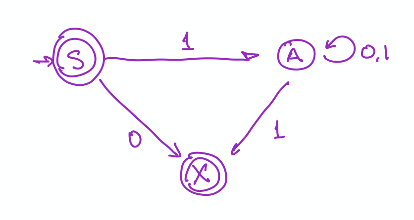

:::{.callout-note collapse=true}
### Checking whether an NFA accepts a string (examples with video)

There are (at least two ways) to think about searching for accepting 
paths in an NFA.  If you are familiar with the terms depth-first and breadth-first,
they correspond to those.

* depth-first: Follow a single path to its end.  If it is an accepting path, you
have found one and your are done.  If not, start over (or better do some back tracking)
to try a different path.  Keep going until you find an accepting path or have 
exhausted all possibilities.

* breadth-first pebbling: In this approach  
  we can imagine placing pebbles on the graph of the NFA representing all the 
  states we could get to at a particular step in processing a string.  
  
    1. We start with a pebble on the start state. 
    2. At each step me move pebbles to any state we could reach from one 
    of the currently pebbled states.
    3. When we are done, we check to see whether an accepting state has a pebble.

Let's illustrate the pebbling method using Exercise 3.5.14 on the string $011$.

[YouTube](https://youtu.be/BrUbzZ3QDSY):

<iframe width="560" height="315" src="https://www.youtube.com/embed/BrUbzZ3QDSY" title="YouTube video player" frameborder="0" allow="accelerometer; autoplay; clipboard-write; encrypted-media; gyroscope; picture-in-picture" allowfullscreen></iframe>


If we are doing this with pencil and paper, we could instead keep a record like this:

$$
\{s_0\} \stackrel{0}{\to} \{s_0, s_2\} \stackrel{1}{\to} \{s_1, s_4\} \stackrel{1}{\to} \{s_4, s_3\}
$$

or even more succinctly (since each state can be identified with a single character) as 

$$
0 \stackrel{0}{\to} 02 \stackrel{1}{\to} 14 \stackrel{1}{\to} 43
$$
Since $s_4$ is an accepting state, there is an accepting path -- there is some way to
get to that state.


Here's another illustration using the string $010$.

[YouTube](https://www.youtube.com/embed/r5iqJqWif2U):

<iframe width="560" height="315" src="https://www.youtube.com/embed/r5iqJqWif2U" title="YouTube video player" frameborder="0" allow="accelerometer; autoplay; clipboard-write; encrypted-media; gyroscope; picture-in-picture" allowfullscreen></iframe>

<!-- <iframe width="800" height="450" -->
<!-- src="https://www.youtube.com/embed/r5iqJqWif2U?rel=0&showinfo=0&autohide=1"  -->
<!-- frameborder="0" allow="accelerometer; encrypted-media; gyroscope; picture-in-picture" allowfullscreen> -->
<!-- </iframe> -->

Here's the pencil-and-paper version (succinct notation):

$$
0 \stackrel{0}{\to} 02 \stackrel{1}{\to} 14 \stackrel{0}{\to} 3
$$

Notice:

* At the last step, two pebbles go to the same place, so the number of states goes from 2 to 1.
* Since $s_3$ is not an accepting state, there is no accepting path and $010$ is not in the
language recognized by this machine.
:::

:::{.callout-note collapse=true}

#### Exercise 21.21 -- Converting NFA to DFA 

Hint: Think about the pebbling algorithm.  How do the pebbles relate
to states in a DFA?

Make sure you give this a good attempt before comparing your work to this solution.

::::{.explain}

```{r, echo = FALSE, out.width = "80%", fig.align = "center"}
knitr::include_graphics('../../docs/images/NFA2DFA-example1sol.png')
```
::::
:::

:::{.callout-note collapse=true}
#### Exercise 21.22 -- Converting NFA to DFA

It isn't important where you put the states, but it is important that the edges and labels
match.

```{r, echo = FALSE, out.width = "80%", fig.align = "center"}
knitr::include_graphics('../../docs/images/DFA-Fig7-13-3-8.png')
```

:::

:::{.callout-note collapse=true}
#### Exercise 21.23 -- How many states in the DFA created from NFA?

In the worst case there is a state in the DFA for every possible set of states
in the NFA. If the NFA has $n$ states, how many subsets of states are there?
Hint: to build a subset, you need to decide for each state whether it is in our
out of the subset.  Now you use your counting rules.
:::

\newcommand{\mybold}[1]{\boldsymbol{#1}}

<!-- <div class = "explain" label = "Exercise 4.1.1"> -->
<!-- What strings belong to $\{0, 01\}^2$? Let's add a vertical bar to show how the strings -->
<!-- are formed.  We need to have two pieces, and each piece must be either 0 or 01, so -->

<!-- * $0|0  \to 00$ -->
<!-- * $0|01  \to 001$ -->
<!-- * $01|0  \to 010$ -->
<!-- * $01|01  \to 0101$ -->
<!-- </div> -->

<!-- <div class = "explain" label = "Exercise 4.1.2"> -->
<!-- Which of these strings belong to $\{0, 01\}^*$? -->

<!-- a. $01001$.  Yes: $01|0|01$ -->
<!-- b. $10110$.  No: Cannot start with a $1$. -->
<!-- c. $00010$.  Yes: $0|0|01|0$.  -->
<!-- </div> -->

<!-- <div class = "explain" label = "Exercise 4.1.3"> -->
<!-- Which of these strings belong to $\{101, 111, 11\}^*$? -->

<!-- a. $1010111$.  No.  You can start 101, but then you are stuck. -->
<!-- b. $1011011$.   No.  You have to start 101, then 101 again, but then there is only one 1 left. -->
<!-- c. $1110111$.   Yes.  $11|101|11$. -->
<!-- d. $11110111$.  Yes.  $111|101|11$ -->
<!-- </div> -->

<!-- <div class = "explain" label = "Exercise 4.2.5"> -->
<!-- $1$ is a symbol or a string with one symbol.  -->
<!-- $\mybold{1}$ represents a language with one string in it: $\{1\}$. -->

<!-- $\lambda$ is the empty string. -->
<!-- $\mybold{\lambda}$ represents a language containing only the empty string: $\{\lambda\}$. -->

<!-- $\emptyset$ is the empty set. -->
<!-- $\mybold{\emptyset}$ represents the empty language, but languages are sets, so the  -->
<!-- empty language is the empty set. -->
<!-- </div> -->

<!-- <div class = "explain" label = "Exercise 4.2.6"> -->
<!-- Describe in words the languages represented by each of these regular expressions:  -->

<!-- a. $\mybold{10^*}$ is the set of all strings that begin with a 1 but don't have any other 1's. -->
<!-- b. $\mybold{(10)^*}$ is the set of all strings with even length that alternate 1's and 0's, -->
<!-- starting with a 1.  (0 is even, so the empty string is included in this description.) -->
<!-- c. $\mybold{0 \cup 01} = \{0, 01\}$, a language with only two strings, $0$ and $01$. -->
<!-- d. $\mybold{0^* \cup 01}$ consists of the string 01 and any string made up only -->
<!-- of 0's (including the empty string). -->
<!-- e. $\mybold{0 (0 \cup 1)^*}$ is the language consisting of strings that start with $0$. -->
<!-- f. $\mybold{(0 \cup 01)^*}$ is the language consisting of all strings that do not start with a 1 and do not have two adjacent $1$'s.  (The empty string is included in this.) -->
<!-- </div> -->

<!-- <div class = "explain" label = "Exercise 4.2.7"> -->
<!-- All of the languages in this problem can be recognized by either a DFA or an NFA. -->
<!-- Do you see how to design them? -->
<!-- </div> -->

<!-- <div class = "explain" label = "Exercise 4.2.8"> -->
<!-- This is will our topic for next time. -->
<!-- </div> -->
<!-- </div> -->
<!-- </div> -->

<!-- <div class = "explain" label = "Exercise 4.3.10"> -->

<!-- We can build up the solution bit by bit using methods for constructing unions, concatenations, -->
<!-- Kleene Star, etc. -->

<!-- ```{r, echo = FALSE, out.width = "80%", fig.align = "center"} -->
<!-- knitr::include_graphics("../../docs/images/NFA-Fig-12-4-3.png") -->
<!-- ``` -->

<!-- </div> -->


<!-- * Where we're going -->

<!-- <div class = "indent"> -->
<!-- <div class = "explain" label = "Show"> -->

<!--   * The main work last time was showing that NFAs and DFAs are equivalent by showing how  -->
<!--   to translate any NFA into an equivalent DFA. (Translating a DFA into and NFA was  -->
<!--   easier.) -->

<!--     $$  -->
<!--     \mathrm{DFA} \leftrightarrow \mathrm{NFA} -->
<!--     $$ -->

<!--   * The "arrow of the day" will be -->

<!--     $$ -->
<!--     \mbox{regular expression} \to \mathrm{NFA} -->
<!--     $$ -->

<!--   * So our picture will look like this -->


<!--     $$ -->
<!--     \Large -->
<!--     \begin{array}{ccc} -->
<!--     \mathrm{DFA} & \stackrel{4/9}{\longleftrightarrow} & \mathrm{NFA} \\ -->
<!--     & \nearrow & \\ -->
<!--     \mathrm{regular} &&\\ -->
<!--     \mathrm{expression}  && -->
<!--     \end{array} -->
<!--     $$ -->


<!--   * Eventually, we want to add regular grammars to our picture, and add some more arrows. -->

<!--     $$ -->
<!--     \Large -->
<!--     \begin{array}{ccc} -->
<!--     \mathrm{DFA} & \stackrel{4/9}\longleftrightarrow & \mathrm{NFA} \\ -->
<!--     & \nearrow & \\ -->
<!--     \mathrm{regular}& & \mathrm{regular} \\ -->
<!--     \mathrm{expression}& & \mathrm{grammar}  -->
<!--     \end{array} -->
<!--     $$ -->

<!-- We will see that all of these are equivalent.  The languages recognized/generated/expressed -->
<!-- by DFAs/NFAs/regular grammars/regular expressions are called **regular langauges**.  -->
<!-- </div> -->
<!-- </div> -->

<!-- * **Topic of the Day:** Regular Expressions and NFAs -->

<!--   * Worksheets:  We will cover Sections 4.1-4.3  -->

<!--     * [HTML](models-of-computation/finite-state-automata.html) -->
<!--     * [PDF](models-of-computation/Models-of-Computation.pdf) -->

<!--   * Start with questions 1 - 6 of sections 4.1 and 4.2 if you did not finish those last time.  -->
<!--   Skip questions 7 and 8. -->

<!--   * Move on to questions in Section 4.3. These walk through the process  -->
<!--   of converting a regular expression into an NFA. -->

<!-- <div class = "indent"> -->
<!-- <div class = "explain" label = "Show Comments/Hints/Solutions"> -->
<!-- <div class = "explain" label = "Exercise 4.1.1"> -->
<!-- What strings belong to $\{0, 01\}^2$? Let's add a vertical bar to show how the strings -->
<!-- are formed.  We need to have two pieces, and each piece must be either 0 or 01, so -->

<!-- * $0|0  \to 00$ -->
<!-- * $0|01  \to 001$ -->
<!-- * $01|0  \to 010$ -->
<!-- * $01|01  \to 0101$ -->
<!-- </div> -->

<!-- <div class = "explain" label = "Exercise 4.1.2"> -->
<!-- Which of these strings belong to $\{0, 01\}^*$? -->

<!-- a. $01001$.  Yes: $01|0|01$ -->
<!-- b. $10110$.  No: Cannot start with a $1$. -->
<!-- c. $00010$.  Yes: $0|0|01|0$.  -->
<!-- </div> -->

<!-- <div class = "explain" label = "Exercise 4.1.3"> -->
<!-- Which of these strings belong to $\{101, 111, 11\}^*$? -->

<!-- a. $1010111$.  No.  You can start 101, but then you are stuck. -->
<!-- b. $1011011$.   No.  You have to start 101, then 101 again, but then there is only one 1 left. -->
<!-- c. $1110111$.   Yes.  $11|101|11$. -->
<!-- d. $11110111$.  Yes.  $111|101|11$ -->
<!-- </div> -->

<!-- <div class = "explain" label = "Exercise 4.2.5"> -->
<!-- $1$ is a symbol or a string with one symbol.  -->
<!-- $\mybold{1}$ represents a language with one string in it: $\{1\}$. -->

<!-- $\lambda$ is the empty string. -->
<!-- $\mybold{\lambda}$ represents a language containing only the empty string: $\{\lambda\}$. -->

<!-- $\emptyset$ is the empty set. -->
<!-- $\mybold{\emptyset}$ represents the empty language, but languages are sets, so the  -->
<!-- empty language is the empty set. -->
<!-- </div> -->

<!-- <div class = "explain" label = "Exercise 4.2.6"> -->
<!-- Describe in words the languages represented by each of these regular expressions:  -->

<!-- a. $\mybold{10^*}$ is the set of all strings that begin with a 1 but don't have any other 1's. -->
<!-- b. $\mybold{(10)^*}$ is the set of all strings with even length that alternate 1's and 0's, -->
<!-- starting with a 1.  (0 is even, so the empty string is included in this description.) -->
<!-- c. $\mybold{0 \cup 01} = \{0, 01\}$, a language with only two strings, $0$ and $01$. -->
<!-- d. $\mybold{0^* \cup 01}$ consists of the string 01 and any string made up only -->
<!-- of 0's (including the empty string). -->
<!-- e. $\mybold{0 (0 \cup 1)^*}$ is the language consisting of strings that start with $0$. -->
<!-- f. $\mybold{(0 \cup 01)^*}$ is the language consisting of all strings that do not start with a 1 and do not have two adjacent $1$'s.  (The empty string is included in this.) -->
<!-- </div> -->

<!-- <div class = "explain" label = "Exercise 4.2.7"> -->
<!-- All of the languages in this problem can be recognized by either a DFA or an NFA. -->
<!-- Do you see how to design them? -->
<!-- </div> -->

<!-- <div class = "explain" label = "Exercise 4.2.8"> -->
<!-- This is will our topic for next time. -->
<!-- </div> -->
<!-- </div> -->
<!-- </div> -->
<!-- <br> -->


\def\emptystring{\lambda}
\def\set#1{\{#1\}}

:::{.callout-note collapse=true}
### Exercise 23.1 Regular grammar to NFA

Start state: $S$;
Accepting states: $S$ and $X$

state     |   0          |   1
--------: | :----------: | :--------:
$S$       |  $\set{X}$   | $\set{A}$
$A$       |  $\set{A}$   | $\set{A}$
$X$       |  $\set{}$    | $\set{X}$

```{r echo = FALSE, fig.align = 'center'}

```

It's a good idea to check your work on a few strings to make sure
the grammar and the NFA agree.  You might try some of these:

* $\lambda$
* $0$
* $1$
* $01$
* $101$
:::


:::{.callout-note collapse=true}
### Exercise 23.2 -- Regular gramar to NFA

Start state: $S$;
Accepting state: $X$

state     |   0           |   1
--------: | :-----------: | :-----------:
$S$       |  $\set{X}$    | $\set{A}$
$A$       |  $\set{B}$    | $\set{A, X}$
$B$       |  $\set{A, X}$ | $\set{B}$
$X$       |  $\set{}$     | $\set{}$

```{r echo = FALSE, fig.align = 'center'}
knitr::include_graphics('../../docs/images/grammar-to-nfa-02.png')
```

It's a good idea to check your work on a few strings to make sure
the grammar and the NFA agree.  You might try some of these:

* $\lambda$
* $110$
* $011$
* $11001$
* $11100$
:::

:::{.callout-note collapse=true}

### Exercise 23.3 -- Regular grammar to NFA (general method)

Three types of rules $S\to\lambda$, $A \to x B$, $A \to x$ where $S$ is the start state, capitals are
non-terminals and lower case are terminals.

States of $N$: one for each non-terminal in the grammar and one more (let's call is $X$ for extra).

Start state = start symbol

$X$ is an accepting state; the only other state that might be accepting is start state.

Convert rules to transitions:

* $S \to \lambda$ makes the start state accepting.
* $A \to xB$ adds a transition $A \stackrel{x}{\to} B$.  (This is a self-loop if $A = B$.)
* $A \to x$ adds a transition $A \stackrel{x}\to X$.
* Note: there will be not transitions out of state $X$.

:::

:::{.callout-note collapse=true}
### Exercise 23.6 -- NFA to regular grammar

* $S_0 \to \lambda$
* $S_0 \to 0S_1$
* $S_0 \to 1S_2$
* $S_0 \to 1$
* $S_1 \to 0S_1$
* $S_1 \to 1S_2$
* $S_1 \to 1$
* $S_2 \to 0S_1$
* $S_2 \to 1S_2$
* $S_2 \to 1$
:::


:::{.callout-note collapse=true}
### Exercise 23.7 -- DFA to regular grammar

$S$ is new lonely start state.

* $S \to 0S_0$
* $S \to 1S_1$
* $S \to 1$
* $S_0 \to 0S_0$
* $S_0 \to 1S_1$
* $S_0 \to 1$
* $S_1 \to 0S_2$
* $S_1 \to 1S_1$
* $S_1 \to 1$
* $S_2 \to 0S_2$
* $S_2 \to 1S_2$
:::


:::{.callout-note collapse=true}
### Exercise 23.8 -- NFA to regular grammar

$S$ is new lonely start state.

* $S \to \lambda$
* $S \to 1S_1$
* $S \to 1$
* $S_0 \to 1S_1$
* $S_0 \to 1$
* $S_0 \to 0S_0$
* $S_1 \to 0S_2$
* $S_2 \to 0S_0$
* $S_2 \to 1S_0$
* $S_2 \to 0$
* $S_2 \to 1$

:::

:::{.callout-note collapse=true}
### Exercise 23.9 -- DFA/NFA to regular grammar (general method)

* terminals = input alphabet
* non-terminals = states (after adding lonely start state)
* start symbol = lonely start state
* Add $S \to \lambda$ if start state is accepting.
* Add $A \to xB$ if $A \stackrel{x}{\to} B$ is a transition.
* Add $A \to x$ if $A \stackrel{x}{\to} B$ and $B$ is accepting.
* Lonely start state avoids having rules with start state on the right side (which is not allowed for regular grammars).

:::


\def\emptystring{\lambda}
\def\union{\cup}

:::{.callout-note collapse=true}
### Exercise 24.1 -- DFA to regex

```{r echo = FALSE, fig.align = 'center'}
# path <- glue::glue('../images/DFA2regex1/frame_0000{i}.png', i = 1:9)
path <- dir('../../docs/images/DFA2regex1', full.names = TRUE)
knitr::include_graphics(path)
```

:::

:::{.callout-note collapse=true}
### Exercise 24.2 -- DFA to regex

```{r echo = FALSE, fig.align = 'center'}
path <- dir('../../docs/images/DFA2regex2', full.names = TRUE)
knitr::include_graphics(path)
```

:::

:::{.callout-note collapse=true}
### Exercise 24.3 -- DFA to regex


```{r echo = FALSE, fig.align = 'center'}
path <- dir('../../docs/images/DFA2regex3', full.names = TRUE)
knitr::include_graphics(path)
```

:::

:::{.callout-note collapse=true}
### Exercises 24.4-5 -- Can we start from NFA or GNFA?

The algorithm works just the same if you start from an NFA or a GNFA.

As a side note, this implies that GNFAs are equivalent to NFAs.  In particular,
$\lambda$-NFAs (NFAs that allow transitions labeled $\lambda$ that can be used
without processing any input symbols) are equivalent.  So our diagram looks like
this

$$
\Large
\begin{array}{ccccccc}
\mathrm{DFA} & \longleftrightarrow & \mathrm{NFA} & \longrightarrow & \lambda\mathrm{-NFA} & \longrightarrow & \mathrm{GNFA} \\
&& \downarrow \uparrow & \nwarrow  &  & \swarrow  \\
& & \mathrm{regular}& & \mathrm{regular} \\
& & \mathrm{grammar}& & \mathrm{expression}
\end{array}
$$
Some books and online resources will demonstrate the conversion

$$
\mbox{regular expression} \longrightarrow \lambda\mathrm{-NFA}
$$
since this is slightly easier than
$$
\mbox{regular expression} \longrightarrow \mathrm{NFA}
$$
But then we would need an additional conversion
$$
\lambda\mathrm{-NFA} \longrightarrow  \mathrm{NFA} \;.
$$
This doable, but isn't really any easier than building it into the
the conversion from regular expressions to NFAs, the way we did it.

You should know how to perform all of the conversions illustrated in the diagram
above.
:::

:::{.callout-note collapse=true}
### Exercise 24.6 -- Outlining all the conversions


Compare your descriptions to the descriptions below.  Did you leave out
anything important?  Do the solutions below leave out anything important?

1a. regex $\to$ NFA:

* 6 parts:
    * 3 base cases -- pretty easy
    * 3 that show union, concatenation and Kleene star -- these are the "interesting" part

* union: $A \cup B$ where $A = L(N_1)$ and $B = L(N_2)$.

    * keep all states and transitions from $N_1$ and $N_2$

    * add one new start state $S$; $S$ is accepting if either
      start state of $N_1$ or start state of $N_2$ is accepting

    * add some additional transitions
        * if $S_1 \stackrel{x}{\to} A$, add $S \stackrel{x}{\to} A$
        * if $S_2 \stackrel{x}{\to} B$, add $S \stackrel{x}{\to} B$

* concatenation: $AB$ where $A = L(N_1)$ and $B = L(N_2)$.

    * keep all states and transitions from $N_1$ and $N_2$
    * start state from $N_1$ is the start state
    * only accepting states from $N_2$ are accepting
    * add some additional transitions
        * if $A \stackrel{x}{\to} F$ (an accepting state in $N_1$), then add
          add $A \stackrel{x}{\to} S_2$ (start state in $N_2$)

* Kleene star: $A = L(N_1)$

    * keep all states and transitions from $N_1$
    * add a new start state that is a accepting state (because $\lambda \in A^*$)
    * add new transitions from new start state ($S$)

        * if $S_1 \stackrel{x}{\to} A$, add $S \stackrel{x}{\to} A$ (includes case where $A = S_1$)

    * add new transitions to old start state ($S_1$)

        * if $A \stackrel{x}{\to} F$, where F is accepting, add $A \stackrel{x}{\to} S_1$
        * If we are at the end of a string in $L(N_1)$, this lets us "restart"


1b. DFA $\to$ NFA

* easy: a DFA "is" an NFA. (Why is "is" in quotes?)

1c. NFA $\to$ DFA

* DFA states are **subsets of NFA states** (think: magnets on white board)

* A is accepting in DFA if A contains a accepting state of NFA

* Remember that $\{ \}$ may be needed as one of the states in the DFA

1d. DFA (or NFA) $\to$ reg grammar

* $A \stackrel{x}{\to} B$ becomes

    * $A \to xB$

    * also $A \to x$  if B is accepting state

* If S is accepting in NFA/DFA, then add $S \to \lambda$

* Number of rules = number of transitions + number of transitions to accepting states +
    1 more if the start state is accepting

1e. reg grammar $\to$ NFA

* states: non-terminals of grammar +
one additional state $F$ (an accepting state)
    * Start symbol is also start state
    * If $S \to \lambda$ is a rule, then $S$ is an accepting state

* production rules become transitions in NFA

    * $A \to xB$ becomes $A \stackrel{x}{\to} B$
    * $A \to x$  becomes $A \stackrel{x}{\to} F$ (the added accepting state)

1f. DFA $\to$ regular expression

* Big idea: Make GNFAs with fewer and fewer states until we have a GNFA with two states
(one the start state and the other the accepting state) and one transition between them, labeled
with a regular expression.

* If necessary, make two addjustments to the DFA before beginning
    * Make sure there is a lonely start state
    * Make sure there is a single accepting state with no exiting transitions.
    * $\lambda$-transitions are allowed for this step, so we might not have a DFA anymore after these adjustments.

* Pick any internal state $R$ (not the start or accepting state) and "rip it out".
    * create or update transitions $A \to B$ when there was $A \to R \to B$.
:::


:::{.callout-note collapse=true}
### A language that is not regular

In addition to the in class discussion, you might like to look at page 885 of the text.

:::

:::{.callout-note collapse=true}
### The Pumping Lemma

::::{.callout-note collapse=true}
#### Ideas behind the Pumping Lemma

The basic idea used to show that $\{0^n1^n \mid n = 0, 1, 2, ... \}$ is not regular
can be turned into a lemma that doesn't mention DFAs at all.

Suppose $L$ is a regular language.  Then there must be a DFA $M$ that recognizes
$L$.  This machine has some number of states, let's call that number $N$.

Now suppose we have a long string $x$ with more symbols than $N$.  (We will
write this $l(x) > N$.  We can break our string into three parts:

* before the loop: $u$
    * What can we say about the length of $u$?

* in the loop: $v$
    * What can we say about the length of $v$?

* after the loop: $w$.

Explain why each of these strings is in $L$ if and only if $x \in L$.

* $uvw$
* $uw$
* $uvvw$
* $uv^kw$

Putting this all together gives us the **Pumping Lemma**:
::::

::::{.callout-note collapse=true}
#### The Pumping Lemma -- Statement

If $L$ is a regular language, then there is a number $N$ such that for any
string $x$ with $l(x) > N$, we can write $x$ as

$$
x = uvw
$$

such that

* $l(uv) \le N$,
* $l(v) > 0$,
* $x \in L$ if and only if $uv^kw \in L$ for every natural number $k$.

Important things to note:

* The Pumping Lemma says something about *long* strings.  There is some length
beyond which the $x = uvw$ splitting is guaranteed. It may or may not work for shorter
strings.

* You do not get to choose $u$, $v$, and $w$.  The Pumping Lemma tells you that
there is a way to split up $x$, not that every way of splitting up $x$ will work.

* The length constraints on $u$ and $v$ are often important in applications.
In particular, $l(uv) \le N$.

::::

::::{.callout-note collapse=true}
#### Pumping Lemma -- Example Application

Let's try using the Pumping Lemma to show that 
$\{0^n1^n \mid n = 0, 1, \dots \}$ is not regular.

Suppose $L$ were regular.
Let $N$ be the number given by the Pumping Lemma.  Consider $x = 0^N1^N$.

* There is some way to split up $x$ as $x = uvw$ (because $x$ is long enough), and
* $u$ and $v$ consist entirely of 0's, since $l(uw) \le N$.

Now consider the string $uw$.  $uw$ must be in $L$, but $uw$ has fewer 0's than 1's, so
it can't be in $L$.  This means our assumption that $L$ was regular must be false.

**Note 1:** Anything you can prove using the Pumping Lemma, you can also prove by going
back to the underlying argument about repeated states (pigeon hole principle), loops,
etc.  So you can think of the Pumping Lemma as an (optional) alternative way to think
about these problems.  I don't care which approach you take, as long as you do it correctly.
Any problem that says "by the Pumping Lemma" may also be done from the underlying argument.

**Note 2:** Using $x = 0^N1^N$ is sufficient since we read more more state than we
have read sybmols.  (After reading the first symbol, we have seen the start state and a next
state.)  But if you prefer to use $x=0^{N+1}1^{N+1}$ just to make the arguement easier,
that's fine too.
::::
:::

<!-- <div class = "foldable" label = "Exercises in 9.4"> -->
<!-- You can check these using the simulator at -->
<!-- <http://morphett.info/turing/turing.html>. -->
<!-- </div> -->

:::{.callout-note collapse=true}
### Exercise 26.3
If $x\not\in L(M)$, $M$ on input $x$ might halt in a state that is not accepting
or it might never halt.
:::

:::{.callout-note collapse=true}
### Exercise 26.4

The language consisting of all strings that have an even number of 0's
and an even number of 1's.

:::

:::{.callout-note collapse=true}
### Exercise 26.6

Here are the instructions for a 1-tape Turing machine that recognizes 
$\{ 0^n 1^n \mid n \ge 0\}$.

```
ATM
Example Turing Machine
0 1 // input alphabet, note such comments are permitted at the end of the line
0 1 X Y B // tape alphabet, blank is B
1 // number of tapes
1 // number of tracks on tape 0
2 // tape 0 is 2-way infinite
[start] // the initial state
[accept] // accepting state
[start] B [accept] B S
[start] 0 [find_1] X R
[start] 1 [too_many_1s] 1 S
[start] Y [out_of_zeros] Y R
[find_1] 0 [find_1] 0 R
[find_1] 1 [reset] Y L
[find_1] Y [find_1] Y R
[find_1] B [too_few_1s] B S
[reset] 0 [reset] 0 L
[reset] X [start] X R
[reset] Y [reset] Y L
[out_of_zeros] Y [out_of_zeros] Y R
[out_of_zeros] 0 [0_after_1s] 0 S
[out_of_zeros] 1 [too_many_1s] Y R
[out_of_zeros] B [accept] B R       // because also out of 1s
end // required
```

:::
