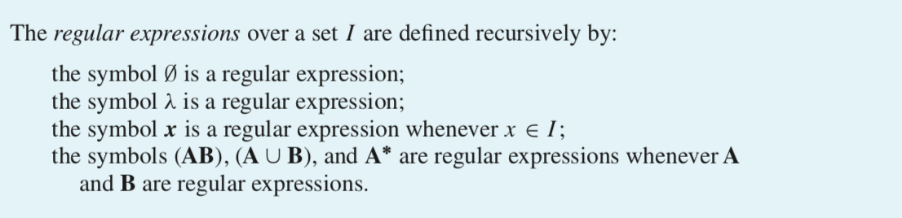
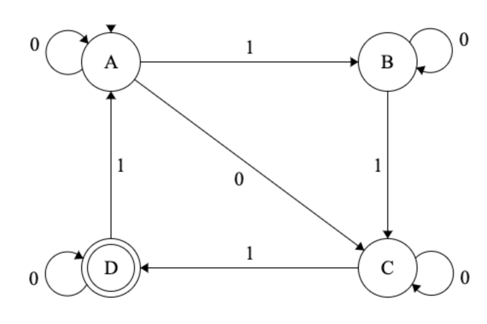

\newpage

# Regular Expressions and Languages

## Operations on Languages

Since languages are sets, we can use set operations like $\cup$ and $\cap$ to create new languages.
But there are some additional operations that we will use.

* concatenation of strings: $xy$ is the concetanation of strings $x$ and $y$ ($x$ followed by $y$)

* concatenation of sets: $AB = \{ xy \mid x \in A \land y \in B \}$

* power: $A^0 = \emptyset$; $A^1 = A$; $A^{n+1} = A^n A$.  (Power is iterated concatenation.)

* Kleene star: $\displaystyle A^* = \cup_{n = 0}^{\infty} \; A^n$

1. What strings belong to $\{0, 01\}^2$?

2. Which of these strings belong to $\{0, 01\}^*$?

    a. 01001
    b. 10110
    c. 00010

3. Which of these strings belong to $\{101, 111, 11\}^*$?

    a. 1010111
    b. 1011011
    c. 1110111
    d. 11110111

\newpage

## Regular Expressions

Regular expression are a type of shorthand notation for representing certain types of sets.

### Syntax

A regular expression over an input alphabet $I$ is defined recursively.

* $\mybold{\emptyset}$ and $\mybold{\lambda}$ and regular expressions.
* $\mybold{x}$ is a regular expression for each $i \in I$.
* If $\mybold{A}$ and $\mybold{B}$ are regular expressions, then

    * $\mybold{A}^*$ is a regular expression
    * $(\mybold{A} \cup \mybold{B})$ is a regular expression
    * $(\mybold{A}\mybold{B})$ is a regular expression
  
<!-- Figures created with http://madebyevan.com/fsm/ -->

### Semantics

Each regular expression represents a language as follows.

* $\mybold{\emptyset}$ represents the empty langauge: $\emptyset$
* $\mybold{\lambda}$ represents language that contains only the empty string: $\{\lambda\}$
* For each $x \in I$, $\mybold{x}$ represents the language containing only $x$: $\{x \}$
* If $\mybold{A}$ and $\mybold{B}$ are regular expressions representing languages $A$ and $B$, then
    * $(\mybold{A}\mybold{B})$ represents $AB$
    * $(\mybold{A} \cup \mybold{B})$ represents $A \cup B$ \hfill 
    [Note: This is often written `(A|B)` in programming languages.]
    * $\mybold{A}^*$ represents $A^*$  \hfill 
    [Note: This is often written as `A*` in programming languages.]
    
The langauges represented by regular expressions are called **regular languages** (how creative).

4. In Rosen 7, the definition of regular expression is missing boldface
in a couple places.  Find them.

```{r echo=FALSE, out.width = "60%", fig.align = "center"}

```

5. What is the difference between $\mybold{1}$ and $1$?
between $\mybold{\lambda}$ and $\lambda$?
between $\mybold{\emptyset}$ and $\emptyset$?

6. Describe in words the languages represented by each of these regular expressions: 

    \ a. $\mybold{10^*} \quad$ b. $\mybold{(10)^*}\quad$ c. $\mybold{0 \cup 01}\quad$ d. $\mybold{0^* \cup 01}\quad$ e. $\mybold{0 (0 \cup 1)^*}\quad$ f. $\mybold{(0 \cup 01)^*}\quad$

7. Can each of the languages above be recognized by an NFA? a DFA?

8. What would we need to do to show that every regualar language can be recognized by an NFA?
Give it a try and see how far you get.  Which parts are easy? Which are trickier? Why?

\vfill

\newpage

## Recognizing Regular Languages with NFAs

1. Show that the empty language ($\emptyset$) is recognized by an NFA.

2. Show that the language $\{\lambda\}$ is recognized by an NFA.

3. Show that if $a \in I$, then the language $\{a \}$ is recognized by an NFA.

4. An NFA is said to have a **lonely start state** if there are no transitions
into the start state.

    a. Contruct an NFA with a lonely start state that is equivalent to the 
    NFA below.
    
    ```{r, echo = FALSE, out.width = "50%", fig.align = "center"}
    
    ```
    
    b. Explain why every NFA is equivalent to an NFA with a lonely start state.
    That is, describe how to convert any NFA into an equivalent NFA with
    a lonely start state.

4. Show that if $A$ and $B$ are each recognized by an NFA, then $AB$ is, too.

    [Hint: Let $N_A$ and $N_B$ be the NFAs that recognize $A$ and $B$.  You may 
    assume each has a lonely start state if that is useful.
    How can you use them to build a new NFA that recognizes $AB$?]

5. Show that if $A$ and $B$ are each recognized by an NFA, then $A \cup B$ is, too.

    [Hint: Let $N_A$ and $N_B$ be the NFAs that recognize $A$ and $B$. 
    You may assume each has a lonely start state if that is useful.
    How can you use them to build a new NFA that recognizes $A \cup B$?]
    
6. Show that if $A$ is recognized by an NFA, then $A^*$ is, too.

    [Hint: Let $N_A$ be the NFA that recognizes $A$. 
    You may assume it has a lonely start state if that is useful.
    How can you use it to build a new NFA that recognizes $A^*$?]
    
7. Explain how 1--7 above show that every regular language is recognized by an NFA.

8. Explain how 7 implies that every regular language is recognized by a DFA.

9. The method just outlined is automatic (you could fairly easily write a
computer program to do the translation from regular expression to NFA), and it
provides a proof that all regular languages can be recognized by an NFA. But it
might produce an NFA with more states than is minimally required. Create an NFA
that recognizes $\mybold{1}^* \cup \mybold{01}$.  Do this two ways:
  
    a. Following the steps outlined in 1--6.
    b. Any way you like, but using fewer states than in part a.
    c. What is the smallest (fewest states) NFA you can find that recognizes $\mybold{1}^* \cup \mybold{01}$?

10. Show that if $A$ is recognized by an NFA, then the complement of $A$ ($\overline{A} = A^c$) 
is too.

    [Hint: There is an easy way and a hard way -- use the easy way.]

<!-- \begin{center} -->
<!-- \begin{tikzpicture}[scale=0.12] -->
<!-- \tikzstyle{every node}+=[inner sep=0pt] -->
<!-- \draw [black] (21.5,-14.4) circle (3); -->
<!-- \draw (21.5,-14.4) node {$S$}; -->
<!-- \draw [black] (49.8,-15) circle (3); -->
<!-- \draw (49.8,-15) node {$A$}; -->
<!-- \draw [black] (36.2,-30.9) circle (3); -->
<!-- \draw (36.2,-30.9) node {$B$}; -->
<!-- \draw [black] (36.2,-30.9) circle (2.4); -->
<!-- \draw [black] (33.235,-30.472) arc (-103.7691:-172.83463:15.449); -->
<!-- \fill [black] (33.24,-30.47) -- (32.58,-29.8) -- (32.34,-30.77); -->
<!-- \draw (24.84,-27.2) node [left] {$1$}; -->
<!-- \draw [black] (24.5,-14.46) -- (46.8,-14.94); -->
<!-- \fill [black] (46.8,-14.94) -- (46.01,-14.42) -- (45.99,-15.42); -->
<!-- \draw (35.64,-15.22) node [below] {$0$}; -->
<!-- \draw [black] (47.85,-17.28) -- (38.15,-28.62); -->
<!-- \fill [black] (38.15,-28.62) -- (39.05,-28.34) -- (38.29,-27.69); -->
<!-- \draw (42.45,-21.51) node [left] {$0$}; -->
<!-- \draw [black] (52.106,-13.099) arc (157.24052:-130.75948:2.25); -->
<!-- \draw (57.13,-13.04) node [right] {$0$}; -->
<!-- \fill [black] (52.71,-15.67) -- (53.26,-16.44) -- (53.64,-15.52); -->
<!-- \draw [black] (24.256,-13.218) arc (110.43244:67.13842:30.965); -->
<!-- \fill [black] (24.26,-13.22) -- (25.18,-13.41) -- (24.83,-12.47); -->
<!-- \draw (35.73,-10.76) node [above] {$1$}; -->
<!-- \draw [black] (49.152,-17.926) arc (-16.89127:-64.19251:19.485); -->
<!-- \fill [black] (49.15,-17.93) -- (48.44,-18.55) -- (49.4,-18.84); -->
<!-- \draw (45.86,-26.37) node [right] {$1$}; -->
<!-- \draw [black] (34.2,-28.66) -- (23.5,-16.64); -->
<!-- \fill [black] (23.5,-16.64) -- (23.65,-17.57) -- (24.4,-16.9); -->
<!-- \draw (29.39,-21.2) node [right] {$0$}; -->
<!-- \end{tikzpicture} -->
<!-- \end{center} -->

\newpage


<!-- ## Solution to problem 4.3.9 -->

<!-- ```{r, echo = FALSE, out.width = "80%", fig.align = "center"} -->
<!-- knitr::include_graphics("../images/NFA-Fig-12-4-3.png") -->
<!-- ``` -->

<!-- Regular -> NFA -> DFA -> complement has DFA -> complement has NFA -->


<!-- regex to epsilon NFA -->

<!-- <iframe width="560" height="315" src="https://www.youtube.com/embed/RYNN-tb9WxI?start=30" frameborder="0" allow="accelerometer; autoplay; encrypted-media; gyroscope; picture-in-picture" allowfullscreen></iframe> -->


<!-- epsilon NFA to DFA -->

<!-- <iframe width="560" height="315" src="https://www.youtube.com/embed/taClnxU-nao" frameborder="0" allow="accelerometer; autoplay; encrypted-media; gyroscope; picture-in-picture" allowfullscreen></iframe> -->

