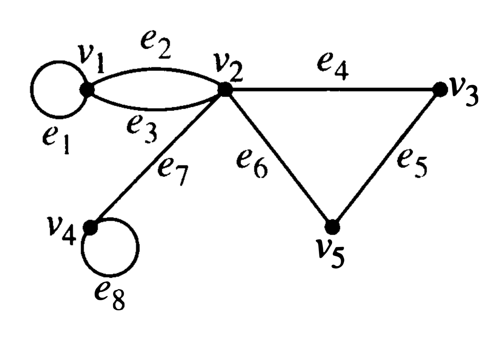

# Graph Representations 

```{r setup-graph-reps, include=FALSE}
knitr::opts_chunk$set(
  echo = FALSE, 
  out.width = "40%")
```

<!-- ## Goals for the day -->

<!--   1. Understand how 4 different graph **representations** work. -->
<!--   2. Understand what it means for two graphs to be **isomorphic**. -->
<!--   3. Be able to give a convincing argument that two graphs are or are not isomorphic. -->
  
## 4 Representations of Graphs

There are several ways to represent a (simple) graph. 
The efficiency of some graph algorithms depends on which
representation is used to store the graph.

### Edge Lists

An edge list simply lists off the edges (i.e., pairs of vertices) in the graph.

### Adjacency Lists

For each vertex $i$, a list of vertices $j$ such that there is an edge from $i$ to $j$.

### Adjacency Matrix

An adjacency matrix $A$ is a square matrix with a row (and column) for each vertex.

  * $A_{ij} = 1$ if there is an edge from vertex $i$ to vertex $j$
  * $A_{ij} = 0$ if there is **not** an edge from vertex $i$ to vertex $j$
   
### Incidence Matrix

An incidence matrix $M$ has a row for each vertex and a column for each edge. 

  * $M_{ij} = 1$ if edge $j$ is incident with vertex $i$.
  * $M_{ij} = 0$ if edge $j$ is **not** incident with vertex $i$.
   
## Representation to Graphs

Draw graphs with the following representations.
  

1. adjacency list
    
vertex | adjacent vertices
-------|--------------------
   1   |  2, 3, 5
   2   |  1
   3   |  1, 4, 5
   4   |  3, 5
   5   |  1, 3, 4  
  
\bigskip
\bigskip

2. edge list: $\{ \{1, 2\}, \{2, 3\}, \{3, 4\}, \{4, 5\}, \{1, 3\}, \{2, 4\}, \{3, 5\} \}$.

\vfill



3. adjacency matrix: 
    
```
0 1 1 1 
1 0 1 1
1 1 0 0
1 1 0 0
```

\vfill

4. adjacency matrix: 

```
0 1 1 0 
1 0 0 1
1 0 0 1
0 1 1 0
```

\vfill

5. adjacency matrix

```
0 1 0 0 1 1
1 0 1 1 0 1
0 1 0 0 1 1
0 1 0 0 1 0
1 0 1 1 0 1
1 1 1 0 1 0
``` 

\vfill

6. incedence matrix
    
```
1 1 0 0 0 0 
0 0 1 1 0 1
0 0 0 0 1 1 
1 0 1 0 0 0 
0 1 0 1 1 0
```

\vfill

7. incedence matrix
    
```
1 1 1 0 0 0 0 0
0 1 1 1 0 1 1 0
0 0 0 1 1 0 0 1 
0 0 0 0 0 0 1 1 
1 0 0 0 1 1 0 0 
```

### Variations on the theme {-}

8. Which of these representations can be used (perhaps with slight modification) 
 with **directed graphs**?  What adjustments do you need to make?
 
9. Which of these representations can be used (perhaps with slight modification) 
 for graphs with **multi-edges**?  What adjustments do you need to make?
 
10. Which of these representations can be used (perhaps with slight modification) 
 for graphs with **self-loops**?  What adjustments do you need to make?

 

## Graph to representation

11. Use each representation to represent the following graphs or say why it isn't possible.

::: {layout-ncol=2} 



:::


