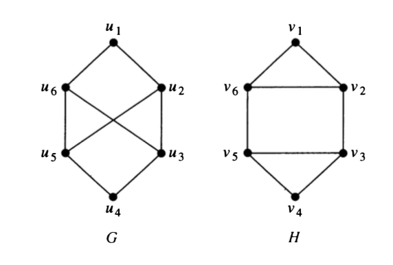
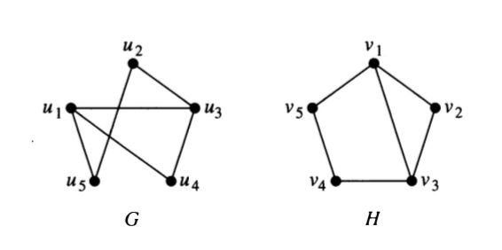
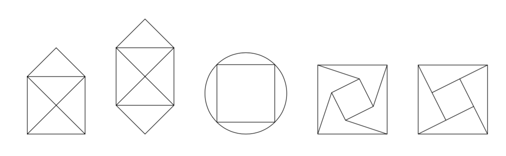
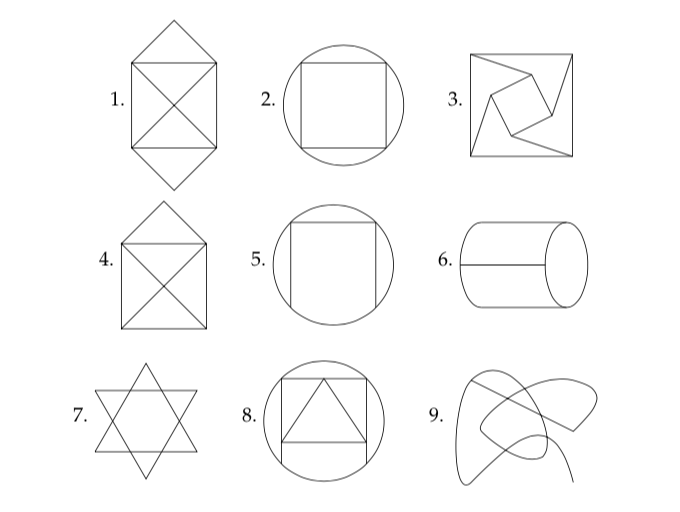
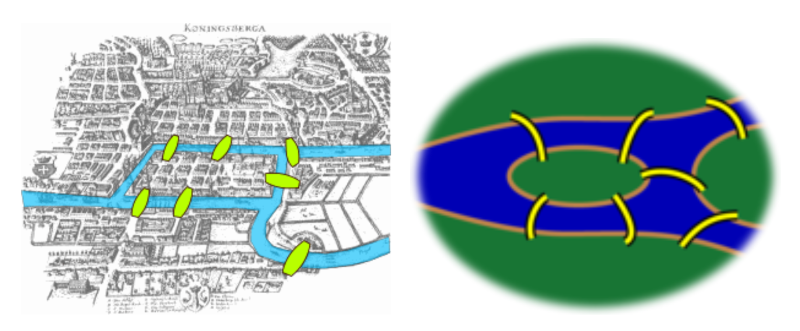
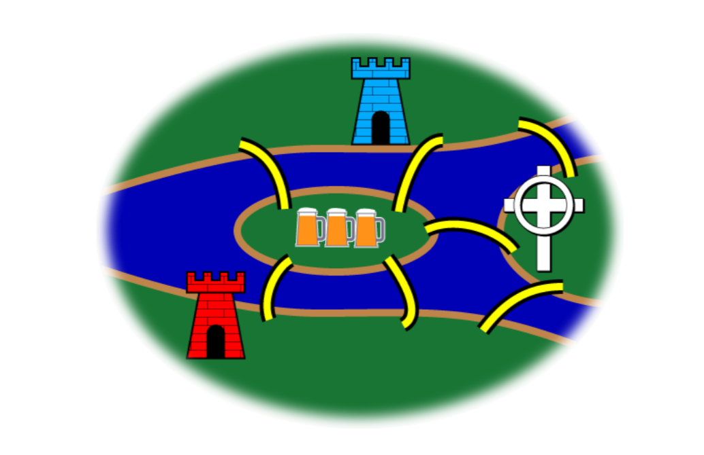

# Paths in Graphs

```{r setup-graph-paths, include=FALSE}
knitr::opts_chunk$set(echo = TRUE)
```


## Definition of a path

 * Informally, a **path** in a graph is a sequence of edges, each one incident to the next.
    * Can sometimes be described as a sequence of vertices, each one adjacent to the next (see below).
    * For directed graphs, we require that the directions of the edges be compatible.

  * More formally, let $n$ be a nonnegative integer and $G$ an undirected [directed] graph. 
    A **path** of **length** $n$ from vertex $v_0$ to vertex $v_{n}$ in $G$ 
    is a sequence of $n$ edges $e_1 , \dots , e_n$ of $G$ such that 
    when $1 \le i \le n$, then
    $e_i = \{v_{i-1}, v_i\}$ [$e_i = \langle v_{i-1}, v_i \rangle$]
    
  * A path is a **circuit** (also called a **cycle**) if it begins and ends at 
  the same vertex and has length $\ge 1$.
  
  * A path or circuit is **simple** if it does not include the same edge more than once.
  

### Questions {-}

 1. What is a path of length 0?
 
 2. Can a path of length 1 be a circuit?  If so, draw an example.  If not, explain why not. 
 
 3. Why are paths defined in terms of edges rather than vertices?  In what situations
 does it matter?  When does it not matter?
 
## Paths and Isomorphism

<!-- If $f : G \to H$ is an isomorphism, and $G$ doesn't include multi-edges, -->
<!-- then $f$ maps paths in $G$ to paths in $H$. (Why?) -->
Paths can be useful for finding an isomorphism between $G$ and $H$ or for showing
that there is no isomorphism.

4. Consider the pair of graphs below.
 
    a. Compute the degreee sequences for each graph.
    
    b. Explain why any isophormphism must either 
    pair $u_1$ with $v_1$ and $u_4$ with $v_4$ or else 
    pair $u_1$ with $v_4$ and $u_4$ with $v_1$. 
    
    c. How long is the shortest path from $u_1$ to $u_4$? the shortest
    path from $v_1$ to $v_4$?
    
    d. Is there a path of length 4 between $u_1$ and $u_4$? between $v_1$ and $v_4$?
    
    c. Are the graphs isomorphic?  Explain.
    
```{r, echo = FALSE, fig.align = "center", out.width = "36%"}

```

 

5. How about these graphs?  Are they isomporphic? How can considering paths help
you figure this out?

```{r, echo = FALSE, fig.align = "center", out.width = "36%"}

```
 
## Euler and Hamilton Paths

 * An **Euler path** is a path that visits every edge of a graph exactly once.
 
 * A **Hamilton path** is a path that visits every vertex exactly once.
 
Euler paths are named after Leonid Euler who posed a famous problem about the 
bridges in Königsberg. Euler is pronounced "Oiler".

Hamilton paths are named after the Irish mathematician
William Rowan Hamilton, not after the American politician Alexander Hamilton.

### Can you trace it?

Perhaps you have seen the following type of "puzzle". 
The goal is to trace the figures without lifting your pencil from 
the paper and without retracing any of the lines.

 6. Which kind of path is this puzzle asking for?

 7. Which of these can you trace in this manner?


```{r, echo = FALSE, fig.align = "center", out.width = "70%"}

```


## Relationships in Graphs


A **planar graph** is a graph that *can be* drawn in 
the plane without any edges crossing.

 8. Show that $K_4$ is a planar graph by drawing it without any edge crossings.
 
\vfill
 
 9. Show that $Q_3$ is a planar graphs by drawing it without any edge crossings.

\vfill



 10.  Here are some graphs that are missing their vertices.
 Add dots showing vertices so that each graph is a planar graph.

```{r, echo = FALSE, fig.align = "center", out.width = "85%"}

```

 
 
<!-- Do this adding *as few vertices as possible* (but no fewer). -->

 11. Fill in the table below for the graphs above.
Do you notice any patterns?
Can you make any conjectures?
Can you prove any of the conjectures?
(Note: an even vertex is a vertex with even degree.
An odd vertex is a vertex with odd degree.)

Graph | number of even verticies | number of odd vertices | total degree | number of vertices  | number of edges     | number of regions    | Euler path? | Euler circuit?
:-----:|-------:|:------:|:------:|:---------:|:----------:|:--------:|:-------:|:-------:
         |          |        |           |           |            |       |           
1        |          |        |           |           |            |       |           
         |          |        |           |           |            |       |           
2        |          |        |           |           |            |       |           
         |          |        |           |           |            |       |           
3        |          |        |           |           |            |       |           
         |          |        |           |           |            |       |           
4        |          |        |           |           |            |       |           
         |          |        |           |           |            |       |           
5        |          |        |           |           |            |       |           
         |          |        |           |           |            |       |           
6        |          |        |           |           |            |       |           
         |          |        |           |           |            |       |           
7        |          |        |           |           |            |       |           
         |          |        |           |           |            |       |           
8        |          |        |           |           |            |       |           
         |          |        |           |           |            |       |           
9        |          |        |           |           |            |       |           
         |          |        |           |           |            |       |           




## Connectedness

* An **undirected graph** is **connected** if there is a path between every pair of vertices.
 
* A **directed graph** is **strongly connected** if there is a path between every pair of vertices.
 
* A **directed graph** is **weakly connected** if the underlying undirected graph
 is connected.

* A connected component $H$ of a graph $G$ is maximal connected subgraph.
  That is, 
  
    * $H$ must be a subgraph of $G$, 
    * $H$ must be connected, but 
    * $H$ cannot be a subgraph of a larger connected subgraph of $G$.
 
 12. Draw a directed graph with 6 vertices that is weakly connected but not strongly connected.
 
 13. Draw an undirected graph with two connected components. Count the number of vertices,
 edges, and regions in your graph. How does this compare to the results in the table in
 problem 11?
 
## Königsberg Bridge Problem

### Original Version

One of the founders of graph theory was Leonid Euler (one of the greatest 
mathematicians who ever lived).  At the time he was alive, the city of Königsberg had seven bridges connecting the two banks of the river flowing 
through downtown and two islands in that river.  Here are a couple maps
of downtown Königsberg at the time.  One is a bit stylized.


```{r, echo = FALSE, fig.align = "center", out.width = "60%"}

```

<!-- \begin{center} -->
<!-- \includegraphics[width=3in]{images/KonigsbergBridges03} -->
<!-- \hfill -->
<!-- \includegraphics[width=3in]{images/KonigsbergBridges02} -->
<!-- \end{center} -->

As the story goes, the residents of Königsberg enjoyed walking the bridges.
The question is this:  How can someone take a Sunday afternoon walk that 
starts and ends in the same place and crosses each bridge exactly once?
(Leaving the map, renting hot air balloons, swimming, etc. are not allowed.)

We'll return to this problem in just a moment.  But first, a different sort of puzzle.

 1. Create a graph that represents the Königsberg Bridge Puzzle (so it can be traced 
 in this manner, if and only if the Königsberg Bridge Puzzle has a solution).  What
 are the vertices?  What are the edges? What type of graph is it?

\vfill

 2. Can you trace the Königsberg Bridge graph?

\vfill

### Extentions to the Königsberg bridge problem

Here are some extensions to the Königsberg Bridge problem.
First, we embelish the map a bit:
The northern bank of the river is occupied by the Schloss, or castle, of the
Blue Prince; the southern by that of the Red Prince. The east bank is home to
the Bishop's Kirche, or church; and on the small island in the center is a
Gasthaus, or inn.

```{r, echo = FALSE, fig.align = "center", out.width = "50%"}

```

<!-- \begin{center} -->
<!-- \includegraphics[width=3in]{../Probs/Figures/KonigsbergBridges04} -->
<!-- \end{center} -->

<!-- %It is understood that the problems to follow should be taken in order, and -->
<!-- %begins with a statement of the original problem: -->

It being customary among the townsmen, after some hours in the Gasthaus, to
attempt to walk the bridges, many have returned for more refreshment claiming
to have walked each bridge exactly once. 
However, none have been able to repeat the feat by the light of day.


3. **The Blue Prince's eighth bridge.**
The Blue Prince, having analyzed the town's bridge system by means of graph
theory, concludes that the bridges cannot be walked. He contrives a stealthy
plan to build an eighth bridge so that he can begin in the evening at his
castle, walk the bridges, and end at the Gasthaus to brag of his victory. Of
course, he wants the Red Prince to be unable to duplicate the feat. Where does
the Blue Prince build the eighth bridge?  

<!-- %Solution The eighth bridge is between -->
<!-- %the Red Prince's castle and the church.  Enlarge The eighth bridge is between -->
<!-- %the Red Prince's castle and the church. -->

<!-- %This Euler walk is desired to begin at the blue castle (which can be thought of -->
<!-- %as the blue node) and end at the inn, or the beer-colored node. Thus a new edge -->
<!-- %is drawn between the other two nodes between the Red Prince's castle and the -->
<!-- %church. Since they each formerly had an odd number of edges, they must now have -->
<!-- %an even number of edges. This is a change in parity from odd to even degree. -->
<!-- %The graph now has exactly two nodes of odd degree--the Blue Prince's castle and -->
<!-- %the inn. Thus, the Blue Prince can perform an Euler walk to the inn or anyone -->
<!-- %starting at the inn could perform an Euler walk to the Blue Prince's castle, -->
<!-- %but the Red Prince is unable to get to the inn. -->

\vfill

4. **The Red Prince's ninth bridge.**
The Red Prince, infuriated by his brother's solution to the problem,
wants to build a ninth bridge, enabling him to begin at his castle, walk the
bridges, and end at the Gasthaus to rub dirt in his brother's face. 
Furthermore, his brother should then no longer walk the bridges himself. 
Where does the Red Prince build the ninth bridge?  

<!-- %Solution The ninth bridge connects the two prince's castles. -->
<!-- %Enlarge The ninth bridge connects the two prince's castles. -->

<!-- %In this case, the required solution is for the Red Prince's castle and the inn -->
<!-- %to have an odd number of edges, while the church and the Blue Prince's castle -->
<!-- %have an even number. The church has an even number already, and the inn already -->
<!-- %has an odd number. The Red Prince's castle has 4 edges, an even number, while -->
<!-- %the Blue Prince's has 3. To make the red node of odd degree and the blue node -->
<!-- %of even degree, the Red Prince must build a bridge between those twoøgiving his -->
<!-- %castle 5 edges and the Blue Prince's 4. Again, there are exactly two nodes of -->
<!-- %odd degree, but now they are the Red Prince's castle and the inn. The Red -->
<!-- %Prince can perform the walk, but the Blue Prince cannot. -->


\vfill

5. **The Bishop's tength bridge.**
The Bishop has watched this furious bridge-building with dismay. It upsets the
townspeople and, worse, contributes to excessive drunkenness. He
wants to build a tenth bridge that allows all the inhabitants to walk the
bridges and return to their own beds. Where does the Bishop build the tenth
bridge?

\vfill


