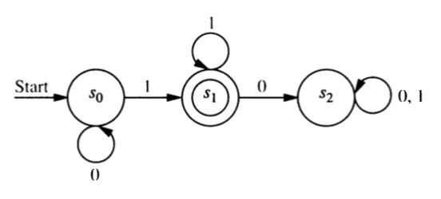
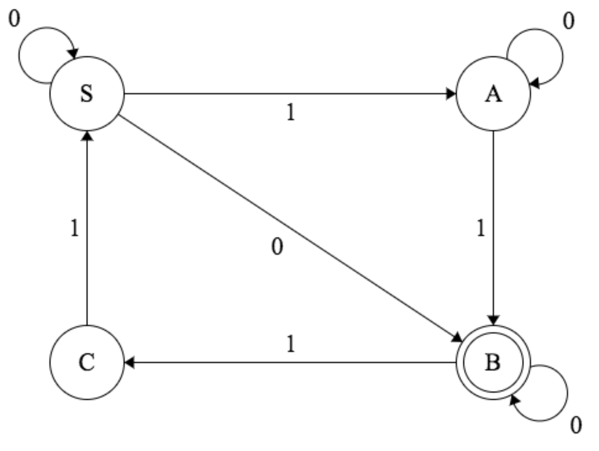
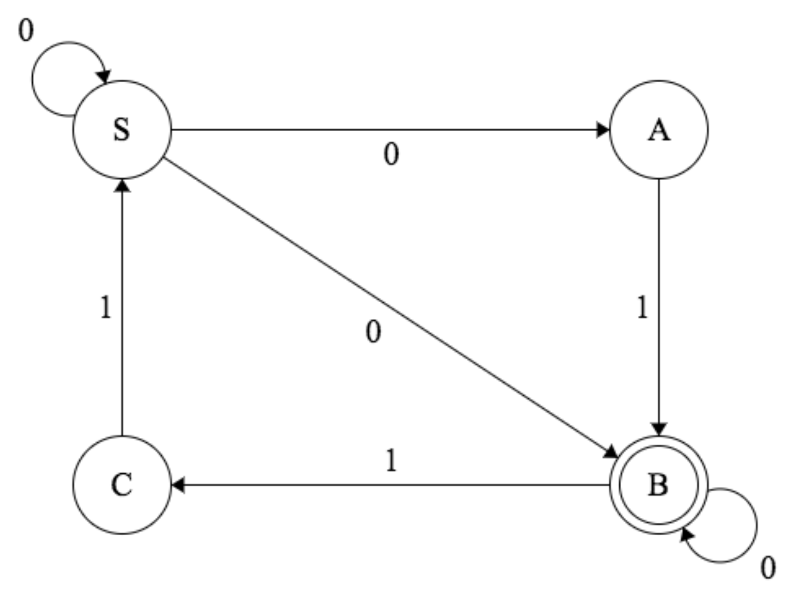
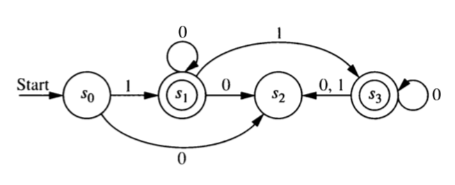

# Regular Grammars and Automata

## Grammars to Automata 

:::{#exr-grammar-to-NFA-1}
Construct a finite state automaton that recognizes the language generated by
the following regular grammar.

* terminals: 0 and 1
* nonterminals: $S$ and $A$
* start symbol: $S$.
* production rules: 
  $S \to 1A$, $S \to 0$, $S\to \lambda$, $A \to 0A$, $A \to 1A$, $A\to 1$
:::

:::{#exr-grammar-to-NFA-2}
Construct a finite state automaton that recognizes the language generated by the following
regular grammar.

* terminals: 0 and 1
* nonterminals: $S$, $A$, $B$
* start symbol: $S$.
* production rules: 
  $S \to 1A$, $S \to 0$, 
  $A \to 0B$, $A \to 1A$, $A\to 1$
  $B \to 0A$, $B \to 1B$, $B\to 0$
:::    

:::{#exr-grammar-to-nfa-general}
Explain how *any* regular grammar $G$ can be converted into an NFA $N$ such that $L(N) = L(G)$.

a. What is a regular grammar? (What sorts of production rules are allowed?)
a. What will the states of $N$ be?  How many will there be?
b. What state will be the start state?
b. Which states will be final (ie. accepting) states?
c. How does each rule in $G$ get converted into a part of $N$?
[Go through each kind of rule a regular grammar may have.]
:::


## Automata to Grammars

:::{#exr-lonely-start-state-again}
Show that every DFA or NFA is equivalent to a DFA or NFA with a 
"lonely start state". A lonely start state is a start state that 
can never be returned to. (In terms of the graph, its in-degree is 0.)
:::

:::{#exr-automata-to-lonely-start-state}
Convert each of the automata in the next three problems into 
an automoton with a lonely start state.
:::



:::{#exr-nfa-to-grammar-1}
Construct a regular grammar that generates the language accepted by this finite state automaton.

```{r, echo = FALSE, fig.align = "center"}
knitr::include_graphics("images/DFA-Fig-12-4-5.png")
```
:::

:::{#exr-nfa-to-grammar-2}
Construct a regular grammar that generates the language accepted by this finite state automaton.

```{r, echo = FALSE, fig.align = "center"}

```
:::

:::{#exr-nfa-to-grammar-3}
Construct a regular grammar that generates the language accepted by this finite state automaton.

```{r, echo = FALSE, fig.align = "center"}
knitr::include_graphics("images/NFA-Ex-12-3-46.png")
```
:::

:::{#exr-nfa-to-grammar-general}
In this problem you will show that any DFA or NFA with a 
lonely start state is equivalent to a regular grammar by showing 
how to  construct a grammar $G$ from such an automaton.

a.  What will the terminals and nonterminals in your grammar be?
b.  What will the start symbol be?
c.  How are the production rules created?
d.  Why was it necessary to have a lonely start state?
:::
    
<!-- 9. True of False. Every NFA is equivalent to an NFA with exactly 1 final state. -->

<!-- 10. True of False. Every DFA is equivalent to a DFA with exactly 1 final state. -->



## Some Review

:::{#exr-equivalent-review}
What does it mean to say that two machines/grammars/regular expressions are equivalent?
:::

:::{#exr-nfa-to-dfa-review}
Convert each of the following NFAs into an equivalent DFA.  
Do this using our general algorithm for this task.  For the first two,
the start state is $S$.

```{r, echo = FALSE, out.width = "30%", fig.align = "center"}

```

```{r, echo = FALSE, out.width = "30%", fig.align = "center"}

```

```{r, echo = FALSE, out.width = "40%", fig.align = "center"}

```

:::

