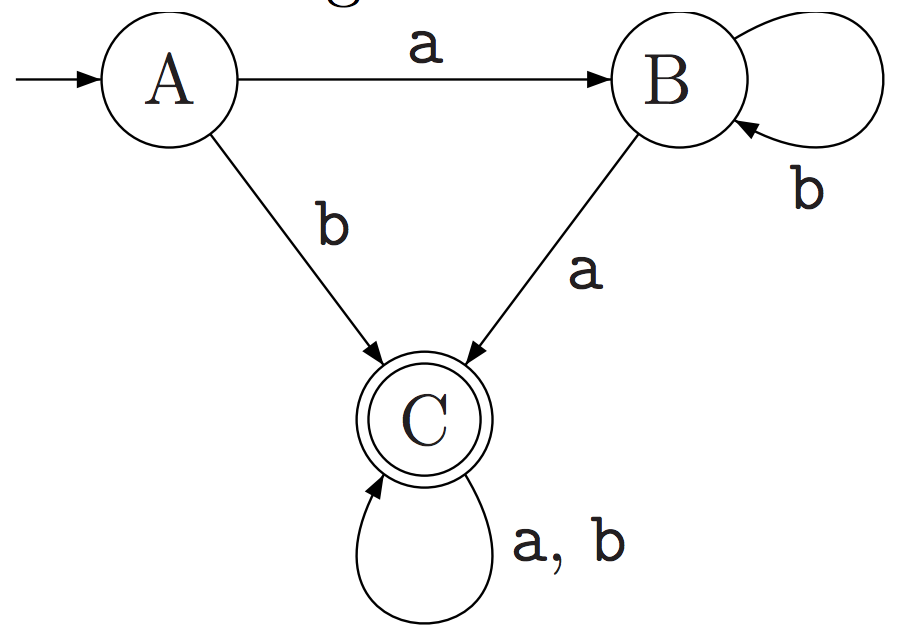
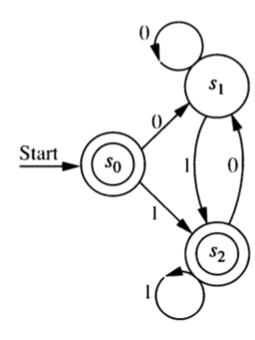

# Regular Langauges

## Equivalent Representations

We have been working toward a result that says the following are 
all equivalent.

1. $L$ can be described by a regular expression.
2. $L$ is recognized by a DFA.
3. $L$ is recognized by an NFA.
4. $L$ is generated by a regular grammar.

The proof that these are equivalent amounts to describing algorithms
that can convert from one representation to another. 
So far we have shown

a. $1 \Rightarrow 3$
b. $2 \Rightarrow 3$
c. $3 \Rightarrow 2$
d. $2 \Rightarrow 4$
e. $4 \Rightarrow 3$

We can depict this a bit more visually like this:

$$
\Large
\begin{array}{ccc}
\mathrm{DFA} & \stackrel{\longrightarrow}{\longleftarrow} & \mathrm{NFA} \\
\phantom{\downarrow} & \nearrow & \downarrow \uparrow \\
\mathrm{regular}& & \mathrm{regular} \\
\mathrm{expression}& & \mathrm{grammar} 
\end{array}
$$

Still missing from our list is

f. $? \Rightarrow 1$

It doesn't matter which representation we start from (do you see why?), so we will choose the easiest: 

$$
\mbox{DFA} \Rightarrow \mbox{regular expresssion}
$$
Once we have that, we will see that all 4 definitions are equivalent.



## DFA to Regular Expression

### GNFA (Generalied NFA)

A GNFA (Generalized NFA) is like an NFA but the edges/transitions may be labeled
with **any regular expression**. One way of obtaining a regular expression from
a DFA uses an algorithm that works with GNFAs.
 

### Algorithm for converting DFA to Regular Expression

Suppose we want to find an equivalent regular expression for some DFA. Here
is an algorithm to do so.

1. Modify the the original machine.

    a. Add a **new start state** with a $\lambda$ transition to the old start state.
    This makes the new start state **lonely**.
    (We can skip this step if the start state is already lonely (has in-degree 0).)
    b. Add a **new accepting state** with a $\lambda$ transition from all old accepting states.
    (We can skip this step if there is exactly one final state and it has out-degree 0.)
    c. The new accepting state will be the **only accepting state**.
    d. **Replace mutliple edges** between any pair of states $A$ and $B$ 
    with one edge labeled with the union of the labels of the original edges.
    [Example $A \stackrel{0,1}{\to} B$ becomes $A \stackrel{0 \cup 1}{\to} B$.]
    
2. Pick an internal state (not the start state or the final state) 
to "rip out". Let's call that state $R$.

    a. If $R$ doesn't have a self-loop, 
    replace every $A \stackrel{r_{\mathrm{in}}}{\to} R \stackrel{r_{\mathrm{out}}} \to B$ with 
    $A \stackrel{(r_{\mathrm{in}} r_{\mathrm{out}})}{\longrightarrow}B$.
    
    b. If $R$ has a self-loop labeled $r_{\mathrm{self}}$, 
    replace every $A \stackrel{r_{\mathrm{in}}}{\to} R \stackrel{r_{\mathrm{out}}} \to B$ with 
    $A \stackrel{(r_{\mathrm{in}} r_{\mathrm{self}}^* r_{\mathrm{out}})}{\longrightarrow} B$.
    c. If this results in multiple edges between two states $A$ and $B$, 
    replace them with one edge labeled with the union of their labels.
    
3. Repeat step 2 until the only states left are the start state and the final 
state. There will be only one transition remaining, and its label will be a regular
expression for the language recognized by the original DFA.

### Examples

:::{#exr-dfa-to-regex-1}
Systematically convert this DFA into an equivalent regular expression.

```{r, echo = FALSE, out.width = "40%", fig.align = "center"}

```

\vfill
:::



:::{#exr-dfa-to-regex-2}
Systematically convert this DFA into an equivalent regular expression.

```{r, echo = FALSE, out.width = "60%", fig.align = "center"}
knitr::include_graphics("images/DFA-regex-2.png")
```

\vfill
:::

:::{#exr-dfa-to-regex-3}
Systematically convert this DFA into an equivalent regular expression.

```{r, echo = FALSE, out.width = "30%", fig.align = "center"}

```
:::

:::{#exr-nfa-to-regex-does-it-work}
Would this algorithm work (possibly with slight modificiation) if we started with an NFA instead of a DFA?
(Be sure to list any modifications that are needed.)
:::

:::{#exr-gnfa-to-regex-does-it-work}
Would this algorithm work (possibly with slight modificiation) if we started with a GNFA instead of a DFA?
(Be sure to list any modifications that are needed.)
:::

\vfill



## Review problems 

:::{#exr-review-describe-algorithms}
For each arrow in the diagram below, write a brief description of the algorithm
that converts from one representation to another.
Your description should include the most important "big idea" and also any potential
"gotchas", things you have to be careful about or might forget about.

$$
\Large
\begin{array}{ccc}
\mathrm{DFA} & \stackrel{\longrightarrow}{\longleftarrow} & \mathrm{NFA} \\
\downarrow & \nearrow & \downarrow \uparrow \\
\mathrm{regular}& & \mathrm{regular} \\
\mathrm{expression}& & \mathrm{grammar} 
\end{array}
$$
:::

:::{#exr-complement-of-regular-is-regular}
Show that if $A$ is a regular language, then $\overline{A}$ is also a regular
language.
:::

:::{#exr-intersect-of-regular-is-regular}
Show that if $A$ and $B$ are regular languages, then $A \intersect B$ is also
a regular language.
:::

:::{#exr-review-machines-to-grammars}
Convert the machines on this sheet to equivalent regular grammars.
:::

:::{#exr-more-examples}
You can find additional worked examples online at places like

* <https://courses.cs.washington.edu/courses/cse311/14sp/kleene.pdf>
* <https://courses.engr.illinois.edu/cs374/sp2019/extra_notes/01_nfa_to_reg.pdf>

But note that sometimes the notation isn't quite the same.

* $\varepsilon$ is sometimes used for what we have called $\lambda$.
* $|$ is sometimes used in place of $\cup$.
* $+$ is sometimes used in place of $\cup$. (To make matters worse, $+$ is more
often used for something else that we haven't seen yet; so make sure you know
how $+$ is being used if you see it.)
:::

