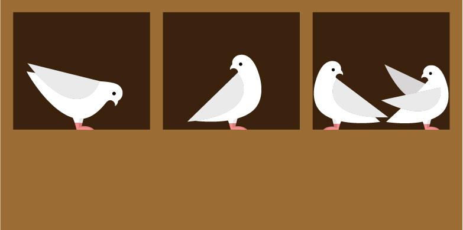

# Pigeonhole Principle

```{r setup-php, include=FALSE}
knitr::opts_chunk$set(echo = TRUE)
```

```{r, echo = FALSE, fig.align = "center", out.width = "40%"}

# source: https://www.ethz.ch/en/news-and-events/eth-news/news/2016/05/creative-proofs-with-pigeons-and-boxes.html
```

**Big Idea**: It is not possible for everyone to be above average or for everyone to be below average. (It is possible for everyone to be exactly average.)  

So if $n$ things are distributed into $k$ groups, 

  * The largest group will have at least $\lceil n/k \rceil$ things, and 
  
  * The smallest group will have at most $\lfloor n/k \rfloor$ things.
  
This is called the (generalized) pigeon hole principle based on the analogy of 
putting letters into mail slots (called pigeon holes).

Applying the pigeonhole principle is generally easy *once you figure out what
the pigeons (letters, really) and the pigeonholes are*.  Figuring out the
pigeons and holes can be easy, or it can take a clever idea.  (Some famous 
proofs center on very clever uses of the pigeonhole principle.)

\vfill

1. Suppose (in some alternative reality) that Professor Pruim brought 150 cookies to
    a class with 34 students.  At the end of the hour, all of the cookies had been 
    eaten by the students.
    
    a. What is the average number of cookies eaten by a student?
    b. This means that the student who had the most cookies had at least _______ cookies.
    c. This means that the student who had the fewest cookies had at most _______ cookies.
 
\vfill

In each of the following problems, each time you use the pigeonhole principle,
identify the "pigeons" and the "holes" and explain how that solves the problem.
If you don't use the pigeonhole principle directly, be sure to explain your reasoning
carefully.

\vfill

2. Fill in the blanks.
 
    a. In a class of 38 students, there are always at least _____ students who were born 
    in the same month.
    
    b. In a class of 38 students, there are always at least _____ students who were born 
    on the same day of the week.
    
\vfill
    
3. In the 2014 Winter Olympics, 88 nations competed in 98 events.  Explain how
 this guaranteed that some country would win more than one gold medal.  (No, the
 answer is not "Norway was there.")
 
\vfill
 
4. At the 2014 Winter Olympics, Norway won 11 gold medals.  Does that fact
 alone guarantee that a country won no gold medals?

\newpage

5. Joe has 21 white socks and 15 black socks.  (Don't ask what happened to the
 missing socks, no one knows where they go.)
 
    a. If he pulls socks in the dark (so he can't tell what color they are), how many
    must he grab to make sure he has a pair of white socks?
    
    b. If he pulls socks in the dark (so he can't tell what color they are), how many
    must he grab to make sure he has a pair of black socks?
    
    c. If he pulls socks in the dark (so he can't tell what color they are), how many
    must he grab to make sure he has a pair of matching socks?
 
\vfill

6. For his birthday, Joe received a gift of 8 red socks
 (4 pairs, and he hasn't lost any yet). 
 Now how many socks must Joe grab to be sure that he has a matching pair?
 
\vfill

7. Joe is going on a trip and needs 3 pairs of matching socks.  He's still too
 lazy to turn on the light to see what socks he is grabbing.  How many socks
 must Joe bring along to make sure he has 3 matching pairs?  (He doesn't care
 how many pairs are red, white, or black.)
 
\vfill


8. Checkers.
 
    a. Consider a $3 \times 9$ grid (like an odd-shaped checker board).  Show that no 
 matter how you place red and black checkers on the 27 squares, there will always 
 be a rectangle whose 4 corners have the same color checker.  (The rectangles must
 be at least $2 \times 2$; $1\times 1$ rectangles don't have four different checkers
 on their corners.)

    b. Consider a $3 \times 7$ grid (like an odd-shaped checker board).  Show that no 
 matter how you place red and black checkers on the 21 squares, there will always 
 be a rectangle whose 4 corners have the same color checker.  (The rectangles must
 be at least $2 \times 2$; $1\times 1$ rectangles don't have four different checkers
 on their corners.)
 
    c. Show how to place red and black checkers on a $3 \times 6$ grid without
    having any rectangles with mono-chromatic corners.
 
\vfill

9. Show that there is an integer that is divisible by 37 and consists only of 
 1's and 0's in its decimal representation.
 
    Hint: Consider the numbers 1, 11, 111, 1111, 11111, etc.  Show that two of them
    are congruent mod 37.  How does that help you answer the question?
    
\vfill

10. Was there anything special about the number 37 in the previous example? 
 For what other divisors does this work? Explain.
 
\vfill

11. Is there anything special about the digits 1 and 0 in the previous example?  What other combinations of digits would work?
 
\vfill

12. A computer lab has 15 workstations and 10 servers. Workstations can only
access servers via direct connections, and each server can only use one of these 
connections at a time.
    
    a. If we connect every workstation to every server, 
    how many connections is that?
    
    b. Show that 60 connections suffice make it possible to use any set of 10
    workstations simultaneously. 
    (No matter what we do, we won't be able to connect
    11 workstations to servers since there are only 10 servers.)
    
    c. Show that 59 connections is not enough.  
    That is, no matter how you do the connecting, 
    there will always be a combination of 10 workstations that cannot
    simultaneously connect to servers. 
    (Hint: on average, how many connections are there per server?)
 
\vfill

 13. The integers from 1 to 10 are distributed around a circle. Prove that there
 must be three neighbors whose sum is at least 17. What about 18? What about 19?
 
\newpage