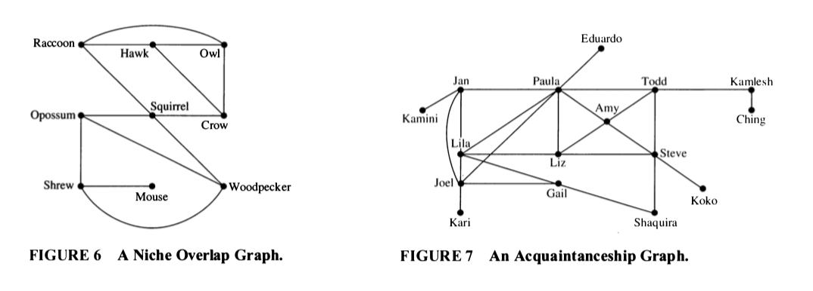
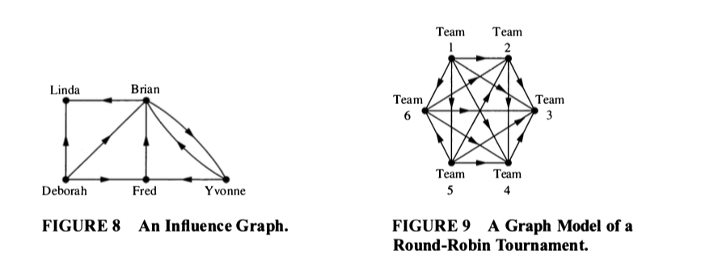
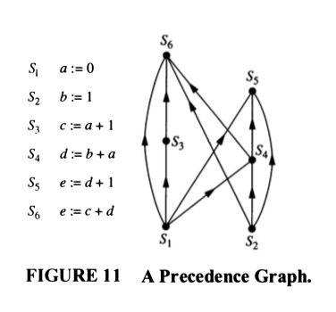

# More Graphs
 
## Some Example Graphs

```{r graphs02-example01, echo = FALSE, fig.align = "center"}
 
```

```{r graphs02-example02, echo = FALSE, fig.align = "center"}

```

```{r graphs02-example03, echo = FALSE, fig.align = "center"}

```

\newpage 
## Some Terminology

  * Two vertices are **adjacent** if they are connected by an edge.
  
  * Two edges are **incident** if they share a vertex.  
      * For directed graphs, one edge must point into the vertex and one out.  
  
  * The **degree** of a vertex in an undirected graph is the number of edges that include the vertex; 
    * Self-loops (if they are allowed) contribute 2 to the degree.
    * For a directed graph, we can talk about **in-degree**, **out-degree**, and 
  **total degree**.
  
  * A **path** in a graph is a sequence of edges, each one incident to the next.
    * Can also be described as a sequence of vertices, each one adjacent to the next.
    * For directed graphs, we require that the directions of the edges be compatible.
    
  * A **cycle** is a path that begins and ends at the same vertex.
  
  * A **connected graph** is one where there is a path between any pair of vertices.
      * For a directed graph, we ignore the direction of the edges.

  * $H$ is a **subgraph** of $G$ if the vertex set of $H$ is a subset of the vertex
  set of $G$ and the edge set of $H$ is a subset of the edge set of $G$, and $H$ is a
  graph.

## Some Questions

These questions will help make sure you understand the terminology above.

 1. In figure 6, which species compete with squirrels?
 
 2. Make a table showing the degree of each vertex in Figure 7.  What does a large 
 degree indicate about a person?  A small degree?
 
 3. Consider the graph in Figure 6.
 
    a. Compute the degree of each vertex in Figure 6.  
    b. Now add up all the degrees.  
    c. How many edges are in the graph?  
    d. How is the sum of all the degrees related to the number of edges in the graph?  Why?  Does this hold for all graphs?  
    e. This result is called the **Handshaking Theorem**.  Why does it have that name?  
 
 3. In Figure 9, assume that $a \to b$ means team $a$ defeated team $b$.   
    a. Compute the in-degree and out-degree of each team in Figure 9.    
    b. What do these numbers tell us about the teams?   
    c. Who is the winner of the Round-Robin tournament in Figure 9? 

\newpage


 4. Consider Figure 8.
    a. Compute the in-degree and the out-degree of each vertex in Figure 8.  
    b. Add up all the in-degrees.    
    c. Now add up all the out-degrees.    
    d. What do you notice?  Will this hold for all directed graphs, or is this graph special?
    
 5. What is the longest path you can find in Figure 8?  What does it represent in terms of the model?
 
## NFL 

From 1961 through 1977 the NFL (National Football League) had a 14-game season.
Until 1976, when two new teams were added, there were 13 teams in each of 2
conferences.  The NFL wanted a schedule were each team would play 11 games
against other teams in their conference and 3 games against teams from the other 
conference. 

Suppose we create such a schedule for the NFL.
Consider the part of the schedule that includes only the 13 NFC teams.
We can represent this as a directed graph (road team $\to$ home team).  (This graph
would be a subgraph of the graph for the entire schedule.)

  7. How many vertices does this graph have?
  
  7. What is the total degree of each vertex?  Why?
  
  8. What is the sum of all the total degrees?
  
  9. How many edges does this graph have?  Why is this impossible?
  
  
So a little bit of graph theory shows that the NFL's desired schedule is not possible.
  

## Some special graphs  

  * $K_n$, the complete graph with $n$ vertices.
    * simple graph with every possible edge.
    
  * $C_n$, the cycle with $n$ vertices.
    * simple graph that consists of a single cycle connecting all the vertices 
    and no other edges.
    
  * $W_n$, the wheel with $n + 1$ vertices.
    * Formed by adding 1 vertex to $C_n$ and an edge between the new vertex and all the vertices in $C_n$.
  
  * $Q_n$, the $n$-dimensional cube.
    * vertices: bit strings with $n$ bits
    * edges: two vertices are adjacent if and only if their bit strings 
    differ in exactly one position.
    
 11. Draw $K_5$. How many edges does $K_5$ have? How many edges does $K_n$ have?  
 
 2. Draw $C_5$. How many edges does $C_5$ have? How many edges does $C_n$ have?  

 3. Draw $W_5$. How many edges does $W_5$ have? How many edges does $W_n$ have?  
 
 4. How many vertices does $Q_3$ have? How many edges does $Q_3$ have?  Draw $Q_3$.  
 
 5. How many vertices does $Q_4$ have? How many edges does $Q_4$ have?   

 6. In Figure 7 there is a subgraph that is a $K_4$. List its vertices. Is there a subgraph that is a $K_5$?  How do you know?  

\newpage
