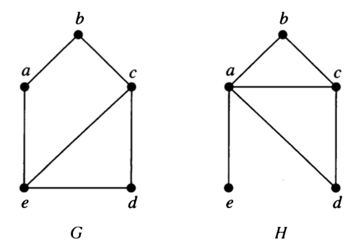
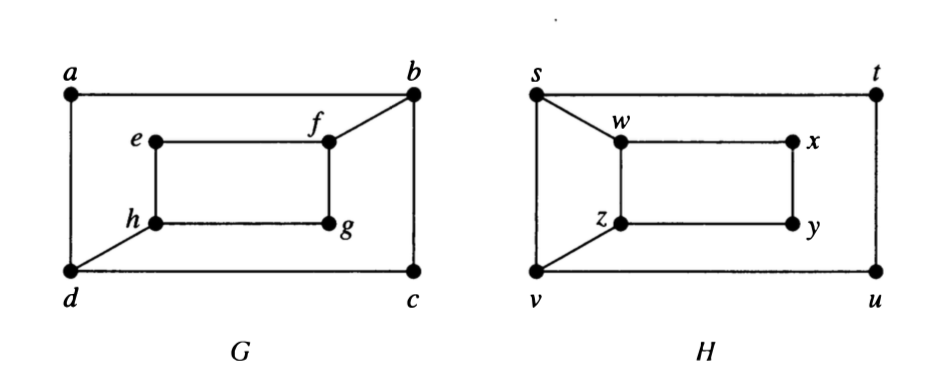
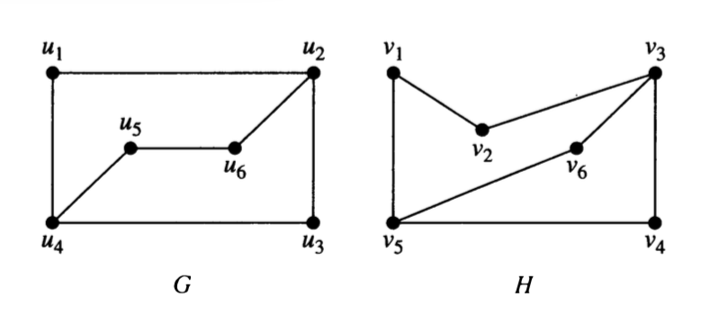
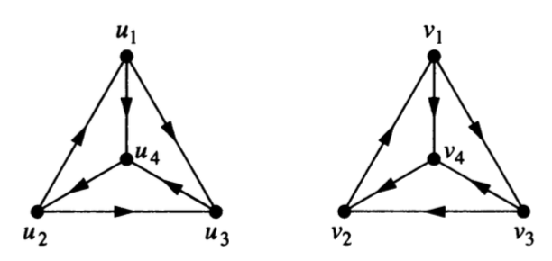
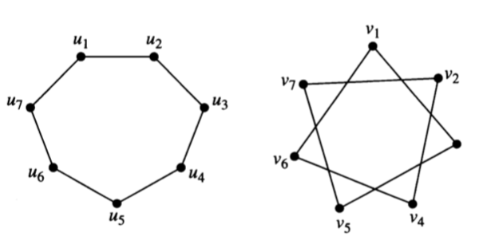

```{r setup-graphiso, include=FALSE}
knitr::opts_chunk$set(
  echo = FALSE, 
  out.width = "40%")
```


# Graph Isomorphism

Two (mathematical) objects are called **isomorphic** if they are "essentially the same"
(iso-morph means same-form).
What "essentially the same" means depends on the kind of object.
For graphs, we mean that the vertex and edge structure is the same.  So

> Graphs $G$ and $H$ are **isomorphic** if there is a bijection (1-1 and onto function)  
$$f: G \to H$$ such that 
there is an edge from $a$ to $b$ in $G$ if and only if 
there is an edge from $f(a)$ to $f(b)$ in $H$.  
The function $f$ is called an **isomorphism**.

(For graphs that allow multi-edges, we require that the number of edges be the same.)

## Showing graphs are isomorphic

When graphs are isomorphic, we can demonstrate this by providing the isomorphism.

1. Show that the following pair of graphs is isomorphic by providing the
isomorphism.  

    a. What must you demonstrate to convince someone that your function
is indeed an isomorphism?

    b. Is there more than one isomorphism?  If so, give another one.

```{r, echo = FALSE, fig.align = "center", out.width = "25%"}
knitr::include_graphics("../images/GraphEx-9-3-39.png")
```


## Showing graphs are not isomorphic

Showing that two graphs are *not* isomorphic can be trickier.  Somehow you need
to demonstrate that no isomorphism exists.  Unfortunately, there are a lot of
bijections ($n!$ if the graphs each have $n$ vertices), so checking 
all possible bijections to see if they are isomorphisms would not be 
a very efficient algorithm.

**News Flash:** Until recently, the best known algorithm for Graph Isomorphism
had exponential worst case running time (but was polynomial time on average).
In 2015, Laszlo Babai demonstrated an [algorithm that runs in sub-exponential
time](https://motherboard.vice.com/en_us/article/4xagmd/graph-isomorphism-youve-been-served)
(almost, but not quite polynomial time).

Back to showing two graphs are not isomorphic. We need to demonstrate that no
isomorphism exists, but we don't want to check all of them.  One good approach
is to consider **graph invariants**.  A graph invariant is a property that is
the same whenever two graphs are isomorphic.

 2. Which of the following are graph invariants?
 
    a. number of vertices
    b. number of edges
    c. degree sequence
    d. adjacency matrix
    e. incidence matrix
    e. having a subgraph isomorphic to $K_4$
    f. having a subgraph isomorphic to _____ (can you fill in the blank with any graph?)
    
Unfortunately, matching invariants does not guarantee that graphs are
isomorphic, but you can use graph invariants to help narrow the search.

3. Explain why each of the following pairs of graphs is not isomorphic.

```{r, echo = FALSE, out.width = "45%"}


```

## Isomorphic or not?

4. For each pair, determine whether the graphs are isomorphic.  Be sure to explain how you know.

```{r, echo = FALSE, out.width = "45%"}


```


---------


```{r, echo = FALSE, out.width = "45%"}
knitr::include_graphics("../images/GraphEx-9-3-43.png")

```


\newpage