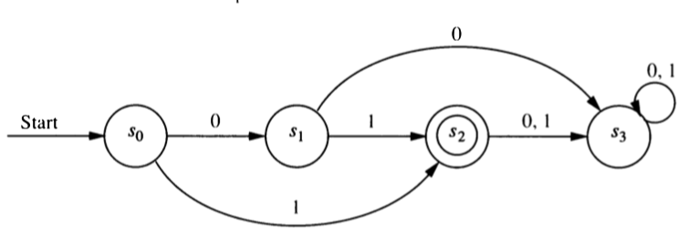

\newpage

# DFA/NFA to Regular Expression

## GNFA (Generalied NFA)

A GNFA (Generalized NFA) is like an NFA but the edges may be labeled with 
any regular expression. One way of obtaining a regular expression
from a DFA or NFA uses an algorithm that works with GNFAs.
  
## Algorithm for converting DFA/NFA to Regular Expression

Suppose we want to find an equivalent regular expression for some DFA or NFA. Here
is an algorithm to do so.

1. Modify the the original machine.

    a. Add a **new start state** with a $\lambda$ transition to the old start state.
    (We can skip this step if the start state is already lonely (has in-degree 0).)
    b. Add a **new final state** with a $\lambda$ transition from all old final states.
    (We can skip this step if there is exactly one final state and it has out-degree 0.)
    c. The new final state will be the **only final state**.
    d. **Replace mutliple edges** between any pair of states $A$ and $B$ 
    with one edge labeled with the union of the labels of the original edges.
    [Example $A \stackrel{0,1}{\to} B$ becomes $A \stackrel{0 \cup 1}{\to} B$.]
    
2. Pick an internal state (not the start state or the final state) 
to "rip out". Let's call that state $R$.

    a. If $A$ doesn't have a self-loop, 
    replace every $A \stackrel{r_{in}}{\to} R \stackrel{r_{out}} \to B$ with 
    $A \stackrel{(r_{in} r_{out})}{\to}B$.
    b. If $A$ has a self-loop labeled $r_{self}$, 
    replace every $A \stackrel{r_{in}}{\to} R \stackrel{r_{out}} \to B$ with 
    $A \stackrel{(r_{in} r_{self}^* r_{out})}{\to} B$.
    c. If this results in multiple edges between two states $A$ and $B$, 
    replace them with one edge labeled with the union of their labels.
    
3. Repeat step 2 until the only states left are the start state and the final 
state. There will be only one transition remaining, and its label will be a regular
expression for the language recognized by the original DFA or NFA.

## Examples

1. Systematically convert this DFA into an equivalent regular expression.

```{r, echo = FALSE, out.width = "40%", fig.align = "center"}
knitr::include_graphics("../images/DFA-regex-example.png")
```

\vfill
\newpage

2. Systematically convert this DFA into an equivalent regular expression.

```{r, echo = FALSE, out.width = "60%", fig.align = "center"}

```

\vfill

3. Systematically convert this DFA into an equivalent regular expression.

```{r, echo = FALSE, out.width = "30%", fig.align = "center"}
knitr::include_graphics("../images/DFA-Fig-12-4-5.png")
```

\vfill

You can find additional worked examples online at places like

* <https://courses.cs.washington.edu/courses/cse311/14sp/kleene.pdf>
* <https://courses.engr.illinois.edu/cs374/sp2019/extra_notes/01_nfa_to_reg.pdf>

But note that sometimes the notation isn't quite the same.

* $\varepsilon$ is sometimes used for what we have called $\lambda$.
* $+$ is sometimes used in place of $\cup$.

