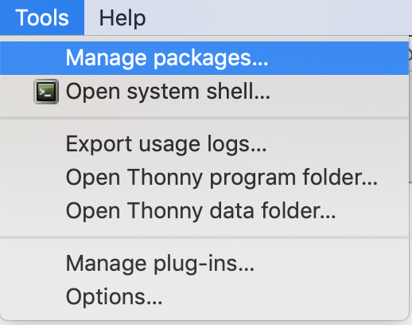
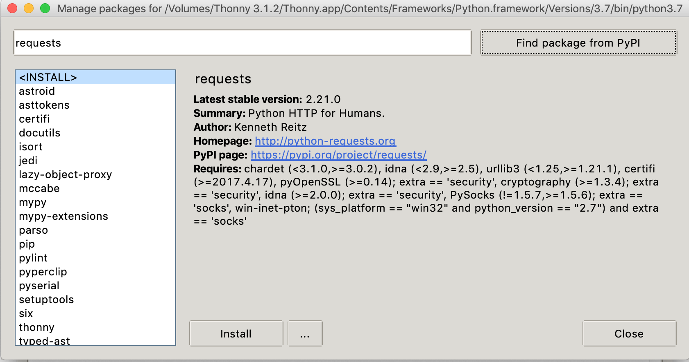

\newpage

# Regular Expressions in Python

```{r python-setup, include = FALSE}
library(reticulate)
# use_python("/usr/local/bin/python3")
knitr::knit_engines$set(python = reticulate::eng_python)
```

## Getting your python environment working

To experiment with regular expressions in python, you will need access to 
python 3 and the `requests` module. 
If you don't already have python running on your machine, 
here are some options.

### repl.it

This python-in-a-browser seems able to do what we need (based on minimal testing)

<https://repl.it/languages/python3>

### Thonny

If you prefer to install a simple versions of python locally, try Thonny.

1. Download and install Thonny from <https://thonny.org/>.

2. Make sure the `requests` module is available.  

    In Thonny, you can install packages from the **tools > manage packages** menu:

    ```{r echo = FALSE, out.width = "20%", fig.align = "center"}
    
    ```


    Then search PyPI for `requests` and hit install.

    ```{r echo = FALSE, out.width = "50%", fig.align = "center"}
    
    ```


### Testing your python setup


If you can run the following and get the same output, you should be OK.

```{python, engine.path = '/usr/local/bin/python3'}
import re
import requests
# Download St. Augustine’s confessions from CCEL and print it
url = 'https://www.ccel.org/ccel/augustine/confess.txt'
r = requests.get(url)
book = r.text
print(len(book))
print(book[1015:1120])

foo = re.compile("aug")
print(foo.search(book))
```