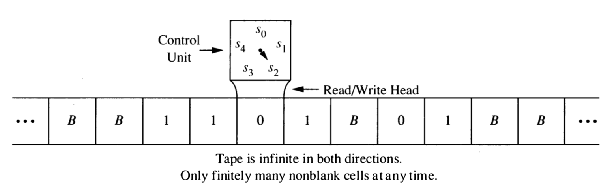

\newpage

# Turing Machines


The Turing machine model pre-dates electronic computers and comes from the 
work of Hilbert (early 1900's) and Turing and Church (1930)'s.

* Not trying to model (electronic) computers, but computation or algorithm
* Identified three essential ingredients: ______________, _____________, __________________
    * implicitly there is a fourth ingredient: ___________________
    
<!-- Read, Write, Remember -->
    
<!-- Read, Write, Remember, Move/Locate -->

* The Turing machine is a specific formalization of these basic ingredients
  

## Definition of a 1-tape Turing Machine (Syntax)

A Turing machine consists of the following:

* **input alphabet**: A set of symbols used for inputs.
* **tape alphabet**:  Input alphabet plus and at least one additional symbol, 
the **blank symbol**.
* **states**: A finite set.
* **initial/start state**: one of the states to start in
* **final states**: some of the states are designated as final or accepting states.
(In some variations there are two kinds of final states: accepting and rejecting.)
* **program**: A list of **instructions**. Each instruction has 5 parts:
    * `<current tape symbol>`: any tape symbol
    * `<current state>`: any state
    * `<new tape symbol>`: any tape symbol
    * `<new state>`: any state
    * `<direction>`: left, right, or stay
        
## Execution of a Turing Machine program (Semantics)

Imagine a machine with a 2-way infinite tape divided into cells.
Each cell contains exactly one symbol from the tape alphabet.
At the start of the execution, the input is written on the tape,
the read/write head is located at the left most symbol of the input,
and all cells that don't contain part of the input contain the blank symbol.

```{r, echo = FALSE, out.width = "40%", fig.align = "center"}

```

At each step in the execution of a Turing machine program, the 
read/write head is located at one cell of the tape. The program
uses the current state and contents of the tape at that position
to determine its action:
  
* write a symbol in the current cell (overwriting what was there before),
* move the head left or right (or stay put)
* update the state

This is repeated until one of two things happens:

* there is no instruction to execute, or
* the state is a final state

When either of these two things happens, the machine **halts**. 

### ASCII Representations of Turing Machines

There are several websites that provide Turing machine simulators. Here are 
a few:

* <http://www.6by9.net/z/projects/turingMachine/turingMachineApplet/> -- My favorite,
but no longer usable since it was written in java by Calvin student Eliot Eschelman
back when java applets were still a thing.
* <http://morphett.info/turing/turing.html> -- plain output, and less flexible (initial 
state must always be called 0, for example), but the program encoding is terse.
* <https://turingmachinesimulator.com/> -- nice looking and more flexible, 
but each instruction takes up 3 lines (current state and tape symbol on one line; new state,
direction, and new symbol on the next line; then a blank line)

Each uses a slightly different ASCII representation of a Turing Machine.
They are all pretty similar but differ in

* How the input alphabet, tape alphabet, start state and accepting states are described
* How they represent the blank tape symbol.  (Often there is a fixed symbol for this like
`b`, `B` or `_`.)
* Whether they are case sensitive, disallow certain characters, observe white space, etc.
* How left/right/stay are denoted
* The order in which the 5 parts of an instruction are given
* Which of various variations on the the 1-tape Turing machine theme they support (and how you
tell the simulator which flavor

## Examples

### Example 1

<!-- Example 12.5.1 from Rosen6 -->

```
; in style of <http://morphett.info/turing/turing.html>
; state symbol symbol direction state
; s0 is initial state
0  * * * s0
s0 0 0 r s0 
s0 1 1 r s1 
s0 _ _ r halt 
s1 0 0 r s0
s1 1 1 l s2 
s1 _ _ r halt
s2 1 0 r halt
```

1. For each input string below, determine the configuration
(tape contents, location of read-write head, and state)
of the Turing machine when it halts.

    a. $\lambda$
    b. 01
    b. 0101
    b. 010110
    b. 001

\newpage    

### Example 2

```
; [init] is initial state
0 * * * [init]
[init] 0 0 r [10] 
[init] 1 0 r [01]
[init] _ _ * halt-init
[00] 0 0 r [10]
[00] 1 1 r [01]
[00] _ _ * halt-00
[01] 0 0 r [11]
[01] 1 1 r [00]
[01] _ _ r [01]
[10] 0 0 r [00]
[10] 1 1 r [11]
[11] 0 0 r [01]
[11] 1 1 r [10]
```

2. For each input string below, determine the configuration
(tape contents, location of read-write head, and state)
of the Turing machine when it halts.

    a. $\lambda$
    b. 0110
    c. 01111
    d. 01110


### The language recognized by a Turing Machine

We will say that a Turing machine $M$ accepts a string $x$ (by state) if 
on input $x$ it halts in a final state. The language recognized by a Turing machine is 

$$
L(M) = \{x \mid M \mbox{ accepts } x\}
$$

3. What languages do the previous two machines recognize?

### Designing a Turing Machine

4. Design a Turing machine that recognizes 
$(\bm{0} \cup \bm{1})\bm{1}(\bm{0} \cup \bm{1})^*$

5. Design a Turing machine that recognizes
$\{0^n1^n \mid n \ge 0\}$.  This shows that Turing machines
can recognize languages that are not regular.

Turing machines can also compute functions.  The output of a Turing
machine is the tape contents when it halts.

6. Design a Turing machine that adds in unary. Use the input alphabet
$\{1,+\}$.

    In unary, a non-negative integer $n$ is represented by $n+1$ 1's.  So 3 is represented as 1111.
    
    Example: Our machine should convert `111+1111` into ______________.
    
A Turing machine computes **neatly** if when it halts (a) the read/write head
is on the left-most non-blank tape symbol (or any blank symbol if the tape is
all blanks), and (b) there are no internal blanks (ie, all the non-blank symbols
are contiguous on the tape).

7. Modify your previous machine so that it computes neatly.

\newpage

## What Can Turing Machines Do?

### Turing Computable Languages

A language $L$ is **Turing computable** if it is recognized by some Turing machine **that always halts**, that is, 

* $L = L(M)$ for some Turing machine $M$.
* $M$ halts on every input.  (If $x\in L$ it halts in an accepting state.)

1. Show that every regular language is Turing computable.

    [Hint: What must you do to demonstrate this?]

### The Halting Problem

The **Halting Problem** is a famous example of a language that is not Turing computable. 
By the **Church-Turing Thesis**, this would mean it is not computable by any means.

Why is it called the Halting *Problem*, you ask, instead of the Halting *Language*?
This goes back to a description of languages as answers to yes/no questions. Each such
problem (ie, language) an be described by an **instance** and a **question**.  Here are 
some examples:

**Euler**

* Instance: A Graph $G$
* Question: Does $G$ have an Euler Circuit?

**3-Colorability**

* Instance: A Graph $G$
* Question: Is $G$ 3-colorable? (Can we color the vertices with 3 colors so that
no adjacent vertices are the same color.)

**SAT**

* Instance: A first order logical formula $\varphi$ (made with $\land$, $\lor$, $\neg$ and some
logical variables).
* Question: Is $\varphi$ satisfiable? (Can we set the variables to TRUE/FALSE in a way
that makes the entire formula true?)

Implicit in each of these descriptions is some encoding scheme by which the objects
mentioned in the instance are coded as bit strings.  Typically, if we are only interested
in whether a problem is Turing computable or not, it does not matter which coding scheme 
is used as long as it is systematic.[^TM-1]

[^TM-1]: The coding scheme can affect the efficiency of a Turing machine computation. Generally
it is required that the encoding be reasonably efficient and not bloated or wasteful of space.

An entire book [@Garey:1979] of such problems (and whether or not they were NP-complete) was produced in
the 1970's by Garey and Johnson and popularized this description. So you will see languages
referred to as problems throughout the CS literature.

Here is a description of the Halting Problem.

* Instance: A Turing Machine $M$ and an input string $x$.
* Question: Does $M$ stop on input $x$?  (This is written $M(x) \downarrow$.)

2. Show that that Halting Problem is not Turing computable.

### Variations on the Turing Machine

There are many variations on the Turing machine.  Here are some
examples.

* Instead of having a single tape, a Turing machine can have multiple tapes.

* Instead of being 2-way infinite, the tape(s) can have a left end.
These are called 1-way infinite tapes.  

* Turing machines may be required to move the head at each step (so "stay" is
not an option).

* Multi-track tapes aren't really a variation, but a handy way of thinking about
a tape alphabet.  (And some simulators makes this easy to do.)  Since the tape alphabet
may be anything, if we want to simulate writing two symbols from $A$, we can use a 
tape alphabet of $A \times A$ or even $A \cup (A \times A)$. 
One element of $A \times A$ represents two elements 
from $A$ (one on the "top track" and one on the "bottom track").

* Instead of having a 1-dimensional tape, a tape can be a
2-dimensional grid of cells.  The read/write head can move up
and down in addition to left and right.

Each of these variations is equivalent to the standard Turing 
machine with one 2-way infinite tape.  So are many other models of 
computation.  This has led to the so-called **Church-Turing Thesis**.
Here is one statement of that thesis:

> A function on the natural numbers is computable by a human being following an algorithm, ignoring resource limitations, if and only if it is computable by a Turing machine.


3. Give a high level description of how to convert a Turing 
machine with 2-way infinite tape into a Turing machine with a 
1-way infinite tape.

4. Give a high level description of how to convert a 2-tape 
machine into a 1-tape machine.

5. **Nested Parens** 
Write a Turing machine recognizes all strings that use the 
input alphabet $\{(, ), *\}$ and the parentheses are properly
nested.  (The asterisks may be anywhere.)

    a. First try this with a two-tape machine.
    b. Then try this with one two-track tape.
    c. For an extra challenge, try doing it with a one-tape machine
    with tape alphabet $\{(, ), *, \# \}$
    
## Running time of a Turing machine

The running time of a Turing machine on input $x$ is the number 
of steps before it halts. The conversions above typically change 
the running time, but machines that run in polynomial time are 
converted into machines that run in polynomial time (typically 
with a different degree polynomial).

### P and NP

This provides a formal definition of the famous set $P$. $P$ is the 
set of all languages that can be recognized by a Turing machine
in polynomial time, that is, the number of steps the machine takes 
on an input of length $n$ is bounded by $p(n)$ for some polynomial $p$.

A **non-deterministic Turing machine** can have multiple transitions
from the same state/tape contents configuration.  A non-deterministic
TM accepts an input $x$ if there is a way of choosing transitions
that causes the machine to halt in a final state.  (This is similar 
to how non-deterministic automata were defined).  $NP$ is the set of 
all languages that can be recognized by a non-deterministic
Turing machine in polynomial time.

The "$P$ vs. $NP$ question" is whether $P$ and $NP$ are the same
or different.  To date, this question is unresolved. [^TM-2]

[^TM-2]: Solving this could make you both rich and famous.

<!-- Hopcroft & Ullman’s TM for {0^n 1^n : n > 0} (file name tm1.txt) -->
<!-- modified to also accept empty string -->
<!-- ``` -->
<!-- ATM -->
<!-- Example Turing Machine -->
<!-- 0 1 // input alphabet, note such comments are permitted at the end of the line -->
<!-- 0 1 X Y B // tape alphabet -->
<!-- 1 // number of tapes -->
<!-- 1 // number of tracks on tape 0 -->
<!-- 2 // tape 0 is 2-way infinite -->
<!-- q0 // the initial state -->
<!-- q4 // final state -->
<!-- q0 B q4 B S -->
<!-- q0 0 q1 X R -->
<!-- q0 Y q3 Y R -->
<!-- q1 0 q1 0 R -->
<!-- q1 1 q2 Y L -->
<!-- q1 Y q1 Y R -->
<!-- q2 0 q2 0 L -->
<!-- q2 X q0 X R -->
<!-- q2 Y q2 Y L -->
<!-- q3 Y q3 Y R -->
<!-- q3 B q4 B R -->
<!-- end // required -->
<!-- ``` -->

<!-- TM for {0^n1^n} -->
<!-- 0 * * * q0 -->
<!-- q0 _ _ * halt-accept -->
<!-- q0 0 X r q1 -->
<!-- q0 Y Y r q3 -->
<!-- q1 0 0 r q1 -->
<!-- q1 1 Y l q2 -->
<!-- q1 Y Y r q1 -->
<!-- q2 0 0 l q2 -->
<!-- q2 X X r q0 -->
<!-- q2 Y Y l q2 -->
<!-- q3 Y Y r q3 -->
<!-- q3 _ _ r halt-accept -->
